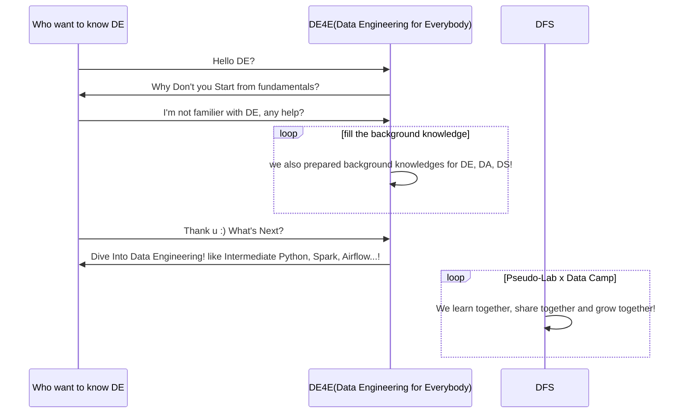
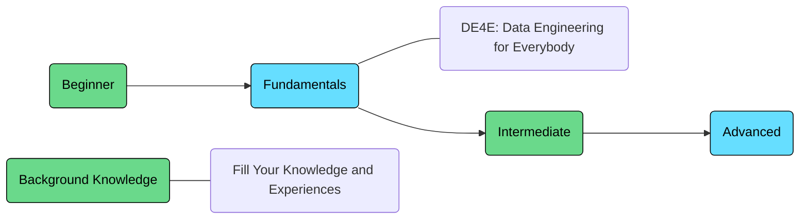
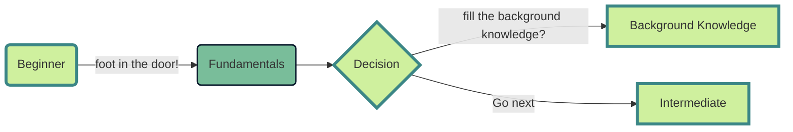
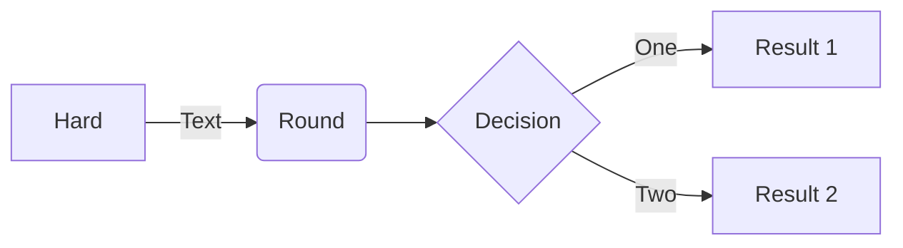
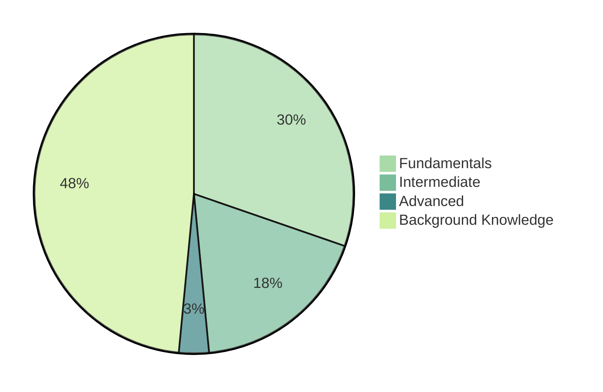

# Data Engineering for Everybody

  

> DE4E: Data Engineering for Everybody by Pseudo-Lab

This repository aims to give a complete picture from the fundamental data engineering landscape to advanced data engineering for Data Lover!
  

# Acknowledgement 🙏
> **DE4E: Data Engineering for Everybody**는 가짜연구소의 DFS프로그램에서 시작되었습니다. 시작에 앞서 감사의 말씀을 전합니다.

[가짜연구소](https://pseudo-lab.com/)는 DataCamp의 후원을 받아 Donates 프로그램을 진행하고 있습니다. 프로그램을 통해 구직자, 불완전 취업자, 비영리 연구 과학자, 학생분들께 DataCamp에서 제공하는 다양한 코스와 트랙을 제공합니다. 본 프로젝트는 DataCamp Donates 프로그램 중 하나인 [Data Science Fellowship](https://pseudo-lab.com/c9013228f63342b689a96e18c0db32c8)으로부터 시작되었습니다. 

DE4E는 데이터 분석가, 데이터 과학자, 데이터 엔지니어, 머신러닝 엔지니어가 함께 모여 데이터의, 데이터에 의한, 데이터를 위한 Data Engineering Repository를 만들어나가고자합니다.
  

# DE4E: Data Engineering for Everybody 

---
  

# Overview 🔎

> We want to let you know how data is connected :)

  

## Fundamentals

* Introduction to DE4E: Data Engineering for Everybody
* Introduction to Data Engineering
* Introduction Shell Programming and Data Processing in Shell
* Introduction to Bash Scripting
* Python Programming
* Introduction to Relational Databases in SQL
* Pandas for data processing
* Database Design
* Introduction to Apache Airflow
* Introduction to PySpark
  

## Intermediate

* Efficient Python Code
* Writing Function in Python
* Unit Testing for Data Science in Python
* OOP(Object-Oriented Programming) in Python
* Big Data Fundamentals with PySpark 
* Data Analysis in SQL
  

## Advanced

* Cleaning Data with PySpark
  

## Background Knowledge

* About Data Engineering
* Data Analyst vs Data Engineer vs Data Science
* Data Engineer's responsibilities
* Structured Data, Semi-Structured Data and Unstructured Data
* OLTP vs OLAP
* ETL, ELT and Reverse ETL
* Change Data Capture(CDC)
* Data Lake vs Data warehouse
* Lake house
* Data engineers process
* Batch Data vs Streaming Data
* Batch processing vs Stream processing
* Scheduling
* Hadoop Ecosystem
* Parallel computing
* Introduction to Cloud Computing
  

## Summary

  

# Course Recommendation 💻
* Data Engineer with Python - DataCamp
  

# Contributors 😃
  

# About us 👋🏼
[가짜연구소](https://pseudo-lab.com/)는 머신러닝, 데이터 사이언스, 데이터 엔지니어링을 중심으로 모인 비영리단체입니다. 누구나 원하는 연구를 할 수 있는 시작점이 되는, 진짜보다 더 진짜 같은 연구소를 꿈꾸고 있습니다. 공유(Share), 동기부여(Motivation), 함께하는 즐거움(Delighted to work together)라는 핵심가치를 추구하며 약 1800여명의 연구원분들이 오늘도 함께 머신러닝, 데이터 사이언스, 데이터 엔지니어링 분야에 선한 영향력을 행사하고 있습니다. 보다 자세한 내용은 [여기](https://pseudo-lab.com/)서 살펴보실 수 있습니다.
  

# License 🗞
