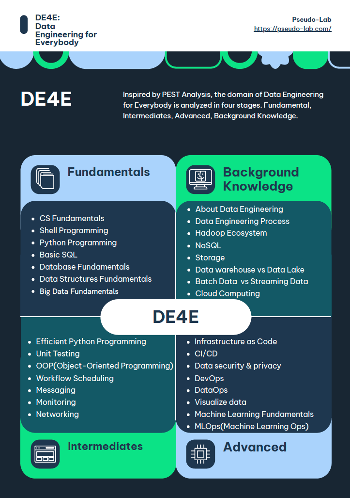

# 📝 Check List

---

## Acknowledgement
[가짜연구소](https://pseudo-lab.com/)는 DataCamp의 후원을 받아 Donates 프로그램을 진행하고 있습니다. 프로그램을 통해 구직자, 불완전 취업자, 비영리 연구 과학자, 학생분들께 DataCamp에서 제공하는 다양한 코스와 트랙을 제공합니다. 본 프로젝트는 DataCamp Donates 프로그램 중 하나인 [Data Science Fellowship](https://pseudo-lab.com/c9013228f63342b689a96e18c0db32c8)으로부터 시작되었습니다. 

**안녕하세요 가짜연구소 DE4E팀입니다.**

> DE4E는 데이터 분석가, 데이터 과학자, 데이터 엔지니어, 머신러닝 엔지니어가 함께 모여 데이터의, 데이터에 의한, 데이터를 위한 Data Engineering Repository를 만들어 나가는 팀입니다.

본 페이지는 데이터 엔지니어링을 막 시작하는 주니어 데이터 엔지니어, 데이터 분석가, 데이터 과학자를 위한 데이터 엔지니어링 체크리스트를 포함하고 있습니다.

단계별, 주제별로 부족한 부분이 있으실 경우 해당 주제를 학습하고 배경지식을 쌓은 뒤에 DE4E를 참고하시는 것을 추천드립니다.

한 가지 기쁜 소식은 DE4E는 모두를 위한 데이터 엔지니어링을 주제로 작성된 프로젝트이기에 대부분의 주제를 보다 쉽고 명확하게 전달해 드릴 예정입니다 😃

그럼 단계별로 핵심 주제들을 하나씩 살펴볼까요?

## Fundamentals
* CS Fundamentals
* Introduction to DE4E: Data Engineering for Everybody
* Introduction to Data Engineering
* Introduction Shell Programming and Data Processing in Shell
* Introduction to Bash Scripting
* Python Programming
* Introduction to Relational Databases in SQL
* Pandas for data processing
* Database Design
* Introduction to Apache Airflow
* Introduction to PySpark
  

## Intermediate
* Efficient Python Code
* Writing Function in Python
* Unit Testing for Data Science in Python
* OOP(Object-Oriented Programming) in Python
* Big Data Fundamentals with PySpark 
* Data Analysis in SQL
* Messaging
* Monitoring
* Networking
  

## Advanced
* Cleaning Data with PySpark
* Introduction to IaaC(Infrastructure as Code)
* Introduction to CI/CD(Continuous Integration and Continuous Delivery)
* Introduction to Data security & Privacy
* Introduction to DevOps
* Introduction to DataOps
* Introduction to Data Visualization
* Machine Learning Fundamentals
* Machine Learning Ops
  

## Background Knowledge
* About Data Engineering
* Data Literacy
* Data Analyst vs Data Engineer vs Data Science
* Data Engineer's responsibilities
* Structured Data, Semi-Structured Data and Unstructured Data
* OLTP vs OLAP
* ETL, ELT and Reverse ETL
* Change Data Capture(CDC)
* Data Lake vs Data warehouse
* Lake house
* Data engineers process
* Batch Data vs Streaming Data
* Batch processing vs Stream processing
* Scheduling
* Hadoop Ecosystem
* Parallel computing
* Introduction to Cloud Computing
  
