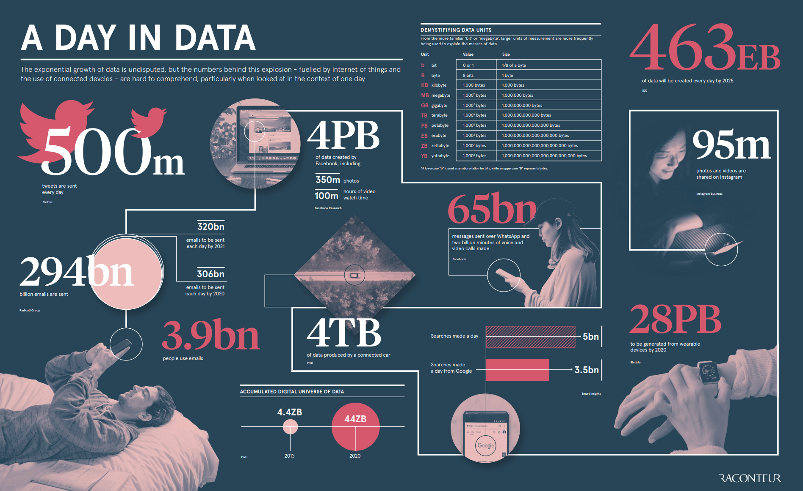
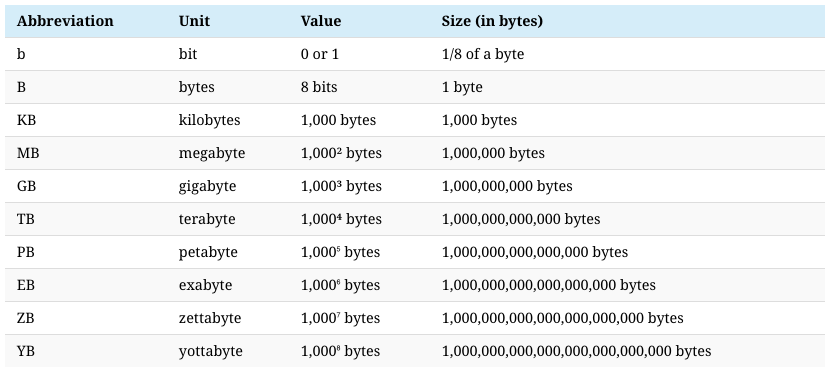

# 우리는 빅데이터 시대에 살고 있습니다

## A DAY IN DATA

> 💡 2025년까지 전 세계적으로 매일 463엑사바이트의 데이터가 생성될 것으로 예상됩니다. 이는 하루에 212,765,957개의 DVD에 해당합니다!

- 5억 개의 트윗이 전송됩니다!
- 2,940억 개의 이메일이 전송됩니다!!
- 4페타바이트의 데이터가 Facebook에서 생성됩니다!!!
- 커넥티드카 1대당 4테라바이트의 데이터 생성됩니다!!!!
- 650억 개의 메시지가 WhatsApp으로 전송됩니다!!!!!
- 50억번 검색이 발생합니다!!!!!

*→ 2019년 기준의 데이터만해도 위와 같은데… 2023년인 현재는 얼마나 더 많은 데이터가 발생하고 있을지 짐작이 가시나요?!* 😅

## Data Literacy(데이터 문해력)
<aside>
💡 빅데이터 시대에 가장 중요한 역량은 무엇일까?
</aside>

> 빅데이터 시대에서 가장 중요한 역량은 `데이터 분석 및 해석 능력`입니다.
> 

데이터를 정보로서 읽고 이해하고 생성하고 전달할 수 있는 역량이 중요해지는 시대에 살고있습니다.

- `데이터 분석 및 해석 능력(살펴보기)`
    
    
    
    데이터를 분석하고 해석하는 역량을 ‘Data Literacy’라고 정의할 수 있습니다. 위키피디아에서는 ‘Data Literacy’를 다음과 같이 정의했습니다. 데이터를 정보로 읽고 이해하고 생성하고 전달할 수 있는 능력이다. 데이터 작업과 관련된 역량에 중점을 둔다. 데이터를 읽고 이해하기 위해서 기술적인 역량이 필요할수도 있다.
    
    빅데이터는 막대한 양의 데이터를 생성하고 저장할 수 있는 기술을 통해 수집된 데이터를 의미합니다. 이러한 데이터는 기업, 정부, 학계 등에서 중요한 의사결정에 영향을 미치는데 사용됩니다. 그러나 데이터만 수집한다고 해서 충분한 것은 아닙니다.
    
    데이터를 분석하고 해석하여 의미 있는 정보를 추출하고 이를 토대로 문제를 해결하거나 기회를 찾아내는 것이 중요합니다. 따라서 빅데이터 시대에는 데이터 분석 기술과 통계학적 지식, 데이터 시각화 능력 등이 필요합니다.
    
    또한, 컴퓨터 프로그래밍과 기계 학습, 인공지능 등의 기술적 지식도 중요합니다. 이러한 기술을 활용하여 빅데이터를 처리하고 분석하는데 있어서 더욱 높은 효율성과 정확성을 달성할 수 있기 때문입니다.
    
    마지막으로, 커뮤니케이션 능력도 중요합니다. 데이터 분석 결과를 이해하기 어려운 사람들에게 설명하고 그들이 이를 활용할 수 있도록 지원하는 것이 빅데이터 분석가의 중요한 역할 중 하나입니다. 따라서 빅데이터 분석가는 기술적인 역량과 커뮤니케이션 능력을 모두 갖추어야 합니다.
    

<aside>
💡 빅데이터 시대에 데이터 엔지니어에게 요구되는 역량은 무엇일까?
</aside>

- `빅데이터 시대에 데이터 엔지니어에게 요구되는 역량(살펴보기)`
    1. `데이터베이스 기술`: 데이터 엔지니어는 대량의 데이터를 수집, 저장, 처리할 수 있는 데이터베이스 기술에 대한 이해가 필요합니다. 특히, 분산 데이터베이스, NoSQL, Hadoop, Spark 등과 같은 대용량 데이터 처리 기술에 대한 이해가 필요합니다.
    2. `프로그래밍`: 데이터 엔지니어는 데이터 처리를 자동화하고, 데이터 플로우를 최적화하기 위해 프로그래밍 기술이 필요합니다. 특히, Python, Java, Scala 등과 같은 프로그래밍 언어에 대한 이해와 사용 경험이 필요합니다.
    3. `클라우드 컴퓨팅`: 클라우드 컴퓨팅 기술을 활용하여 대규모 데이터를 저장하고 처리할 수 있어야 합니다. 데이터 엔지니어는 AWS, Azure, Google Cloud Platform 등과 같은 클라우드 플랫폼에 대한 이해와 사용 경험이 필요합니다.
    4. `분산 시스템`: 데이터 엔지니어는 대규모 데이터를 처리하는 분산 시스템에 대한 이해가 필요합니다. 특히, Hadoop, Spark, Kafka, Flink 등과 같은 분산 시스템을 이해하고 사용할 수 있어야 합니다.
    5. `데이터 아키텍처`: 데이터 엔지니어는 데이터 아키텍처를 설계하고, 데이터 파이프라인을 구축하는 역할을 수행합니다. 이를 위해 데이터 모델링, 데이터 아키텍처 설계, ETL 등의 지식과 경험이 필요합니다.
    6. `문제 해결 능력`: 데이터 엔지니어는 대량의 데이터를 다루는 과정에서 생기는 문제를 해결하기 위한 능력이 필요합니다. 따라서 데이터 분석, 시스템 튜닝 등의 문제 해결 능력이 요구됩니다.
    7. `커뮤니케이션 능력`: 데이터 엔지니어는 데이터 관련 이슈를 비전문가에게 설명하고, 데이터와 관련된 의사 결정을 지원하는 역할을 수행합니다. 따라서 커뮤니케이션 능력이 요구됩니다.

여기에 데이터 품질(Data Quality)를 보장하는 엔지니어링 역량이 더욱 중요해질 것 같다는 생각을 하게 되었습니다. 자세한 사항은 뒤에서 다루도록 하겠습니다!

##  📘 함께 보면 좋은 자료
    
### 5기 스터디 자료 - Data Engineer with Python
    
<aside>
    💡 함께 보시면 좋습니다!
</aside>

[ 📘  Data Engineer with Python 정리 노트](https://file.notion.so/f/s/d26914d0-cb22-42c2-8985-dd60c14f39d6/Week1_Introduction_to_Data_Engineering.pdf?id=1ace0eb5-cf57-4bb1-badb-2a43e2f670f5&table=block&spaceId=333f96cf-396d-45ff-8331-232d41bd4d55&expirationTimestamp=1680437645135&signature=8mEwbqmv8e2CbQY63RbzUzQ4HxX76GIjfMu1iEfKqkg&downloadName=Week1_Introduction+to+Data+Engineering.pdf)

## Introduction to Data Engineering
- Data Engineer vs Data Scientist
- Introduction to Data Engineering
    - Cloud Computing
- Data Engineering Toolbox
    - Database
    - Structured data and unstructured data
    - SQL and NoSQL
    - Parallel computing
    - Parallel computation frameworks
    - workflow scheduling frameworks