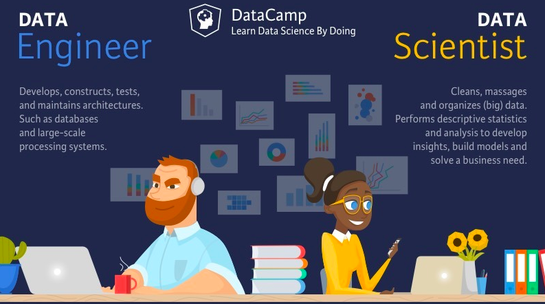
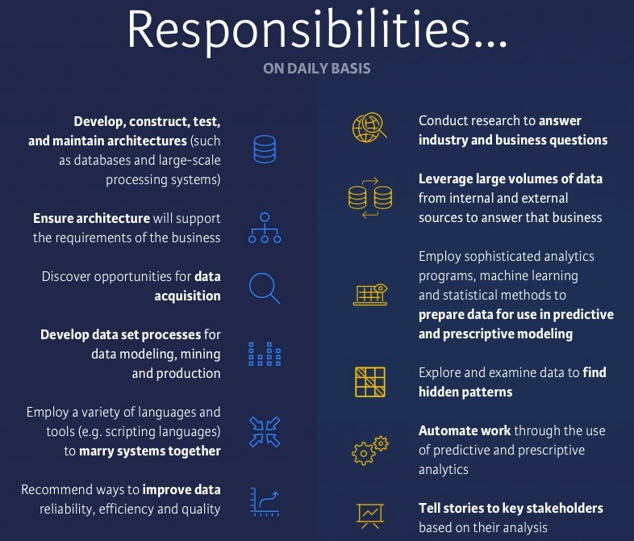
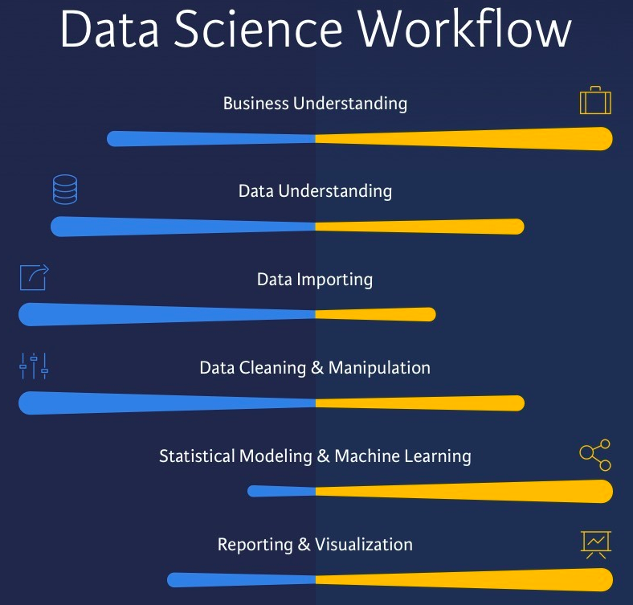
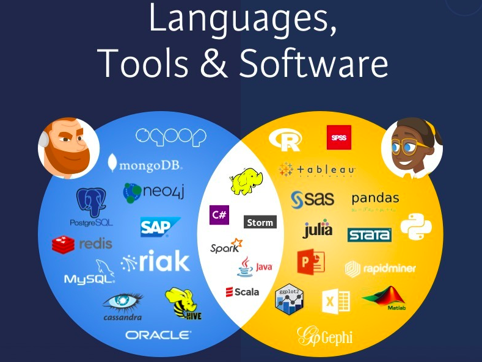
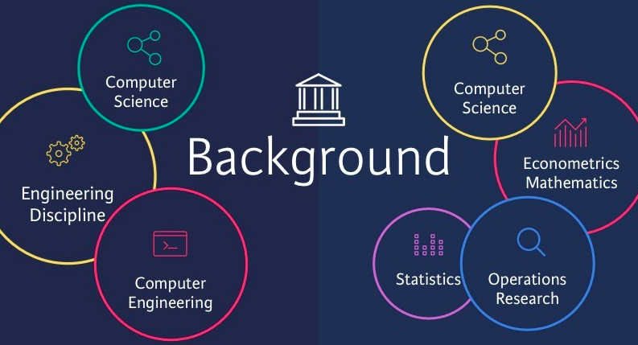
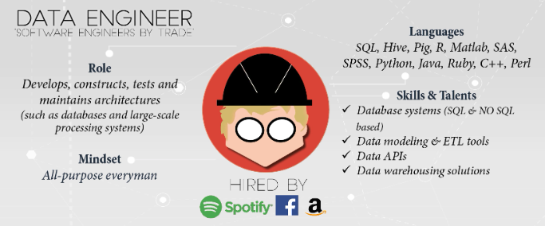

# 1.1. 데이터 엔지니어링이란 무엇일까?

- 데이터 엔지니어링에 대한 정의
- 데이터 엔지니어의 역할
- 데이터 엔지니어의 핵심 역량

## 1.1.1. 데이터 엔지니어링이란?

> `데이터 엔지니어링`은 데이터를 대규모로 수집, 저장 및 분석하기 위한 시스템을 설계하고 구축하는 작업입니다.

거의 모든 산업 분야에 적용되는 광범위한 분야입니다. 하나의 조직은 방대한 양의 데이터를 수집할 수 있는 능력이 필요하며 데이터 과학자와 분석가에게 데이터가 도달할 때까지 사용 가능한 상태가 되도록 `올바른 사람과 기술`이 필요합니다.

뒤에서 다룰 ‘Data Engineering Lifecycle’을 미리 살펴보면서 데이터 엔지니어가 하는 일을 머릿속으로 그려보도록 하겠습니다.
  

📌 ***What Is the Data Engineering Lifecycle? - O’Reilly Medea. Fundamentals of Data Engineering***
> `The data engineering lifecycle` comprises stages that turn raw data ingredients into a useful end product, ready for consumption by analysts, data scientists, ML engineers, and others.
> 

*→ 데이터 엔지니어링 수명 주기(Data Engineering LIfecycle)는 원시 데이터를 분석가, 데이터 과학자, ML 엔지니어 등이 사용할 수 있는 유용한 최종 제품으로 전환하는 단계로 구성됩니다.*

지금은 이 다이어그램이 이해가 되지 않으셔도 됩니다! 오늘의 목표는 다이어그램의 의미를 이해하는 것입니다!

## 1.2.1. 데이터 엔지니어의 역할 및 핵심 역량

<aside>
💡 데이터 분석가, 데이터 과학자와 비교하면 데이터 엔지니어의 역할이 보다 명확하게 다가옵니다!

</aside>

### 📌 Data Engineer vs Data Scientist by DataCamp

<aside>
💡 데이터 엔지니어와 데이터 과학자의 역할, 사용 도구, 언어, 전망, 급여 등을 비교해봅니다.
비교.대조하는 과정에서 보다 명확하게 두 역할의 차이를 구분하실 수 있습니다!

</aside>

[Data Scientist vs Data Engineer by Data Camp](https://www.datacamp.com/blog/data-scientist-vs-data-engineer)

> 데이터 엔지니어는 데이터베이스 및 대규모 처리 시스템과 같은 아키텍처를 `구성, 개발, 테스트 및 유지 관리`하는 사람입니다. 반면에 데이터 과학자는 (큰)데이터를 `정리, 처리 및 활용` 하는 사람입니다.
> 

### 데이터 엔지니어의 역할

- `원시 데이터 처리`
    - 사람, 기계 또는 기기의 오류가 포함된 원시 데이터를 처리(raw data)합니다
    - 데이터가 검증되지 않고 의심스러운 레코드를 포함할 수 있습니다
    - 또한 형식이 지정되지 않으며 시스템에 특화된(system-specific) 코드를 포함할 수 있습니다
- `데이터 신뢰성, 효율성 및 품질 개선`
    - 데이터 엔지니어는 데이터 신뢰성, 효율성 및 품질을 개선하는 방법을 권장하고 때로는 구현해야 합니다
    - 다양한 언어와 도구를 사용하여 시스템을 결합하거나 다른 시스템에서 새로운 데이터를 얻을 수 있는 기회를 찾아야합니다
- `데이터 제공`
    - 데이터 사이언스팀에 데이터를 전달하기 위해 데이터 모델링, 마이닝 및 생산을 위한 데이터 세트 프로세스를 개발해야 합니다

### 데이터 과학자의 역할

- `통계적 방법 및 머신러닝 사용`
    - 일반적으로 1차 정제 및 조작을 통과한 데이터를 확보하고 있습니다. 이를 기반으로 정교한 분석 프로그램, 머신 러닝 및 예측 및 처방 모델링에 사용할 데이터를 준비하는 통계적 방법에 사용할 수 있습니다
- `다양한 데이터 활용`
    - 모델을 구축하기 위해 산업 및 비즈니스 질문을 조사해야 하며 비즈니스 요구 사항에 답변하기 위해 내부 및 외부 소스의 대량 데이터를 활용해야 하기도 합니다
- `비즈니스 이해 관계자에게 보고 및 프로덕트 개선`
    - 데이터 과학자가 분석을 완료한 후에는 주요 이해 관계자에게 명확한 이야기를 제시해야 하며 결과가 수락되면 비즈니스 이해 관계자에게 통찰력을 전달할 수 있도록 작업이 자동화되었는지 확인해야 합니다

- `데이터 엔지니어`는 ETL 목적을 위해 데이터베이스 시스템, 데이터 API 및 도구로 작업하고 데이터 모델링 및 데이터 웨어하우스 설정에 관여합니다.
- `데이터 과학자`는 예측 모델을 구축하기 위해 통계, 수학 및 기계 학습에 대해 알아야 합니다.
- `데이터 과학자` 는 데이터 엔지니어링 팀에서 처리한 데이터에 대한 액세스 권한을 얻어야 하므로 분산 컴퓨팅에 대해 알고 있어야 하지만 비즈니스 이해 관계자에게 보고할 수 있어야 합니다. 스토리텔링과 시각화에 중점을 두는 것이 필수적입니다.

데이터 자체에 대한 이해.조작을 주로 하는 직무가 데이터 엔지니어라면 이러한 데이터에 기반하여 머신러닝 모형을 만들고 시각화를 하여 경영진에 보고하는 역할을 하는 직무가 데이터 과학자입니다

2015년 Data Camp의 ‘The Data Science Industry: Who Does What (Infographic)’ 게시글에서는 데이터 엔지니어를 ‘All-purpose everyman’이라고 표현했네요…! 한국에서는 ‘데이터 잡부’라는 오명을 쓰고 있지만… 잡부 보다는 팔방미인이 더 어울리는 직군인 것 같습니다!

## Appendix - Data 직군 비교하기 
> Data Engineer, Data Scientist 외에도 다양한 역할이 존재합니다
> 

 
