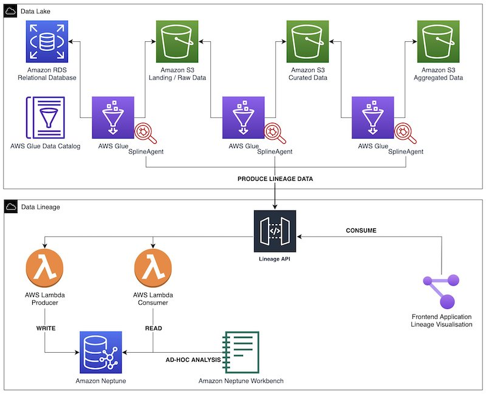

# 1.2. 사례를 통해 알아보는 데이터 엔지니어링

<aside>
💡 데이터 엔지니어라면 한 번쯤 들어봤을 만한 주제를 준비해봤습니다 😃 
사례를 통해 살펴보면 더 직관적으로 이해할 수 있을 것 같아 사례도 준비해 봤습니다! 😃

</aside>

- `데이터 엔지니어링 생애주기(Data Engineering Life Cycle)`: 데이터 엔지니어링 생애 주기에 대해 알아봅니다
- `데이터 분석 아키텍처(Data Analytice Architecture)`: 데이터 분석 플랫폼에 활용되는 데이터 아키텍처에 대해 알아봅니다
- `데이터 엔지니어링 프로젝트(Data Engineering Project) 사례 학습`: 일반적인 데이터 엔지니어링 프로젝트에 대해 알아봅니다
- `데이터 엔지니어링 용어정리 (* Data Engineering Term)`
    - 데이터 베이스(Database): 데이터 엔지니어링의 시작점
    - 데이터 처리(Data Processing): 데이터 엔지니어의 기본 소양
    - 데이터 아키텍처(Data Architecture): 데이터 엔지니어의 일터
    - 데이터 파이프라인(Data Pipeline): 데이터 업무 자동화
    - 데이터 품질(Data Quality): 늦었다고 생각했을 때가 가장 빠르다 1
    - 데이터 계보(Data Lineage): 늦었다고 생각했을 때가 가장 빠르다 2
- `데이터 엔지니어링 생애주기(Data Engineering Life Cycle)`: 데이터 엔지니어링 생애 주기에 대해 알아봅니다

## 1.2.1. `📌 Data Engineering Lifecycle?`

(feat. ***O’Reilly Medea. Fundamentals of Data Engineering)***

> `The data engineering lifecycle` comprises stages that turn raw data ingredients into a useful end product, ready for consumption by analysts, data scientists, ML engineers, and others.
> 

*데이터 엔지니어링 수명 주기(Data Engineering Lifecycle)는 원시 데이터를 분석가, 데이터 과학자, ML 엔지니어 등이 사용할 수 있는 유용한 최종 제품으로 전환하는 단계로 구성됩니다.*

앞서 데이터 엔지니어링에 대해 알아봤습니다.

> `데이터 엔지니어링`은 데이터를 대규모로 수집, 저장 및 분석하기 위한 시스템을 설계하고 구축하는 작업입니다.
> 

데이터 엔지니어링의 각 과정을 세분화하면 아래의 다이어그램과 같이 표현할 수 있습니다. 이러한 프로세스를 Data Engineering Lifecycle라고 합니다.

데이터 엔지니어링 생애주기를 떠올리며 하나씩 살펴보도록 하겠습니다!

- `Generation`: 운영되고 있는 서비스에서 저장되는 데이터, 사용자의 행위로부터 발생하는 이벤트 데이터, 외부 API 데이터 등 다양한 경로에서 발생하는 데이터를 일반적으로 소스 데이터(Source Data)라고 부릅니다. 이렇게 다양한 경로에서 발생하는 다양한 유형의 데이터(Structured, Semi-Structured, Unstructured)는 데이터 엔지니어링의 시작점이라고 할 수 있습니다.
- `Ingestion`: 다양한 경로에서 발생하는 다양한 유형의 데이터 중 목적에 맞는 데이터를 수집하는 단계를 Ingestion 단계라고 표현할 수 있습니다. ETL(Extract, Transform, Load) 프로세스에서 Extract와 같은 의미로 사용되곤합니다.
- `Transformation`: 변환(Transformation) 단계란 간단히 말하면 ‘데이터를 처리하는 단계’라고 표현할 수 있습니다. 변환과 관련 된 작업들은 목적에 따라 다양합니다. 단순 Attribute를 선택하는 작업부터 코드 값을 변환하는 작업부터 , 데이터 생성 시간을 추가하는 작업, Column을 여러개로 나누는 작업, 다양한 소스 데이터를 조인하는 작업등이 있습니다.
- `Serving`: “저장소에 저장된 데이터를 필요한 조직, 서비스에 전달하는 단계”
    - 먼저 분석 및 BI용 데이터를 제공합니다. 통계 분석, 보고 및 대시보드에 사용할 데이터를 준비합니다. 이것은 가장 전통적인 데이터 서비스 영역입니다. 틀림없이 IT와 데이터베이스보다 앞서지만 이해 관계자가 비즈니스, 조직 및 재무 프로세스에 대한 가시성을 확보하는 것이 그 어느 때보다 중요합니다.
    - 둘째, ML 애플리케이션용 데이터를 제공합니다. ML은 적절하게 준비된 고품질 데이터 없이는 불가능합니다. 데이터 엔지니어는 데이터 과학자 및 ML 엔지니어와 협력하여 모델 교육에 필요한 데이터를 수집, 변환 및 제공합니다.
    - 셋째, 역 ETL을 통해 데이터를 제공합니다. *`역방향 ETL`은* 데이터를 데이터 원본으로 다시 보내는 프로세스입니다. 예를 들어 광고 기술 플랫폼에서 데이터를 수집하고 이 데이터에 대한 통계 프로세스를 실행하여 클릭당 비용 입찰가를 결정한 다음 이 데이터를 다시 광고 기술 플랫폼에 제공할 수 있습니다. 역 ETL은 BI 및 ML과 매우 얽혀 있습니다.
        
        
        

*→ 이 외에 `보안`, `데이터 관리`, `데이터 옵스`, `데이터 아키텍처`, `오케스트레이션`, `소프트웨어 엔지니어링` 등 다양한 기술과 패턴을 적용한 종합 예술이라고 할 수 있습니다!*

## 1.2.2. 📌 Data Analytics Architecture - **Logical architecture of modern data lake centric analytics platforms**

- `Modern Data Like Centric Analytics Platforms`
    
    
    
    > 데이터 레이크 중심 분석 아키텍처를 각 계층이 `여러 구성 요소로 구성된 6개의 논리적 계층 스택으로 상상`할 수 있습니다. 계층화된 구성 요소 지향 아키텍처는 관심사 분리, 작업 분리 및 유연성을 촉진합니다. 이는 새로운 데이터 소스를 신속하게 통합하고, 새로운 분석 방법을 지원하고, 분석 환경의 빠른 변화 속도를 따라잡는 데 필요한 도구를 추가하는 데 필요한 민첩성을 제공합니다. 다음 섹션에서는 각 논리적 계층의 주요 책임, 기능 및 통합을 살펴봅니다.
    > 
    
    ### 수집 계층(Ingestion layer)
    
    `수집 계층`은 데이터를 데이터 레이크로 가져오는 역할을 합니다. 다양한 프로토콜을 통해 내부 및 외부 데이터 소스에 연결할 수 있는 기능을 제공합니다. 배치 및 스트리밍 데이터를 스토리지 계층으로 수집할 수 있습니다. 수집 계층은 수집된 데이터를 데이터 저장소 계층(오브젝트 저장소, 데이터베이스 및 웨어하우스 포함)의 다양한 대상 세트로 전달하는 역할도 담당합니다.
    
    ### 스토리지 레이어(**Storage layer)**
    
    `스토리지 계층`은 방대한 양의 데이터를 저장하기 위해 내구성 있고 확장 가능하며 안전하고 비용 효율적인 구성 요소를 제공하는 역할을 합니다. 구조화되지 않은 데이터와 다양한 구조 및 형식의 데이터 세트 저장을 지원합니다. 먼저 대상 스키마 또는 형식을 준수하도록 구조화할 필요 없이 소스 데이터를 있는 그대로 저장할 수 있습니다. 다른 모든 계층의 구성 요소는 스토리지 계층과의 손쉬운 기본 통합을 제공합니다. 조직 전체의 다양한 페르소나에 대한 소비 준비 상태에 따라 데이터를 저장하기 위해 스토리지 계층은 다음 영역으로 구성됩니다.
    
    - **원시 영역(Raw zone)**
        
        – 수집 계층의 구성 요소가 데이터를 저장하는 스토리지 영역입니다. 데이터가 있는 그대로 소스에서 수집되는 임시 영역입니다. 일반적으로 데이터 엔지니어링 페르소나는 이 영역에 저장된 데이터와 상호 작용합니다.
        
    - **정리된 영역(Cleaned zone)**
        
        – `예비 품질 검사` 후 원시 영역의 데이터는 영구 저장을 위해 정리된 영역으로 이동됩니다. 여기서 데이터는 원래 형식으로 저장됩니다. 
        
        정리된 영역에 모든 소스의 모든 데이터를 영구적으로 저장하면 다운스트림 스토리지 영역에서 오류 또는 데이터 손실이 발생하는 경우 다운스트림 데이터 처리를 "재생(replay)"할 수 있습니다. 일반적으로 데이터 엔지니어링 및 데이터 과학 페르소나는 이 영역에 저장된 데이터와 상호 작용합니다.
        
    - **선별된 영역(Curated zone)**
        
        – 이 영역은 가장 사용 준비가 된 상태에 있고 조직 표준 및 데이터 모델을 준수하는 데이터를 호스팅합니다. 선별된 영역의 데이터 세트는 일반적으로 소비 계층에서 효율적이고 비용 효율적인 액세스를 지원하는 형식으로 분할, 카탈로그화 및 저장됩니다. 
        
        처리 계층은 원시 영역의 데이터를 정리, 정규화, 표준화 및 강화한 후 큐레이팅된 영역에서 데이터 세트를 생성합니다. 조직 전체의 모든 페르소나는 이 영역에 저장된 데이터를 사용하여 비즈니스 결정을 내립니다.
        
     
    
    ### 처리 계층(**Processing layer)**
    
    `처리 계층`은 데이터 유효성 검사, 정리, 정규화, 변환 및 강화를 통해 데이터를 소비 가능한 상태로 변환하는 역할을 합니다.
    랜딩, 원시 및 선별된 영역을 따라 `데이터 세트의 소비 준비 상태를 개선`하고 원시 및 변환된 `데이터에 대한 메타데이터를 카탈로그 계층에 등록`하는 일을 담당합니다. 처리 계층은 올바른 데이터 세트 특성 및 당면한 처리 작업과 일치하도록 특수 제작된 데이터 처리 구성 요소로 구성됩니다. 
    
    처리 계층은 대량의 데이터를 처리하고 읽을 때 `스키마, 분할된 데이터 및 다양한 데이터 형식을 지원`할 수 있습니다. 
    
    또한 처리 계층은 각 단계에 대해 특수 제작된 구성 요소를 사용하는 `다단계 데이터 처리 파이프라인을 구축`하고 `오케스트레이션`하는 기능을 제공합니다.
    
    ### 목록화 및 검색 레이어(**Cataloging and search layer)**
    
    `카탈로그 및 검색 계층`은 스토리지 계층에서 호스팅되는 데이터 세트에 대한 비즈니스 및 기술 메타데이터를 저장하는 역할을 합니다. 레이크에서 스키마 및 데이터 세트 정보의 세분화된 분할을 추적하는 기능을 제공합니다. 또한 메타데이터의 변경 사항을 추적하기 위해 버전을 추적하는 메커니즘을 지원합니다. 데이터 레이크의 데이터 세트 수가 증가함에 따라 이 계층은 검색 기능을 제공하여 데이터 레이크의 데이터 세트를 검색 가능하게 만듭니다.
    
    ### 소비층(**Consumption layer)**
    
    `소비 계층`은 확장 가능하고 성능이 뛰어난 도구를 제공하여 데이터 레이크의 방대한 양의 데이터에서 통찰력을 얻습니다. SQL, 배치 분석, BI 대시보드, 보고 및 ML을 포함하여 분석 방법을 지원하는 몇 가지 목적에 맞게 구축된 분석 도구를 통해 조직 전체의 모든 페르소나에서 분석을 민주화합니다. 소비 계층은 기본적으로 데이터 레이크의 스토리지, 카탈로그 및 보안 계층과 통합됩니다. 소비 계층의 구성 요소는 읽기 시 스키마, 다양한 데이터 구조 및 형식을 지원하고 비용 및 성능 최적화를 위해 데이터 분할을 사용합니다.
    
    ### 보안 및 거버넌스 계층(**Security and governance layer)**
    
    `보안 및 거버넌스 계층`은 스토리지 계층의 데이터 보호와 다른 모든 계층의 리소스 처리를 담당합니다. 액세스 제어, 암호화, 네트워크 보호, 사용량 모니터링 및 감사를 위한 메커니즘을 제공합니다. 보안 계층은 또한 다른 계층에 있는 모든 구성 요소의 활동을 모니터링하고 자세한 감사 추적을 생성합니다. 다른 모든 계층의 구성 요소는 보안 및 거버넌스 계층과의 기본 통합을 제공합니다.
    

## 1.2.3. Data Lineage

> Treating data quality like an engineering problem
> 

`Data Reliability Engineering`이란 데이터 팀이 데이터 환경의 반복 속도를 잃지 않고 주요 응용 프로그램(의사 결정, AI/ML 프로젝트 및 내장된 분석)에서 사용하기에 적합한 상태를 유지하기 위해 데이터 팀이 채택해야 하는 주요 사례

- `Data Lineage(Option)`
    
    
    
    다음 다이어그램은 솔루션 아키텍처를 보여줍니다. AWS Glue Spark ETL 작업을 사용하여 데이터 수집, 변환 및 로드를 수행합니다. Spline 에이전트는 각 AWS Glue 작업에서 계보(lineage)를 캡처하고 지표를 실행하고 이러한 데이터를 계보 REST API로 전송하도록 구성됩니다. [이 백엔드는 Amazon API Gateway](https://aws.amazon.com/api-gateway) 및 [AWS Lambda](http://aws.amazon.com/lambda) 기능 으로 구동되는 생산자 및 소비자 엔드포인트로 구성됩니다 . 생산자 엔드포인트는 들어오는 계보 개체를 Neptune 데이터베이스에 저장하기 전에 처리합니다. 소비자 엔드포인트를 사용하여 프런트엔드 애플리케이션에서 다양한 시각화를 위한 특정 계보 그래프를 추출합니다. Neptune 노트북을 통해 그래프에 대한 임시 대화형 분석을 수행합니다.
    
    [Build data lineage for data lakes using AWS Glue, Amazon Neptune, and Spline | Amazon Web Services](https://aws.amazon.com/ko/blogs/big-data/build-data-lineage-for-data-lakes-using-aws-glue-amazon-neptune-and-spline/)
    

## 📌 Recap: ***What Is the Data Engineering Lifecycle?***

Data Engineering Life Cycle을 떠올리며 국내 IT 서비스 기업의 사례를 살펴보겠습니다.

## 1.2.4. 국내 기업 사례(카카오 데이터 엔지니어링)

**`카카오의 데이터 엔지니어링`**

> 이제부터는 일반적인 이야기보다는 카카오의 데이터 엔지니어링에 대해 이야기하겠습니다. 앞서 이야기했듯이 회사마다 정의하는 업무가 다르기 때문입니다.
> 

카카오의 수많은 서비스들의 데이터는 데이터 파이프라인으로 모이고 이 수많은 데이터는 쓰기 편하고 안전한 형태로 가공이 되어 저장이 됩니다.

이 빅 데이터를 활용해서 서비스에서 의사 결정을 할 수 있는 분석 시스템을 만들고, 데이터 사이언티스트는 고도화된 분석을 하며 AI/ML 업무를 수행합니다.

- `카**카오 데이터 엔지니어가 하는 업무와 필요한 능력**`
    
    ### 카카오 데이터 엔지니어가 하는 업무와 필요한 능력을 이야기해보겠습니다.
    
    > 주로 하는 일은 역시 다양한 소스에서 발생하는 데이터를 수집, 가공, 저장 하는 일인 것 같습니다.
    이렇게 수집.가공.저장된 데이터를 분석에 활용하고 데이터 과학자, 서비스 조직과 협업하여 더 나은 서비스가 될 수 있도록 기여합니다!
    > 
    
    #### **수집, 가공, 저장**
    
    수많은 서비스에서 생산된 수많은 데이터를 모을 수 있도록 `거대한 데이터 파이프라인을 설계, 구축`합니다. 모두가 쉽고 안전하게 다룰 수 있도록 `가공 처리`를 하며, 데이터의 성격에 따라 `스트리밍 혹은 배치 처리`를 합니다. 이것을 제대로 하려면 `적합한 기술들의 선택`과 `조화로운 설계`가 필요합니다. 그래서 쉬운 일이 아니고 더 많은 데이터 엔지니어가 필요한 근본적인 이유가 되지요.
    
    스트리밍 데이터를 모으기 위해 logstash, fluentd 같은 수집기와 kafka, rabbitMQ 같은 MQ를 사용하고 스트리밍 데이터 가공을 위해 storm, flink, spark streaming 등을 사용합니다. 배치 처리는 hadoop MR, hive, spark 등을 사용하며 용도에 따라 다른 기술을 사용하기도 합니다. 이런 처리를 하는 환경에서는 프로그래밍이 필요하며 python, scala, java 같은 언어들이 주로 쓰이고 있습니다.
    
    #### **분석**
    
    저장된 데이터에서 hive 등의 쿼리로 일회성 분석을 하기도 합니다. 그래서 데이터 엔지니어는 쿼리에 대한 이해가 필요합니다. visualization tool 을 통해 `self service BI` (직원 누구나 접속하여 분석할 수 있는 환경) 환경을 개발하기도 합니다. 데이터에 대한 이해와 시각화 툴에 대한 이해가 동시에 필요하겠죠.
    
    위 두 분석 업무 중 중요한 데이터에 대해서는 서비스 조직에서 수시로 확인할 수 있도록 `analytics system을 개발`하기도 합니다.. 프로그래밍 능력도 필요하겠네요!
    
    #### **협업**
    
    심화된 분석, ML, AI 등을 하는 `데이터 사이언티스트들과 협업`이 필요합니다. 어떤 데이터들을 쓰고 있고, 어떤 데이터들이 필요한지 알아야 일이 원활하게 진행이 되니까요. 일이 원활하게 진행이 된다면 서비스는 점점 더 사용자가 원하는 콘텐츠를 추천하게 될 것입니다.
    
    이것이 `데이터의 힘`이죠. 더 나아가 데이터 사이언티스트의 업무도 잘 이해한다면 더 능력 있는 데이터 엔지니어가 되겠지요.
    
    `서비스 조직과 협업`도 필요합니다. 예를 들어 서비스에서 개편을 위해 ab test를 한다면 여러 가설을 세우고 실험을 하고 분석을 같이 해야 합니다. (이는 노하우가 생긴다면 프로세스화할 수 있겠죠.)
    
    이후 서비스 개편 후에 대한 성과 분석 지표를 analytics system에 나오도록 한다면 이미 수집하고 있는 데이터로 충분한지 확인해보고, 부족하다면 니즈에 맞으며 확장성 있게 데이터를 추가 수집해야 합니다.그 후 원하는 성과 분석을 할 수 있도록 데이터를 설계하고 개발을 진행합니다. 이런 협업들을 잘 하려면 빅 데이터 경험이 필요하다보니 경험있는 데이터 엔지니어가 더 많이 필요해지는 것이고요.
    
