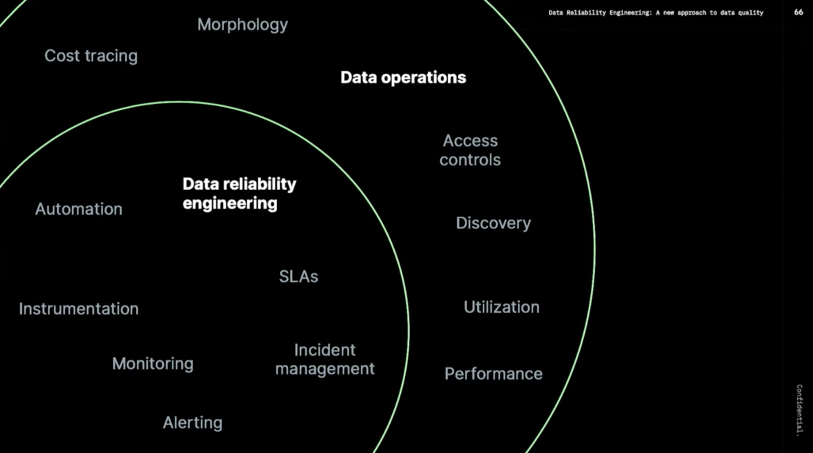
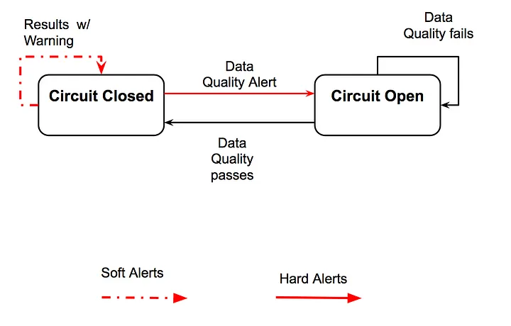

# 1.3. 데이터 엔지니어는 어떻게 진화하고 있을까?

> 빅데이터 시대의 데이터 엔지니어와 AI 상용화 시대의 데이터 엔지니어의 역할은 어떻게 진화하고 있는지 알아보자!

## 1.3.1. 데이터 엔지니어 커리어 패스

<aside>
💡 주니어 데이터 엔지니어부터 선임 데이터 엔지니어까지의 커리어 패스

</aside>

데이터 엔지니어의 경력 경로는 회사의 규모와 데이터 팀의 성숙도에 따라 달라질 수 있습니다. 그러나 대부분의 데이터 엔지니어는 일반적으로 다음 경로를 따릅니다.

- 주니어 데이터 엔지니어
- 중간 수준의 데이터 엔지니어
- 선임 데이터 엔지니어
- 고위 관리 역할

Software Engineer와 Data Engineer의 커리어 패스는 비슷하면서도 다른 점들이 많은 것 같습니다 :)

### `📌 데이터 엔지니어 커리어 패스`

 접기/펼치기 

  
#### 주니어 데이터 엔지니어
  
  > 나중에 경력에서 사용해야할 도구에 대해 배우고 실습 경험을 얻는 시간
  - 기존 시스템 유지 관리.지원업무
  - 시스템 테스트, 디버깅, 기존 시스템 기능 추가 및 개선 작업
  - 선배 동료 지원 역할
  - 다른 팀과 부서와 함께 작업하며 문제와 질문에 대한 해결책을 찾는 방법 학습
  
  경력을 막 시작할 때 주니어 데이터 엔지니어는 일반적으로 기존 시스템을 유지 관리하고 지원하는 작은 작업을 수행합니다. 이것은 시스템을 테스트하고 버그를 찾고 수정하는 것부터 기존 시스템에 기능을 추가하는 것까지 무엇이든 될 수 있습니다. 이러한 초기 단계에서 주니어는 일반적으로 자신의 프로젝트를 수행하지 않고 대신 선배 동료를 지원하는 역할을 맡습니다.
  
  주니어 데이터 엔지니어로서 처음 몇 년 동안 가장 중요한 부분은 나중에 경력에서 사용해야 할 도구에 대해 배우고 실습 경험을 얻는 것입니다. 그들은 또한 다른 팀과 부서가 함께 작업하여 문제와 질문에 대한 해결책을 찾는 방법을 배우고 있습니다.
  
  #### 중간 수준의 데이터 엔지니어(`feat. 중니어 데이터 엔지니어`)
  
  - 프로젝트 관리를 시작할 수 있음. 다른 팀 및 부서와 더 많이 협력해야 할 수도 있음
  - 일반적으로 데이터 과학자 및 분석 팀 구성원을 지원하는 시스템을 설계하고 구축하는 책임이 있음
  - 프로그래밍 기술 개발 능력 향상 단계
  - 발생하는 버그나 문제를 식별하고 수정할 수 있으며 팀 내외 원활하게 협업하는 단계
  
  데이터 엔지니어는 약 1~3년 후에 중간 레벨로 승진할 수 있습니다. 이때 그들은 업무의 더 많은 프로젝트 관리 측면에 노출될 수 있으며 다른 팀 및 부서와 더 많이 협력해야 할 수도 있습니다.
  
  그들은 일반적으로 데이터 과학자 및 기타 분석 팀 구성원을 지원하는 시스템을 설계하고 구축하는 책임이 있습니다. 이 단계에서는 여전히 선임 데이터 엔지니어의 감독을 받고 있을 수 있습니다. 이 일을 효과적으로 수행하기 위해서는 좋은 의사소통 기술을 개발하고 다른 팀과 잘 협력할 수 있어야 합니다.
  
  데이터 엔지니어는 약 3~5년 동안 이 수준에 머물 수 있습니다. 이 기간 동안 그들은 프로그래밍 기술을 개발하고 조직에서 사용되는 모든 도구와 시스템에 익숙해야 합니다. 발생하는 모든 버그나 문제를 식별하고 수정할 수 있으며 팀 내외에서 원활하게 협업합니다.
  
  #### 선임 데이터 엔지니어
  
  - 더 많은 관리 책임을 맡게 됨
  - 기술적 측면에서 능숙하며 비교적 쉽게 시스템을 구축하고 문제를 해결할 수 있음
  - 비즈니스 측면에 더 밀접하게 관여하며 데이터 프로젝트의 방향과 시스템의 장기적인 효율성 및 최적화에 대해 전략적으로 생각하기 시작하는 단계
  - 많은 데이터 엔지니어는 전략 및 비즈니스 책임에 대한 열정이 없을 수 있으므로 회사에서 더 이상 발전하지 않기로 선택할 수 있다고 함
  
  데이터 엔지니어가 고위직에 도달하면 더 많은 관리 책임을 맡게 됩니다. 그들은 한 명 이상의 데이터 엔지니어를 감독해야 할 수 있으며 프로젝트가 나올 때 가르치고 프로젝트를 할당해야 합니다.
  
  이 단계에서 데이터 엔지니어는 역할의 기술적 측면에 능숙하며 비교적 쉽게 시스템을 구축하고 문제를 해결할 수 있습니다. 그러나 그들은 이제 사물의 비즈니스 측면에 더 밀접하게 관여하고 있으며 데이터 프로젝트의 방향과 시스템의 장기적인 효율성 및 최적화에 대해 전략적으로 생각할 필요가 있습니다.
  
  이를 위해서는 데이터 엔지니어가 생각하는 방식의 변화가 필요하며 이는 어려울 수 있습니다. 많은 데이터 엔지니어는 전략 및 비즈니스 책임에 대한 열정이 없을 수 있으므로 회사에서 더 이상 발전하지 않기로 선택할 수 있습니다.
  
  #### 고위 관리 역할
  
  데이터 엔지니어가 약 6년 이상의 경험을 쌓으면 다음과 같은 선택에 따라 더 많은 관리 역할로 이동할 수 있습니다.
  
  - 데이터 엔지니어링 관리자
  - 데이터 엔지니어링 이사
  - 최고 데이터 책임자

  ### 이 외에 필요한 역량
  
  - 강력한 데이터 인프라 및 데이터 아키텍처 기술 보유 역량
  - 분석 팀을 관리하고 확장할 수 있는 역량
  - 고성능 시스템 개발을 위한 프로세스 정의
  - 새로운 프로젝트 범위 기획
  - 신규 및 기존 시스템에 대한 SLA 정의 및 관리
  
  낮은 수준에서 얻은 기술에 매우 능숙한 것 외에도 이러한 역할은 데이터 엔지니어가 강력한 데이터 인프라 및 데이터 아키텍처 기술을 보유하고 분석 팀을 관리하고 확장할 수 있어야 합니다. 또한 고성능 시스템을 개발하기 위한 프로세스를 정의하고, 새로운 프로젝트의 범위를 정하고, 신규 및 기존 시스템에 대한 SLA를 정의 및 관리할 수 있어야 합니다.
  

[What Does a Data Engineer Do? Everything You Need to Know](https://www.datacamp.com/blog/what-does-data-engineer-do)

## 1.3.2. 현대 데이터 엔지니어(2023.ver)

- `Data Reliability Engineering`

### `주요 포인트`

> I don’t know if this dashboard looks correct…I don’t if something looks suspicious…

→ 데이터 퀄리티가 보장되지 않을 경우 데이터 팀은 원인을 찾는 과정을 반복해야 할지도 모릅니다. 연간 낭비되는 금액이 무려 $12.9 million에 달한다고 합니다…

> The infrastructure for data became easy 
> the last prolem which is reliability 
- 소프트웨어 엔지니어링에서 인프라의 발전처럼 데이터 엔지니어링의 인프라 발전이 도래하게 되었습니다
    - 더이상 이전처럼 직접 데이터 센터를 구성하고 데이터 웨어하우스를 설치할 필요 없이 단 몇분 안에 원하는 데이터 웨어하우스를 구성할 수 있게 되었습니다
- 데이터 웨어하우스의 구성이 쉬워진 것과 함께 ETL/ELT도 너무나도 쉽게 할 수 있는 환경이 갖춰졌습니다
- 데이터 엔지니어링 생애주기에서 남은 문제는 `데이터 신뢰성(Data Reliability)문제`라고 합니다
    - 데이터가 제 때 제공되는지
    - 내가 원하는대로 데이터가 제공 되는지
- 데이터 신뢰성(Data Reliability) 문제는 현대에 발생한 문제입니다
    - 데이터 스케일이 커지는 속도를 팀이 커지는 속도가 따라가지 못하면서 발생한 문제로 정의했습니다

발표자는 데이터 엔지니어링의 종착점은 운영 단계에서 데이터 품질 보장, 데이터 출처 파악 등 데이터의 품질을 향상시키는데 있다고 합니다.

- `SRE Principles`
    - Embrace risk - 위험 감수
    - Set standards - 표준 설정
    - Reduce toil - 수고 줄이기
    - Monitor everything - 모든 것을 모니터링
    - Use automation - 자동화 사용
    - Control releases - 제어 릴리즈
    - Favor simplicity - 단순함 선호

> Treating data quality like an engineering problem

`Data Reliability Engineering`이란 데이터 팀이 데이터 환경의 반복 속도를 잃지 않고 주요 응용 프로그램(의사 결정, AI/ML 프로젝트 및 내장된 분석)에서 사용하기에 적합한 상태를 유지하기 위해 데이터 팀이 채택해야 하는 주요 사례

> 새벽 2시에 일어나서 부서진 파이프라인을 수정하는 것을 막아준다. 단 2개의 박스로 표현한 심플함!

접기/펼치기

### AWS serverless data analytics pipeline reference architecture (by AWS)
[AWS serverless data analytics pipeline reference architecture | Amazon Web Services](https://aws.amazon.com/ko/blogs/big-data/aws-serverless-data-analytics-pipeline-reference-architecture/)

## **Logical architecture of modern data lake centric analytics platforms**

## **Serverless data lake centric analytics architecture**

To compose the layers described in our logical architecture, we introduce a reference architecture that uses AWS serverless and managed services. In this approach, AWS services take over the heavy lifting of the following:

- Providing and managing scalable, resilient, secure, and cost-effective infrastructural components
- Ensuring infrastructural components natively integrate with each other

This reference architecture allows you to focus more time on rapidly building data and analytics pipelines. It significantly accelerates new data onboarding and driving insights from your data. The AWS serverless and managed components enable self-service across all data consumer roles by providing the following key benefits:

- Easy configuration-driven use
- Freedom from infrastructure management
- Pay-per-use pricing model

The following diagram illustrates this architecture.

## 1.3.3. 데이터 과학 경력의 출발점으로서의 데이터 엔지니어

> 데이터 과학 경력의 출발점으로서 데이터 엔지니어 직군을 선택하셨다면 아래의 필수 스킬에 대한 고민이 필요할 것 같습니다!
> 
- `Coursera Introduction to Data Engineering 중`
    - **`코딩`:** 코딩 언어 능숙도는 이 역할에 필수적이므로 기술을 배우고 연습하는 과정을 수강하는 것이 좋습니다. 일반적인 프로그래밍 언어에는 SQL, NoSQL, Python, Java, R 및 Scala가 포함됩니다.
    - **`관계형 및 비관계형 데이터베이스`:** 데이터베이스는 데이터 저장을 위한 가장 일반적인 솔루션 중 하나입니다. 관계형 및 비관계형 데이터베이스와 작동 방식에 대해 잘 알고 있어야 합니다.
    - **`ETL(추출, 변환 및 로드) 시스템`:** ETL은 데이터베이스 및 기타 소스에서 데이터 웨어하우스와 같은 단일 리포지토리로 데이터를 이동하는 프로세스입니다. 일반적인 ETL 도구에는 Xplenty, Stitch, Alooma 및 Talend가 포함됩니다.
    - **`데이터 저장`:** 특히 빅 데이터의 경우 모든 유형의 데이터를 동일한 방식으로 저장해야 하는 것은 아닙니다. 예를 들어 회사의 데이터 솔루션을 설계할 때 데이터 레이크와 데이터 웨어하우스를 사용할 시기를 알고 싶을 것입니다.
    - **`자동화 및 스크립팅`:** 조직에서 많은 정보를 수집할 수 있기 때문에 자동화는 빅 데이터 작업에 필요한 부분입니다. 반복 작업을 자동화하는 스크립트를 작성할 수 있어야 합니다.
    - **`머신 러닝`:** 머신 러닝은 데이터 과학자의 관심사이지만 팀의 데이터 과학자의 요구 사항을 더 잘 이해하려면 기본 개념을 파악하는 것이 도움이 될 수 있습니다.
    - **빅 데이터 도구:** 데이터 엔지니어는 일반 데이터로만 작업하지 않습니다. 그들은 종종 빅 데이터를 관리하는 임무를 맡습니다. 도구와 기술은 진화하고 있으며 회사마다 다르지만 일부 인기 있는 기술로는 Hadoop, MongoDB 및 Kafka가 있습니다.
    - **`클라우드 컴퓨팅`:** 회사에서 점점 더 클라우드 서비스를 위해 물리적 서버를 거래함에 따라 클라우드 스토리지 및 클라우드 컴퓨팅을 이해해야 합니다. [초보자는 Amazon Web Services(AWS)](https://www.coursera.org/learn/aws-fundamentals-going-cloud-native) 또는 [Google Cloud](https://www.coursera.org/learn/gcp-big-data-ml-fundamentals?specialization=gcp-data-engineering) 과정을 고려할 수 있습니다 .
    - **`데이터 보안`:** 일부 회사에는 전담 데이터 보안 팀이 있을 수 있지만 많은 데이터 엔지니어는 여전히 데이터를 손실 또는 도난으로부터 보호하기 위해 데이터를 안전하게 관리하고 저장해야 합니다.