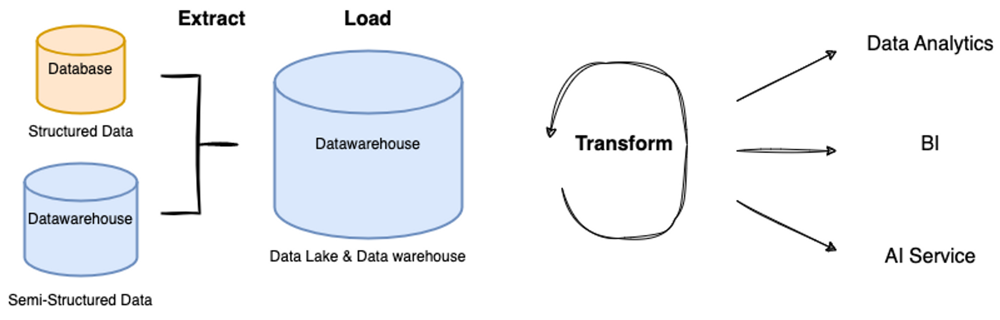

# 1.4. 데이터 엔지니어는 어떤 고민을 할까?

<aside>
📌 (feat. `발표자 사례, 스터디 러너 사례 취합 예정`)

</aside>

> 데이터 엔지니어는 어떤 고민을 갖고 있을까?
데이터 엔지니어가 갖고 있는 고민을 털어놓고 문제를 하나씩 해결해 나가자! 😃
> 

## 발표자 사례

많은 양의 데이터가 생성되는데 이를 수집.가공.처리하는 `파이프라인을 효율적으로 개선`하는 작업 중에 있습니다.

- 만으로 3년차 이하이기에 Data Camp 기준 ‘`주니어 데이터 엔지니어`’로 정의하겠습니다
    - 지난 1월 18일 실시간 예약 서비스를 제공하는 외식업 스타트업의 데이터 엔지니어로 합류했습니다
    - 지난 1분기를 한 번 회고해봤습니다
- `변화`
    - 자체 프로덕트가 있는 IT 서비스의 인하우스 데이터 엔지니어로 커리어 전환(Data Specialist → Data Engineer)
    - 데이터 지원 조직 합류 → 데이터 사이언스랩(데이터 파트 데이터 엔지니어)
- `한일`
    - 서비스, 데이터, 데이터 환경을 이해하는데 대부분의 시간을 사용
    - 데이터 지원 요청 사항 대응과 동시에 서비스.데이터 구조 파악
        - 다양한 유관부서의 데이터 분석 요청건 처리
        - 데이터 지원 요청 사항을 처리하면서 데이터를 이해하고 비즈니스 및 서비스를 이해하고 있음
    - *(빠른 개발 → 누락된 문서화 → 데이터 구조 및 데이터 이해 필요 → 조직내 문서 참고 → 데이터 이해 → 개발자 인터뷰 → 데이터 구조 및 데이터 이해 → ERD 작성 → 공유 → 분석계 데이터 환경 구성 논의 → PoC 수행)*
    - 협업 및 프로세스 개선을 위한 환경 개선
- `할일`
    
    > 통합 분석 환경 구성을 위해 데이터 아키텍처는 어떻게 가져가면 좋을지, 해당 파이프라인의 진행 단계마다 데이터 품질을 어떻게 보장하면 좋을지, 결과 데이터를 유의미하게 활용하기 위해서는 어떻게 해야하는지 고민에 고민에 고민을 더합니다…!
    - 통합 분석 환경 구성
    - 데이터 품질 향상
    - 분석 프로세스 최적화
    - 대시보드 개발 및 운영
    - 데이터 파이프라인 개발 및 운영
