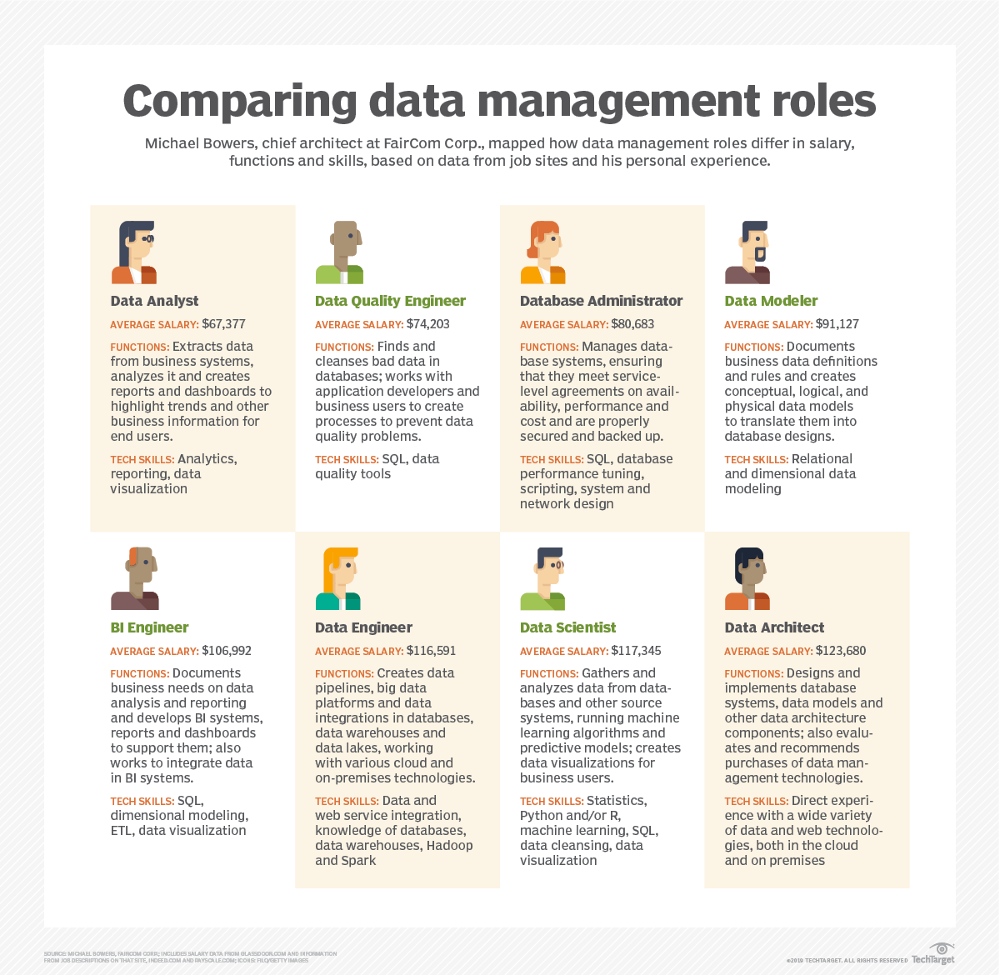
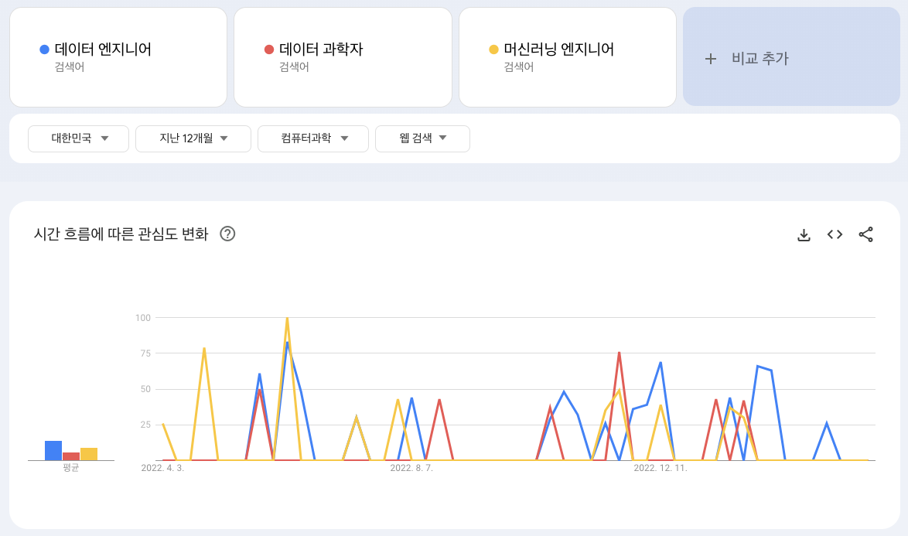
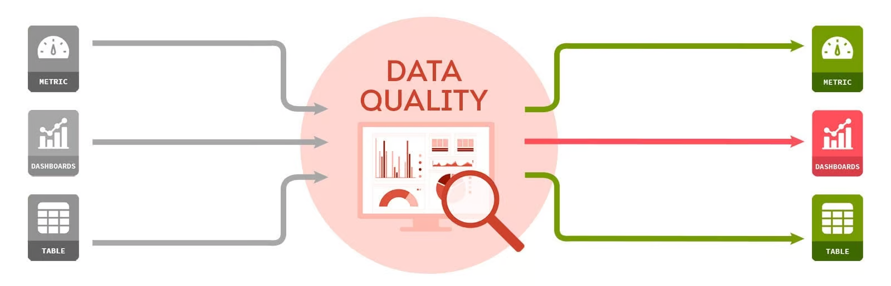
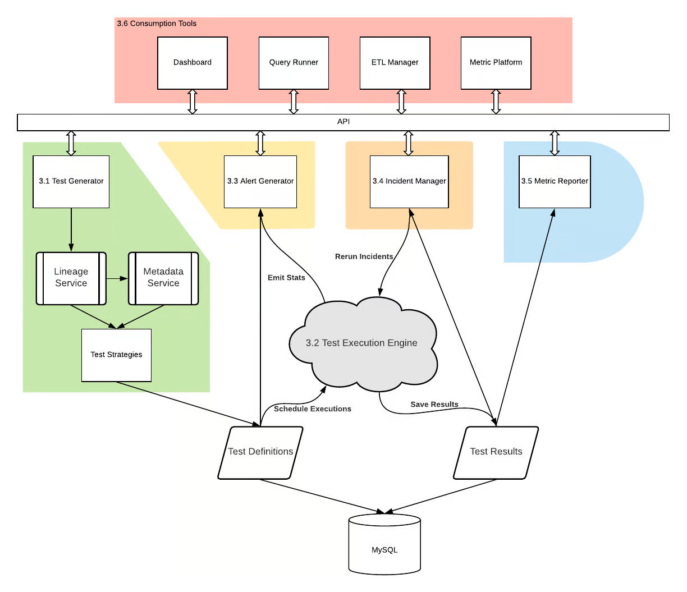

# `🗂️ 참고자료(Reference)`

## 1. 이전 스터디 자료

<aside>
💡 DE4E는 가짜연구소 5기 'Data Engineer with Python' 후속 스터디입니다! 함께 보시면 좋습니다!

</aside>

- Introduction to Data Engineering
    - Data Engineer vs Data Scientist
    - Introduction to Data Engineering
        - Cloud Computing
    - Data Engineering Toolbox
        - Database
        - Structured data and unstructured data
        - SQL and NoSQL
        - Parallel computing
        - Parallel computation frameworks
        - workflow scheduling frameworks

## 2. 데이터 엔지니어링이란 무엇일까?

- 데이터 엔지니어링이란?
    1. 짧은 영상

[What Is a Data Engineer?: A Guide to This In-Demand Career](https://www.coursera.org/articles/what-does-a-data-engineer-do-and-how-do-i-become-one)

- 데이터 엔지니어링이란?
    - 블로그 포스팅

[What is Data Engineering?](https://www.datacamp.com/blog/what-is-data-engineering)

## 1. 데이터 엔지니어는 어떤 일을 하는 사람일까?

2. Data Camp, Data Engineer:

- Data Camp에서 발행한 문서
- 데이터 과학자 vs 데이터 엔지니어
    
    → 이제는 엄마냐 아빠냐와 같이 다가오는 주제네요…ㅎㅎ
    

[Data Scientist vs Data Engineer](https://www.datacamp.com/blog/data-scientist-vs-data-engineer)

3. 데이터 엔지니어에 대한 정의

- 데이터와 관련된 다양한 직군에 대해서 보여줍니다
- 데이터 엔지니어, 데이터 분석가, 데이터 과학자 외에 다양한 직군에 대해서 일목 요연하게 정리한 인포그래픽이 인상적입니다

[What is a data engineer and what do they do?](https://www.techtarget.com/searchdatamanagement/definition/data-engineer)

## 2. 데이터 엔지니어의 핵심 역량은 무엇일까?

* [국내] 카카오 데이터 엔지니어링이란?
  - 국내 최대 IT 기업중 한 곳인 카카오의 기술 블로그 글입니다
  - 데이터 엔지니어링이란 무엇인지 엔지니어분께서 쉽게 정리해주셨습니다 
  - [데이터 엔지니어링이란](https://tech.kakao.com/2020/11/30/kakao-data-engineering/)

* [국내] 채용공고 톺아보기. 데이터 엔지니어란?
  - 데이터로 일하는 조직, 데이터 직군에 대해서 상세히 정리해둔 글입니다
  - 데이터 엔지니어, 데이터 분석가, 데이터 과학자 직군 중 어느 직군으로 가야할지 고민이시라면 한 번 살펴보시기를 권장드립니다
  - [[채용공고 톺아보기] #6 데이터 엔지니어란?](https://brunch.co.kr/@13335218e68a4e8/96)

* [국내] 데이터 집중 직무의 모든 것:
  - 마찬가지로 데이터 직무에 대한 문서입니다
  - 일러스트가 상당히 매력적이네요
  - [데이터 집중 직무의 모든 것: 데이터 엔지니어, 데이터 사이언티스트, 데이터 분석가 : 다이티 데이터 마켓 - 콘텐츠](https://market.dighty.com/contents/?idx=7614796&bmode=view)

* Data Engineer vs Software Engineer
  - 최근 Google Cloud의 데이터 세션에서 *근마켓 데이터 엔지니어분의 세션을 듣던 중 궁금증이 발생했던 주제입니다
  - Data Engineer와 Software Engineer란 어떤 점에서 비슷할까? 그리고 어떤 차이가 있을까?
  - 물음에 대한 답을 찾고자 한 번 더 찾아보았습니다
  - [Data Engineer vs. Software Engineer: Choosing the Right Career Path](https://gb.coursera.org/articles/data-engineer-vs-software-engineer)

## 3. 데이터 엔지니어링은 어떻게 진화하고 있을까?
- 당근마켓과 함께 성장하며 데이터 신뢰성 지켜내기
  - [20230112 당근마켓과 함께 성장하며 데이터 신뢰성 지켜내기 - 수군수군 데이터 엔지니어 밋업 1회 (공유용)](https://docs.google.com/presentation/d/1tBm4iA_Zx2QtQAUmaYctzz6Ow9RAJTHloDtqZgfL5mU/edit#slide=id.g5ed592767b_0_192)
- Data Reliability Engineer란 무엇일까?
  - [Data Reliability Engineering: A New Approach to Data Quality | Bigeye](https://www.youtube.com/watch?v=u7sJmmAyJT4)
- 데이터 직군은 어떤 특징을 갖고 있을까?
  - [A Guide to Data Roles — Data Captains](https://www.datacaptains.com/blog/guide-to-data-roles)

## 4. 국내 검색 트렌드는 어떻게 될까?
* [https://trends.google.com/trends/explore?cat=1227&geo=KR&q=데이터 엔지니어,데이터 과학자,머신러닝 엔지니어&hl=ko](https://trends.google.com/trends/explore?cat=1227&geo=KR&q=%EB%8D%B0%EC%9D%B4%ED%84%B0%20%EC%97%94%EC%A7%80%EB%8B%88%EC%96%B4,%EB%8D%B0%EC%9D%B4%ED%84%B0%20%EA%B3%BC%ED%95%99%EC%9E%90,%EB%A8%B8%EC%8B%A0%EB%9F%AC%EB%8B%9D%20%EC%97%94%EC%A7%80%EB%8B%88%EC%96%B4&hl=ko)

# 더 보기

---

## 유용한 GitHub 저장소 모음

- query book
    * [GitHub - pinterest/querybook: Querybook is a Big Data Querying UI, combining collocated table metadata and a simple notebook interface.](https://github.com/pinterest/querybook)

- awesome-public-datasets
    - 토이프로젝트에 활용 가능한 데이터
    * [GitHub - awesomedata/awesome-public-datasets: A topic-centric list of HQ open datasets.](https://github.com/awesomedata/awesome-public-datasets)

## Global Tech 기업의 블로그
- Airbnb Data Engineering blog
  - [Data Engineering – The Airbnb Tech Blog – Medium](https://medium.com/airbnb-engineering/tagged/data-engineering)

- How User Achieves Operational Excellence in the Data Quality Experience
  * [How Uber Achieves Operational Excellence in the Data Quality Experience | Uber Blog](https://www.uber.com/blog/operational-excellence-data-quality/)
    * 

  - 우버의 데이터 품질 보장 사례
  - Data Quality Platform Architecture
    - 

## Data Literacy
* [Introducing The State of Data Literacy Report 2023](https://www.datacamp.com/blog/introducing-state-of-data-literacy-report)

## How to Write Data Job Description
* [How to Write A Data Engineer Job Description](https://www.datacamp.com/blog/data-engineer-job-description)
