# Session 1. Introduction to Data Engineering

# 세션 주제: Introduction to Data Engineering

---

## 시작에 앞서

`📌 부탁의 말씀!`

- 적극적으로 참여해주신 분들께는 `Award`를…!
- 일방적인 강의 전달식 세션이 되지 않도록… 도와주세요…! 🙏

## 부제: '도대체 Data Engineering이란 무엇일까?' 🤫

---

오늘 이 시간은 저를 포함한 스터디 러너분들의 물음에서 시작된 질문에 대한 답을 하는 시간입니다. 앞으로 다루게 될 데이터 엔지니어링에 대해서 궁금증을 갖고 그 물음을 하나씩 채워나갈 수 있는 시간이 되셨으면 좋겠습니다!

> *다루고 싶은 주제들이 정말 많지만..! 우선순위가 높은 주제부터 다뤄보도록 하겠습니다!*
> 
- 데이터 엔지니어링이란 무엇일까?
    - 데이터 엔지니어는 어떤 일을 하는 사람일까?
    - 데이터 엔지니어의 핵심 역량은 무엇일까?
- ~~데이터 엔지니어가 반드시 알고 넘어가야 할 업무 용어 살펴보기~~
- 사례를 통해 알아보는 데이터 엔지니어링
- 데이터 엔지니어링 생애주기(Data Engineering Lifecycle)
- 데이터 엔지니어는 어떻게 진화하고 있을까?
    - DRE(Data Reliability Engineer)
- 데이터 엔지니어는 어떤 고민을 할까? (`사례 공유, 스터디 러너 사례 취합 예정`)

#데이터 엔지니어링 #데이터 엔지니어 #데이터 엔지니어의 역할 
#데이터 저장소 #데이터 처리 
#데이터 아키텍처 #데이터 파이프라인 
#데이터 품질(Data Quality) 

#데이터 계보(Data Lineage) 
#실제 사례 공유

- `이미지 출처`
    
    [https://ww2.kqed.org/app/uploads/sites/23/2012/10/134031979.jpg](https://ww2.kqed.org/app/uploads/sites/23/2012/10/134031979.jpg)
    

## `사전 공지`

- `📌 사전 공지 내용`
    
    1) Data Engineering에 대한 정의, Data Engineer란?, Data Engineer의 역할, 
    --- (살펴보기) 국내 IT 서비스 기업의 Data Engineer 역할, 글로벌 IT 서비스 기업의 Data Engineer 역할,
    2) 원천 데이터, 데이터 처리, 데이터 저장, 데이터 아키텍쳐 vs 데이터 파이프라인,  Data Quality, Data Lineage
    --- 데이터 엔지니어가 반드시 알아야할 업무 용어 파헤치기
    3) Data Engineering LifeCycle(코세라 MLOps LifeCycle참고)
    —- 데이터 엔지니어링 생애 주기에 대해서 간단히 짚고 넘어가도록 하겠습니다.
    
    ------
    ------
    
    ## 이외 다뤄보고 싶은 주제들...
    
    ------
    [ ] Data Engineer Roadmap
    [ ] Modern Data Stack
    [ ] Modern Data Pipeline
    [ ] 데이터 엔지니어링 조직에서 실제 마주하는 문제들(고민들
    [ ] ......
    

<aside>
💡 이제 시작합니다 😃

</aside>

# ▶️ Introduction to Data Engineering

---

- 우리는 빅데이터 시대에 살고 있습니다
- 데이터 엔지니어링이란 무엇일까?
    - 데이터 엔지니어는 어떤 일을 하는 사람일까?
    - 데이터 엔지니어의 핵심 역량은 무엇일까?
- ~~데이터 엔지니어가 반드시 알고 넘어가야 할 업무 용어 살펴보기~~
- 사례를 통해 알아보는 데이터 엔지니어링
- 데이터 엔지니어는 어떻게 진화하고 있을까?
    - DRE(Data Reliability Engineer)
- 데이터 엔지니어는 어떤 고민을 할까? (`사례 공유, 스터디 러너 사례 취합 예정`)

## 우리는 빅데이터 시대에 살고 있습니다

> 2025년까지 전 세계적으로 매일 463엑사바이트의 데이터가 생성될 것으로 예상됩니다. 이는 하루에 212,765,957개의 DVD에 해당합니다!
> 
- 5억 개의 트윗이 전송됩니다!
- 2,940억 개의 이메일이 전송됩니다!!
- 4페타바이트의 데이터가 Facebook에서 생성됩니다!!!
- 커넥티드카 1대당 4테라바이트의 데이터 생성됩니다!!!!
- 650억 개의 메시지가 WhatsApp으로 전송됩니다!!!!!
- 50억번 검색이 발생합니다!!!!!

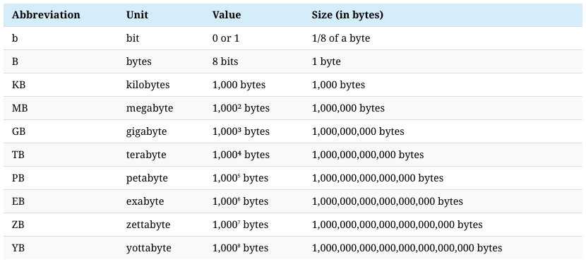

*→ 2019년 기준의 데이터만해도 위와 같은데… 2023년인 현재는 얼마나 더 많은 데이터가 발생하고 있을지 짐작이 가시나요?!* 😅

[How much data is generated each day?](https://www.weforum.org/agenda/2019/04/how-much-data-is-generated-each-day-cf4bddf29f/)

<aside>
💡 빅데이터 시대에 가장 중요한 역량은 무엇일까?

</aside>

> 빅데이터 시대에서 가장 중요한 역량은 `데이터 분석 및 해석 능력`입니다.
> 

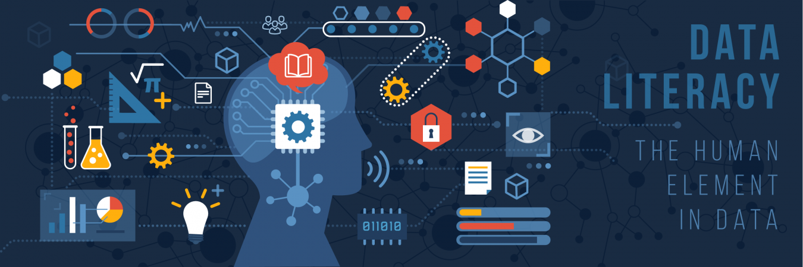

데이터를 정보로서 읽고 이해하고 생성하고 전달할 수 있는 역량이 중요해지는 시대에 살고있습니다.

- `데이터 분석 및 해석 능력(살펴보기)`
    
    
    
    데이터를 분석하고 해석하는 역량을 ‘Data Literacy’라고 정의할 수 있습니다. 위키피디아에서는 ‘Data Literacy’를 다음과 같이 정의했습니다. 데이터를 정보로 읽고 이해하고 생성하고 전달할 수 있는 능력이다. 데이터 작업과 관련된 역량에 중점을 둔다. 데이터를 읽고 이해하기 위해서 기술적인 역량이 필요할수도 있다.
    
    빅데이터는 막대한 양의 데이터를 생성하고 저장할 수 있는 기술을 통해 수집된 데이터를 의미합니다. 이러한 데이터는 기업, 정부, 학계 등에서 중요한 의사결정에 영향을 미치는데 사용됩니다. 그러나 데이터만 수집한다고 해서 충분한 것은 아닙니다.
    
    데이터를 분석하고 해석하여 의미 있는 정보를 추출하고 이를 토대로 문제를 해결하거나 기회를 찾아내는 것이 중요합니다. 따라서 빅데이터 시대에는 데이터 분석 기술과 통계학적 지식, 데이터 시각화 능력 등이 필요합니다.
    
    또한, 컴퓨터 프로그래밍과 기계 학습, 인공지능 등의 기술적 지식도 중요합니다. 이러한 기술을 활용하여 빅데이터를 처리하고 분석하는데 있어서 더욱 높은 효율성과 정확성을 달성할 수 있기 때문입니다.
    
    마지막으로, 커뮤니케이션 능력도 중요합니다. 데이터 분석 결과를 이해하기 어려운 사람들에게 설명하고 그들이 이를 활용할 수 있도록 지원하는 것이 빅데이터 분석가의 중요한 역할 중 하나입니다. 따라서 빅데이터 분석가는 기술적인 역량과 커뮤니케이션 능력을 모두 갖추어야 합니다.
    

<aside>
💡 빅데이터 시대에 데이터 엔지니어에게 요구되는 역량은 무엇일까?

</aside>

- `빅데이터 시대에 데이터 엔지니어에게 요구되는 역량(살펴보기)`
    1. `데이터베이스 기술`: 데이터 엔지니어는 대량의 데이터를 수집, 저장, 처리할 수 있는 데이터베이스 기술에 대한 이해가 필요합니다. 특히, 분산 데이터베이스, NoSQL, Hadoop, Spark 등과 같은 대용량 데이터 처리 기술에 대한 이해가 필요합니다.
    2. `프로그래밍`: 데이터 엔지니어는 데이터 처리를 자동화하고, 데이터 플로우를 최적화하기 위해 프로그래밍 기술이 필요합니다. 특히, Python, Java, Scala 등과 같은 프로그래밍 언어에 대한 이해와 사용 경험이 필요합니다.
    3. `클라우드 컴퓨팅`: 클라우드 컴퓨팅 기술을 활용하여 대규모 데이터를 저장하고 처리할 수 있어야 합니다. 데이터 엔지니어는 AWS, Azure, Google Cloud Platform 등과 같은 클라우드 플랫폼에 대한 이해와 사용 경험이 필요합니다.
    4. `분산 시스템`: 데이터 엔지니어는 대규모 데이터를 처리하는 분산 시스템에 대한 이해가 필요합니다. 특히, Hadoop, Spark, Kafka, Flink 등과 같은 분산 시스템을 이해하고 사용할 수 있어야 합니다.
    5. `데이터 아키텍처`: 데이터 엔지니어는 데이터 아키텍처를 설계하고, 데이터 파이프라인을 구축하는 역할을 수행합니다. 이를 위해 데이터 모델링, 데이터 아키텍처 설계, ETL 등의 지식과 경험이 필요합니다.
    6. `문제 해결 능력`: 데이터 엔지니어는 대량의 데이터를 다루는 과정에서 생기는 문제를 해결하기 위한 능력이 필요합니다. 따라서 데이터 분석, 시스템 튜닝 등의 문제 해결 능력이 요구됩니다.
    7. `커뮤니케이션 능력`: 데이터 엔지니어는 데이터 관련 이슈를 비전문가에게 설명하고, 데이터와 관련된 의사 결정을 지원하는 역할을 수행합니다. 따라서 커뮤니케이션 능력이 요구됩니다.

여기에 데이터 품질(Data Quality)를 보장하는 엔지니어링 역량이 더욱 중요해질 것 같다는 생각을 하게 되었습니다. 자세한 사항은 뒤에서 다루도록 하겠습니다!

- `📌 📘 함께 보면 좋은 자료`
    
    ## 5기 스터디 자료 - Data Engineer with Python
    
    <aside>
    💡 함께 보시면 좋습니다!
    
    </aside>
    
    
    
    ## Introduction to Data Engineering
    
    - Data Engineer vs Data Scientist
    - Introduction to Data Engineering
        - Cloud Computing
    - Data Engineering Toolbox
        - Database
        - Structured data and unstructured data
        - SQL and NoSQL
        - Parallel computing
        - Parallel computation frameworks
        - workflow scheduling frameworks

## 📌 1. 데이터 엔지니어링이란 무엇일까?

---

- 데이터 엔지니어링에 대한 정의
- 데이터 엔지니어의 역할
- 데이터 엔지니어의 핵심 역량

### 1.1. 데이터 엔지니어링이란?

> `데이터 엔지니어링`은 데이터를 대규모로 수집, 저장 및 분석하기 위한 시스템을 설계하고 구축하는 작업입니다.
> 

거의 모든 산업 분야에 적용되는 광범위한 분야입니다. 하나의 조직은 방대한 양의 데이터를 수집할 수 있는 능력이 필요하며 데이터 과학자와 분석가에게 데이터가 도달할 때까지 사용 가능한 상태가 되도록 `올바른 사람과 기술`이 필요합니다.

뒤에서 다룰 ‘Data Engineering Lifecycle’을 미리 살펴보면서 데이터 엔지니어가 하는 일을 머릿속으로 그려보도록 하겠습니다.

📌 ***What Is the Data Engineering Lifecycle? - O’Reilly Medea. Fundamentals of Data Engineering***

***`What Is the Data Engineering Lifecycle?`***

> `The data engineering lifecycle` comprises stages that turn raw data ingredients into a useful end product, ready for consumption by analysts, data scientists, ML engineers, and others.
> 

*→ 데이터 엔지니어링 수명 주기(Data Engineering LIfecycle)는 원시 데이터를 분석가, 데이터 과학자, ML 엔지니어 등이 사용할 수 있는 유용한 최종 제품으로 전환하는 단계로 구성됩니다.*

지금은 이 다이어그램이 이해가 되지 않으셔도 됩니다! 오늘의 목표는 마지막에 이 다이어그램의 의미를 이해하는 것입니다!

### 1.2. 데이터 엔지니어의 역할 및 핵심 역량

<aside>
💡 데이터 분석가, 데이터 과학자와 비교하면 데이터 엔지니어의 역할이 보다 명확하게 다가옵니다!

</aside>

- `📌 Data Engineer vs Data Scientist by [DataCamp](https://www.datacamp.com/blog/data-scientist-vs-data-engineer)`
    
    <aside>
    💡 데이터 엔지니어와 데이터 과학자의 역할, 사용 도구, 언어, 전망, 급여 등을 비교해봅니다.
    비교.대조하는 과정에서 보다 명확하게 두 역할의 차이를 구분하실 수 있습니다!
    
    </aside>
    
    [Data Scientist vs Data Engineer](https://www.datacamp.com/blog/data-scientist-vs-data-engineer)
    
    
    
    > 데이터 엔지니어는 데이터베이스 및 대규모 처리 시스템과 같은 아키텍처를 `구성, 개발, 테스트 및 유지 관리`하는 사람입니다. 반면에 데이터 과학자는 (큰)데이터를 `정리, 처리 및 활용` 하는 사람입니다.
    > 
    
    ## 데이터 엔지니어의 역할
    
    - `원시 데이터 처리`
        - 사람, 기계 또는 기기의 오류가 포함된 원시 데이터를 처리(raw data)합니다
        - 데이터가 검증되지 않고 의심스러운 레코드를 포함할 수 있습니다
        - 또한 형식이 지정되지 않으며 시스템에 특화된(system-specific) 코드를 포함할 수 있습니다
    - `데이터 신뢰성, 효율성 및 품질 개선`
        - 데이터 엔지니어는 데이터 신뢰성, 효율성 및 품질을 개선하는 방법을 권장하고 때로는 구현해야 합니다
        - 다양한 언어와 도구를 사용하여 시스템을 결합하거나 다른 시스템에서 새로운 데이터를 얻을 수 있는 기회를 찾아야합니다
    - `데이터 제공`
        - 데이터 사이언스팀에 데이터를 전달하기 위해 데이터 모델링, 마이닝 및 생산을 위한 데이터 세트 프로세스를 개발해야 합니다
    
    ## 데이터 과학자의 역할
    
    - `통계적 방법 및 머신러닝 사용`
        - 일반적으로 1차 정제 및 조작을 통과한 데이터를 확보하고 있습니다. 이를 기반으로 정교한 분석 프로그램, 머신 러닝 및 예측 및 처방 모델링에 사용할 데이터를 준비하는 통계적 방법에 사용할 수 있습니다
    - `다양한 데이터 활용`
        - 모델을 구축하기 위해 산업 및 비즈니스 질문을 조사해야 하며 비즈니스 요구 사항에 답변하기 위해 내부 및 외부 소스의 대량 데이터를 활용해야 하기도 합니다
    - `비즈니스 이해 관계자에게 보고 및 프로덕트 개선`
        - 데이터 과학자가 분석을 완료한 후에는 주요 이해 관계자에게 명확한 이야기를 제시해야 하며 결과가 수락되면 비즈니스 이해 관계자에게 통찰력을 전달할 수 있도록 작업이 자동화되었는지 확인해야 합니다
    
    
    
    - `데이터 엔지니어`는 ETL 목적을 위해 데이터베이스 시스템, 데이터 API 및 도구로 작업하고 데이터 모델링 및 데이터 웨어하우스 설정에 관여합니다.
    - `데이터 과학자`는 예측 모델을 구축하기 위해 통계, 수학 및 기계 학습에 대해 알아야 합니다.
    - `데이터 과학자` 는 데이터 엔지니어링 팀에서 처리한 데이터에 대한 액세스 권한을 얻어야 하므로 분산 컴퓨팅에 대해 알고 있어야 하지만 비즈니스 이해 관계자에게 보고할 수 있어야 합니다. 스토리텔링과 시각화에 중점을 두는 것이 필수적입니다.
    
    
    
    데이터 자체에 대한 이해.조작을 주로 하는 직무가 데이터 엔지니어라면 이러한 데이터에 기반하여 머신러닝 모형을 만들고 시각화를 하여 경영진에 보고하는 역할을 하는 직무가 데이터 과학자입니다
    
    
    
    
    
    
    
    
    
    2015년 Data Camp의 ‘The Data Science Industry: Who Does What (Infographic)’ 게시글에서는 데이터 엔지니어를 ‘All-purpose everyman’이라고 표현했네요…! 한국에서는 ‘데이터 잡부’라는 오명을 쓰고 있지만… 잡부 보다는 팔방미인이 더 어울리는 직군인 것 같습니다!
    
- Data 직군 비교하기
    
    Data Engineer, Data Scientist 외에도 다양한 역할이 존재합니다
    
    
    

## 📌 ~~2. 데이터 엔지니어가 반드시 알고 넘어가야 할 업무 용어 살펴보기~~

- `~~접어두기~~`
    
    > 톺아보기는 스터디가 성숙해지는 단계에서 필요할 것 같습니다 😅
    오늘은 데이터 엔지니어라면 한 번은 들어봤을 만한 주제.용어에 대해서 `간단하게 살펴보도록` 하겠습니다! 😃
    > 
    
    
    
    Google Cloud에서 제공하는 Data Analytics Pipeline 예시입니다.
    데이터를 수집하고(Capture) → 처리하고(Process) → 저장하고(Store) → 분석하고(Analyze) → 활용합니다(Use)
    

## 2. 사례를 통해 알아보는 데이터 엔지니어링

<aside>
💡 데이터 엔지니어라면 한 번쯤 들어봤을만한 주제를 준비해봤습니다 😃
사례를 통해 살펴보면 더 직관적으로 이해할 수 있을 것 같아 사례를 준비해봤습니다! 😃

</aside>

- `데이터 엔지니어링 생애주기(Data Engineering Life Cycle)`: 데이터 엔지니어링 생애 주기에 대해 알아봅니다
- `데이터 분석 아키텍처(Data Analytice Architecture)`: 데이터 분석 플랫폼에 활용되는 데이터 아키텍처에 대해 알아봅니다
- `데이터 엔지니어링 프로젝트(Data Engineering Project) 사례 학습`: 일반적인 데이터 엔지니어링 프로젝트에 대해 알아봅니다
- `데이터 엔지니어링 용어정리 (* Data Engineering Term)`
    - 데이터 베이스(Database): 데이터 엔지니어링의 시작점
    - 데이터 처리(Data Processing): 데이터 엔지니어의 기본 소양
    - 데이터 아키텍처(Data Architecture): 데이터 엔지니어의 일터
    - 데이터 파이프라인(Data Pipeline): 데이터 업무 자동화
    - 데이터 품질(Data Quality): 늦었다고 생각했을 때가 가장 빠르다 1
    - 데이터 계보(Data Lineage): 늦었다고 생각했을 때가 가장 빠르다 2
- `데이터 엔지니어링 생애주기(Data Engineering Life Cycle)`: 데이터 엔지니어링 생애 주기에 대해 알아봅니다

### `📌 ***Data Engineering Lifecycle?***`

(feat. ***O’Reilly Medea. Fundamentals of Data Engineering)***

> `The data engineering lifecycle` comprises stages that turn raw data ingredients into a useful end product, ready for consumption by analysts, data scientists, ML engineers, and others.
> 

*데이터 엔지니어링 수명 주기(Data Engineering Lifecycle)는 원시 데이터를 분석가, 데이터 과학자, ML 엔지니어 등이 사용할 수 있는 유용한 최종 제품으로 전환하는 단계로 구성됩니다.*

앞서 데이터 엔지니어링에 대해 알아봤습니다.

> `데이터 엔지니어링`은 데이터를 대규모로 수집, 저장 및 분석하기 위한 시스템을 설계하고 구축하는 작업입니다.
> 

데이터 엔지니어링의 각 과정을 세분화하면 아래의 다이어그램과 같이 표현할 수 있습니다. 이러한 프로세스를 Data Engineering Lifecycle라고 합니다.

데이터 엔지니어링 생애주기를 떠올리며 하나씩 살펴보도록 하겠습니다!

- `Generation`: 운영되고 있는 서비스에서 저장되는 데이터, 사용자의 행위로부터 발생하는 이벤트 데이터, 외부 API 데이터 등 다양한 경로에서 발생하는 데이터를 일반적으로 소스 데이터(Source Data)라고 부릅니다. 이렇게 다양한 경로에서 발생하는 다양한 유형의 데이터(Structured, Semi-Structured, Unstructured)는 데이터 엔지니어링의 시작점이라고 할 수 있습니다.
- `Ingestion`: 다양한 경로에서 발생하는 다양한 유형의 데이터 중 목적에 맞는 데이터를 수집하는 단계를 Ingestion 단계라고 표현할 수 있습니다. ETL(Extract, Transform, Load) 프로세스에서 Extract와 같은 의미로 사용되곤합니다.
- `Transformation`: 변환(Transformation) 단계란 간단히 말하면 ‘데이터를 처리하는 단계’라고 표현할 수 있습니다. 변환과 관련 된 작업들은 목적에 따라 다양합니다. 단순 Attribute를 선택하는 작업부터 코드 값을 변환하는 작업부터 , 데이터 생성 시간을 추가하는 작업, Column을 여러개로 나누는 작업, 다양한 소스 데이터를 조인하는 작업등이 있습니다.
- `Serving`: “저장소에 저장된 데이터를 필요한 조직, 서비스에 전달하는 단계”
    - 먼저 분석 및 BI용 데이터를 제공합니다. 통계 분석, 보고 및 대시보드에 사용할 데이터를 준비합니다. 이것은 가장 전통적인 데이터 서비스 영역입니다. 틀림없이 IT와 데이터베이스보다 앞서지만 이해 관계자가 비즈니스, 조직 및 재무 프로세스에 대한 가시성을 확보하는 것이 그 어느 때보다 중요합니다.
    - 둘째, ML 애플리케이션용 데이터를 제공합니다. ML은 적절하게 준비된 고품질 데이터 없이는 불가능합니다. 데이터 엔지니어는 데이터 과학자 및 ML 엔지니어와 협력하여 모델 교육에 필요한 데이터를 수집, 변환 및 제공합니다.
    - 셋째, 역 ETL을 통해 데이터를 제공합니다. *`역방향 ETL`은* 데이터를 데이터 원본으로 다시 보내는 프로세스입니다. 예를 들어 광고 기술 플랫폼에서 데이터를 수집하고 이 데이터에 대한 통계 프로세스를 실행하여 클릭당 비용 입찰가를 결정한 다음 이 데이터를 다시 광고 기술 플랫폼에 제공할 수 있습니다. 역 ETL은 BI 및 ML과 매우 얽혀 있습니다.
        
        
        

*→ 이 외에 `보안`, `데이터 관리`, `데이터 옵스`, `데이터 아키텍처`, `오케스트레이션`, `소프트웨어 엔지니어링` 등 다양한 기술과 패턴을 적용한 종합 예술이라고 할 수 있습니다!*

### 📌 Data Analytics Architecture - **Logical architecture of modern data lake centric analytics platforms**

- `Modern Data Like Centric Analytics Platforms`
    
    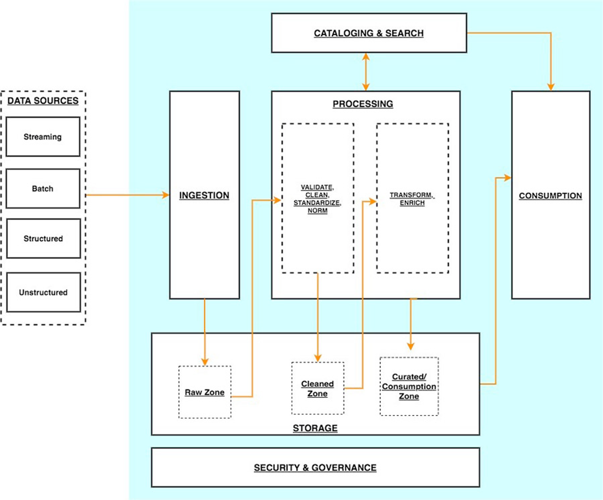
    
    > 데이터 레이크 중심 분석 아키텍처를 각 계층이 `여러 구성 요소로 구성된 6개의 논리적 계층 스택으로 상상`할 수 있습니다. 계층화된 구성 요소 지향 아키텍처는 관심사 분리, 작업 분리 및 유연성을 촉진합니다. 이는 새로운 데이터 소스를 신속하게 통합하고, 새로운 분석 방법을 지원하고, 분석 환경의 빠른 변화 속도를 따라잡는 데 필요한 도구를 추가하는 데 필요한 민첩성을 제공합니다. 다음 섹션에서는 각 논리적 계층의 주요 책임, 기능 및 통합을 살펴봅니다.
    > 
    
    ### 수집 계층(Ingestion layer)
    
    `수집 계층`은 데이터를 데이터 레이크로 가져오는 역할을 합니다. 다양한 프로토콜을 통해 내부 및 외부 데이터 소스에 연결할 수 있는 기능을 제공합니다. 배치 및 스트리밍 데이터를 스토리지 계층으로 수집할 수 있습니다. 수집 계층은 수집된 데이터를 데이터 저장소 계층(오브젝트 저장소, 데이터베이스 및 웨어하우스 포함)의 다양한 대상 세트로 전달하는 역할도 담당합니다.
    
    ### 스토리지 레이어(**Storage layer)**
    
    `스토리지 계층`은 방대한 양의 데이터를 저장하기 위해 내구성 있고 확장 가능하며 안전하고 비용 효율적인 구성 요소를 제공하는 역할을 합니다. 구조화되지 않은 데이터와 다양한 구조 및 형식의 데이터 세트 저장을 지원합니다. 먼저 대상 스키마 또는 형식을 준수하도록 구조화할 필요 없이 소스 데이터를 있는 그대로 저장할 수 있습니다. 다른 모든 계층의 구성 요소는 스토리지 계층과의 손쉬운 기본 통합을 제공합니다. 조직 전체의 다양한 페르소나에 대한 소비 준비 상태에 따라 데이터를 저장하기 위해 스토리지 계층은 다음 영역으로 구성됩니다.
    
    - **원시 영역(Raw zone)**
        
        – 수집 계층의 구성 요소가 데이터를 저장하는 스토리지 영역입니다. 데이터가 있는 그대로 소스에서 수집되는 임시 영역입니다. 일반적으로 데이터 엔지니어링 페르소나는 이 영역에 저장된 데이터와 상호 작용합니다.
        
    - **정리된 영역(Cleaned zone)**
        
        – `예비 품질 검사` 후 원시 영역의 데이터는 영구 저장을 위해 정리된 영역으로 이동됩니다. 여기서 데이터는 원래 형식으로 저장됩니다. 
        
        정리된 영역에 모든 소스의 모든 데이터를 영구적으로 저장하면 다운스트림 스토리지 영역에서 오류 또는 데이터 손실이 발생하는 경우 다운스트림 데이터 처리를 "재생(replay)"할 수 있습니다. 일반적으로 데이터 엔지니어링 및 데이터 과학 페르소나는 이 영역에 저장된 데이터와 상호 작용합니다.
        
    - **선별된 영역(Curated zone)**
        
        – 이 영역은 가장 사용 준비가 된 상태에 있고 조직 표준 및 데이터 모델을 준수하는 데이터를 호스팅합니다. 선별된 영역의 데이터 세트는 일반적으로 소비 계층에서 효율적이고 비용 효율적인 액세스를 지원하는 형식으로 분할, 카탈로그화 및 저장됩니다. 
        
        처리 계층은 원시 영역의 데이터를 정리, 정규화, 표준화 및 강화한 후 큐레이팅된 영역에서 데이터 세트를 생성합니다. 조직 전체의 모든 페르소나는 이 영역에 저장된 데이터를 사용하여 비즈니스 결정을 내립니다.
        
     
    
    ### 처리 계층(**Processing layer)**
    
    `처리 계층`은 데이터 유효성 검사, 정리, 정규화, 변환 및 강화를 통해 데이터를 소비 가능한 상태로 변환하는 역할을 합니다.
    랜딩, 원시 및 선별된 영역을 따라 `데이터 세트의 소비 준비 상태를 개선`하고 원시 및 변환된 `데이터에 대한 메타데이터를 카탈로그 계층에 등록`하는 일을 담당합니다. 처리 계층은 올바른 데이터 세트 특성 및 당면한 처리 작업과 일치하도록 특수 제작된 데이터 처리 구성 요소로 구성됩니다. 
    
    처리 계층은 대량의 데이터를 처리하고 읽을 때 `스키마, 분할된 데이터 및 다양한 데이터 형식을 지원`할 수 있습니다. 
    
    또한 처리 계층은 각 단계에 대해 특수 제작된 구성 요소를 사용하는 `다단계 데이터 처리 파이프라인을 구축`하고 `오케스트레이션`하는 기능을 제공합니다.
    
    ### 목록화 및 검색 레이어(**Cataloging and search layer)**
    
    `카탈로그 및 검색 계층`은 스토리지 계층에서 호스팅되는 데이터 세트에 대한 비즈니스 및 기술 메타데이터를 저장하는 역할을 합니다. 레이크에서 스키마 및 데이터 세트 정보의 세분화된 분할을 추적하는 기능을 제공합니다. 또한 메타데이터의 변경 사항을 추적하기 위해 버전을 추적하는 메커니즘을 지원합니다. 데이터 레이크의 데이터 세트 수가 증가함에 따라 이 계층은 검색 기능을 제공하여 데이터 레이크의 데이터 세트를 검색 가능하게 만듭니다.
    
    ### 소비층(**Consumption layer)**
    
    `소비 계층`은 확장 가능하고 성능이 뛰어난 도구를 제공하여 데이터 레이크의 방대한 양의 데이터에서 통찰력을 얻습니다. SQL, 배치 분석, BI 대시보드, 보고 및 ML을 포함하여 분석 방법을 지원하는 몇 가지 목적에 맞게 구축된 분석 도구를 통해 조직 전체의 모든 페르소나에서 분석을 민주화합니다. 소비 계층은 기본적으로 데이터 레이크의 스토리지, 카탈로그 및 보안 계층과 통합됩니다. 소비 계층의 구성 요소는 읽기 시 스키마, 다양한 데이터 구조 및 형식을 지원하고 비용 및 성능 최적화를 위해 데이터 분할을 사용합니다.
    
    ### 보안 및 거버넌스 계층(**Security and governance layer)**
    
    `보안 및 거버넌스 계층`은 스토리지 계층의 데이터 보호와 다른 모든 계층의 리소스 처리를 담당합니다. 액세스 제어, 암호화, 네트워크 보호, 사용량 모니터링 및 감사를 위한 메커니즘을 제공합니다. 보안 계층은 또한 다른 계층에 있는 모든 구성 요소의 활동을 모니터링하고 자세한 감사 추적을 생성합니다. 다른 모든 계층의 구성 요소는 보안 및 거버넌스 계층과의 기본 통합을 제공합니다.
    

### Data Lineage

> Treating data quality like an engineering problem
> 

`Data Reliability Engineering`이란 데이터 팀이 데이터 환경의 반복 속도를 잃지 않고 주요 응용 프로그램(의사 결정, AI/ML 프로젝트 및 내장된 분석)에서 사용하기에 적합한 상태를 유지하기 위해 데이터 팀이 채택해야 하는 주요 사례

- `Data Lineage(Option)`
    
    
    
    다음 다이어그램은 솔루션 아키텍처를 보여줍니다. AWS Glue Spark ETL 작업을 사용하여 데이터 수집, 변환 및 로드를 수행합니다. Spline 에이전트는 각 AWS Glue 작업에서 계보(lineage)를 캡처하고 지표를 실행하고 이러한 데이터를 계보 REST API로 전송하도록 구성됩니다. [이 백엔드는 Amazon API Gateway](https://aws.amazon.com/api-gateway) 및 [AWS Lambda](http://aws.amazon.com/lambda) 기능 으로 구동되는 생산자 및 소비자 엔드포인트로 구성됩니다 . 생산자 엔드포인트는 들어오는 계보 개체를 Neptune 데이터베이스에 저장하기 전에 처리합니다. 소비자 엔드포인트를 사용하여 프런트엔드 애플리케이션에서 다양한 시각화를 위한 특정 계보 그래프를 추출합니다. Neptune 노트북을 통해 그래프에 대한 임시 대화형 분석을 수행합니다.
    
    [Build data lineage for data lakes using AWS Glue, Amazon Neptune, and Spline | Amazon Web Services](https://aws.amazon.com/ko/blogs/big-data/build-data-lineage-for-data-lakes-using-aws-glue-amazon-neptune-and-spline/)
    

### 📌 Recap: ***What Is the Data Engineering Lifecycle?***

### 국내 기업 사례(카카오 데이터 엔지니어링)

**`카카오의 데이터 엔지니어링`**

> 이제부터는 일반적인 이야기보다는 카카오의 데이터 엔지니어링에 대해 이야기하겠습니다. 앞서 이야기했듯이 회사마다 정의하는 업무가 다르기 때문입니다.
> 

카카오의 수많은 서비스들의 데이터는 데이터 파이프라인으로 모이고 이 수많은 데이터는 쓰기 편하고 안전한 형태로 가공이 되어 저장이 됩니다.

이 빅 데이터를 활용해서 서비스에서 의사 결정을 할 수 있는 분석 시스템을 만들고, 데이터 사이언티스트는 고도화된 분석을 하며 AI/ML 업무를 수행합니다.

- `카**카오 데이터 엔지니어가 하는 업무와 필요한 능력**`
    
    ## 카카오 데이터 엔지니어가 하는 업무와 필요한 능력을 이야기해보겠습니다.
    
    > 주로 하는 일은 역시 다양한 소스에서 발생하는 데이터를 수집, 가공, 저장 하는 일인 것 같습니다.
    이렇게 수집.가공.저장된 데이터를 분석에 활용하고 데이터 과학자, 서비스 조직과 협업하여 더 나은 서비스가 될 수 있도록 기여합니다!
    > 
    
    ### **수집, 가공, 저장**
    
    수많은 서비스에서 생산된 수많은 데이터를 모을 수 있도록 `거대한 데이터 파이프라인을 설계, 구축`합니다. 모두가 쉽고 안전하게 다룰 수 있도록 `가공 처리`를 하며, 데이터의 성격에 따라 `스트리밍 혹은 배치 처리`를 합니다. 이것을 제대로 하려면 `적합한 기술들의 선택`과 `조화로운 설계`가 필요합니다. 그래서 쉬운 일이 아니고 더 많은 데이터 엔지니어가 필요한 근본적인 이유가 되지요.
    
    스트리밍 데이터를 모으기 위해 logstash, fluentd 같은 수집기와 kafka, rabbitMQ 같은 MQ를 사용하고 스트리밍 데이터 가공을 위해 storm, flink, spark streaming 등을 사용합니다. 배치 처리는 hadoop MR, hive, spark 등을 사용하며 용도에 따라 다른 기술을 사용하기도 합니다. 이런 처리를 하는 환경에서는 프로그래밍이 필요하며 python, scala, java 같은 언어들이 주로 쓰이고 있습니다.
    
    ### **분석**
    
    저장된 데이터에서 hive 등의 쿼리로 일회성 분석을 하기도 합니다. 그래서 데이터 엔지니어는 쿼리에 대한 이해가 필요합니다. visualization tool 을 통해 `self service BI` (직원 누구나 접속하여 분석할 수 있는 환경) 환경을 개발하기도 합니다. 데이터에 대한 이해와 시각화 툴에 대한 이해가 동시에 필요하겠죠.
    
    위 두 분석 업무 중 중요한 데이터에 대해서는 서비스 조직에서 수시로 확인할 수 있도록 `analytics system을 개발`하기도 합니다.. 프로그래밍 능력도 필요하겠네요!
    
    ### **협업**
    
    심화된 분석, ML, AI 등을 하는 `데이터 사이언티스트들과 협업`이 필요합니다. 어떤 데이터들을 쓰고 있고, 어떤 데이터들이 필요한지 알아야 일이 원활하게 진행이 되니까요. 일이 원활하게 진행이 된다면 서비스는 점점 더 사용자가 원하는 콘텐츠를 추천하게 될 것입니다.
    
    이것이 `데이터의 힘`이죠. 더 나아가 데이터 사이언티스트의 업무도 잘 이해한다면 더 능력 있는 데이터 엔지니어가 되겠지요.
    
    `서비스 조직과 협업`도 필요합니다. 예를 들어 서비스에서 개편을 위해 ab test를 한다면 여러 가설을 세우고 실험을 하고 분석을 같이 해야 합니다. (이는 노하우가 생긴다면 프로세스화할 수 있겠죠.)
    
    이후 서비스 개편 후에 대한 성과 분석 지표를 analytics system에 나오도록 한다면 이미 수집하고 있는 데이터로 충분한지 확인해보고, 부족하다면 니즈에 맞으며 확장성 있게 데이터를 추가 수집해야 합니다.그 후 원하는 성과 분석을 할 수 있도록 데이터를 설계하고 개발을 진행합니다. 이런 협업들을 잘 하려면 빅 데이터 경험이 필요하다보니 경험있는 데이터 엔지니어가 더 많이 필요해지는 것이고요.
    

## 3. 데이터 엔지니어는 어떻게 진화하고 있을까?

> 빅데이터 시대의 데이터 엔지니어와 AI 상용화 시대의 데이터 엔지니어의 역할은 어떻게 진화하고 있는지 알아보자!
> 

### 3.1. 데이터 엔지니어 커리어 패스

<aside>
💡 주니어 데이터 엔지니어부터 선임 데이터 엔지니어까지의 커리어 패스

</aside>

데이터 엔지니어의 경력 경로는 회사의 규모와 데이터 팀의 성숙도에 따라 달라질 수 있습니다. 그러나 대부분의 데이터 엔지니어는 일반적으로 다음 경로를 따릅니다.

- 주니어 데이터 엔지니어
- 중간 수준의 데이터 엔지니어
- 선임 데이터 엔지니어
- 고위 관리 역할

Software Engineer와 Data Engineer의 커리어 패스는 비슷하면서도 다른 점들이 많은 것 같습니다 :)

- `📌 데이터 엔지니어 커리어 패스`
    
    ### 주니어 데이터 엔지니어
    
    > 나중에 경력에서 사용해야할 도구에 대해 배우고 실습 경험을 얻는 시간
    > 
    - 기존 시스템 유지 관리.지원업무
    - 시스템 테스트, 디버깅, 기존 시스템 기능 추가 및 개선 작업
    - 선배 동료 지원 역할
    - 다른 팀과 부서와 함께 작업하며 문제와 질문에 대한 해결책을 찾는 방법 학습
    
    경력을 막 시작할 때 주니어 데이터 엔지니어는 일반적으로 기존 시스템을 유지 관리하고 지원하는 작은 작업을 수행합니다. 이것은 시스템을 테스트하고 버그를 찾고 수정하는 것부터 기존 시스템에 기능을 추가하는 것까지 무엇이든 될 수 있습니다. 이러한 초기 단계에서 주니어는 일반적으로 자신의 프로젝트를 수행하지 않고 대신 선배 동료를 지원하는 역할을 맡습니다.
    
    주니어 데이터 엔지니어로서 처음 몇 년 동안 가장 중요한 부분은 나중에 경력에서 사용해야 할 도구에 대해 배우고 실습 경험을 얻는 것입니다. 그들은 또한 다른 팀과 부서가 함께 작업하여 문제와 질문에 대한 해결책을 찾는 방법을 배우고 있습니다.
    
    ### 중간 수준의 데이터 엔지니어(`feat. 중니어 데이터 엔지니어`)
    
    - 프로젝트 관리를 시작할 수 있음. 다른 팀 및 부서와 더 많이 협력해야 할 수도 있음
    - 일반적으로 데이터 과학자 및 분석 팀 구성원을 지원하는 시스템을 설계하고 구축하는 책임이 있음
    - 프로그래밍 기술 개발 능력 향상 단계
    - 발생하는 버그나 문제를 식별하고 수정할 수 있으며 팀 내외 원활하게 협업하는 단계
    
    데이터 엔지니어는 약 1~3년 후에 중간 레벨로 승진할 수 있습니다. 이때 그들은 업무의 더 많은 프로젝트 관리 측면에 노출될 수 있으며 다른 팀 및 부서와 더 많이 협력해야 할 수도 있습니다.
    
    그들은 일반적으로 데이터 과학자 및 기타 분석 팀 구성원을 지원하는 시스템을 설계하고 구축하는 책임이 있습니다. 이 단계에서는 여전히 선임 데이터 엔지니어의 감독을 받고 있을 수 있습니다. 이 일을 효과적으로 수행하기 위해서는 좋은 의사소통 기술을 개발하고 다른 팀과 잘 협력할 수 있어야 합니다.
    
    데이터 엔지니어는 약 3~5년 동안 이 수준에 머물 수 있습니다. 이 기간 동안 그들은 프로그래밍 기술을 개발하고 조직에서 사용되는 모든 도구와 시스템에 익숙해야 합니다. 발생하는 모든 버그나 문제를 식별하고 수정할 수 있으며 팀 내외에서 원활하게 협업합니다.
    
    ### 선임 데이터 엔지니어
    
    - 더 많은 관리 책임을 맡게 됨
    - 기술적 측면에서 능숙하며 비교적 쉽게 시스템을 구축하고 문제를 해결할 수 있음
    - 비즈니스 측면에 더 밀접하게 관여하며 데이터 프로젝트의 방향과 시스템의 장기적인 효율성 및 최적화에 대해 전략적으로 생각하기 시작하는 단계
    - 많은 데이터 엔지니어는 전략 및 비즈니스 책임에 대한 열정이 없을 수 있으므로 회사에서 더 이상 발전하지 않기로 선택할 수 있다고 함
    
    데이터 엔지니어가 고위직에 도달하면 더 많은 관리 책임을 맡게 됩니다. 그들은 한 명 이상의 데이터 엔지니어를 감독해야 할 수 있으며 프로젝트가 나올 때 가르치고 프로젝트를 할당해야 합니다.
    
    이 단계에서 데이터 엔지니어는 역할의 기술적 측면에 능숙하며 비교적 쉽게 시스템을 구축하고 문제를 해결할 수 있습니다. 그러나 그들은 이제 사물의 비즈니스 측면에 더 밀접하게 관여하고 있으며 데이터 프로젝트의 방향과 시스템의 장기적인 효율성 및 최적화에 대해 전략적으로 생각할 필요가 있습니다.
    
    이를 위해서는 데이터 엔지니어가 생각하는 방식의 변화가 필요하며 이는 어려울 수 있습니다. 많은 데이터 엔지니어는 전략 및 비즈니스 책임에 대한 열정이 없을 수 있으므로 회사에서 더 이상 발전하지 않기로 선택할 수 있습니다.
    
    ### 고위 관리 역할
    
    데이터 엔지니어가 약 6년 이상의 경험을 쌓으면 다음과 같은 선택에 따라 더 많은 관리 역할로 이동할 수 있습니다.
    
    - 데이터 엔지니어링 관리자
    - 데이터 엔지니어링 이사
    - 최고 데이터 책임자
    
    ### 이 외에 필요한 역량
    
    - 강력한 데이터 인프라 및 데이터 아키텍처 기술 보유 역량
    - 분석 팀을 관리하고 확장할 수 있는 역량
    - 고성능 시스템 개발을 위한 프로세스 정의
    - 새로운 프로젝트 범위 기획
    - 신규 및 기존 시스템에 대한 SLA 정의 및 관리
    
    낮은 수준에서 얻은 기술에 매우 능숙한 것 외에도 이러한 역할은 데이터 엔지니어가 강력한 데이터 인프라 및 데이터 아키텍처 기술을 보유하고 분석 팀을 관리하고 확장할 수 있어야 합니다. 또한 고성능 시스템을 개발하기 위한 프로세스를 정의하고, 새로운 프로젝트의 범위를 정하고, 신규 및 기존 시스템에 대한 SLA를 정의 및 관리할 수 있어야 합니다.
    

[What Does a Data Engineer Do? Everything You Need to Know](https://www.datacamp.com/blog/what-does-data-engineer-do)

### 3.2. 현대 데이터 엔지니어(2023.ver)

[https://www.youtube.com/watch?v=u7sJmmAyJT4](https://www.youtube.com/watch?v=u7sJmmAyJT4)

- `Data Reliability Engineering`
    
    
    
    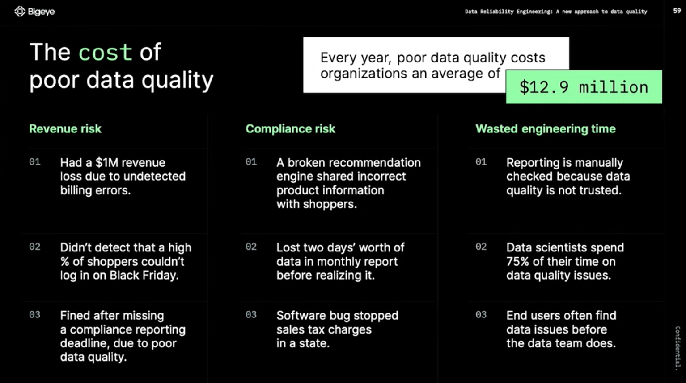
    
    > Why Data Reliability is important
    > 
    
    
    

`주요 포인트`

> I don’t know if this dashboard looks correct…I don’t if something looks suspicious…
> 

→ 데이터 퀄리티가 보장되지 않을 경우 데이터 팀은 원인을 찾는 과정을 반복해야 할지도 모릅니다. 연간 낭비되는 금액이 무려 $12.9 million에 달한다고 합니다…

> The infrastructure for data became easy
> 
> 
> > the last prolem which is reliability
> > 
- 소프트웨어 엔지니어링에서 인프라의 발전처럼 데이터 엔지니어링의 인프라 발전이 도래하게 되었습니다
    - 더이상 이전처럼 직접 데이터 센터를 구성하고 데이터 웨어하우스를 설치할 필요 없이 단 몇분 안에 원하는 데이터 웨어하우스를 구성할 수 있게 되었습니다
- 데이터 웨어하우스의 구성이 쉬워진 것과 함께 ETL/ELT도 너무나도 쉽게 할 수 있는 환경이 갖춰졌습니다
- 데이터 엔지니어링 생애주기에서 남은 문제는 `데이터 신뢰성(Data Reliability)문제`라고 합니다
    - 데이터가 제 때 제공되는지
    - 내가 원하는대로 데이터가 제공 되는지
- 데이터 신뢰성(Data Reliability) 문제는 현대에 발생한 문제입니다
    - 데이터 스케일이 커지는 속도를 팀이 커지는 속도가 따라가지 못하면서 발생한 문제로 정의했습니다

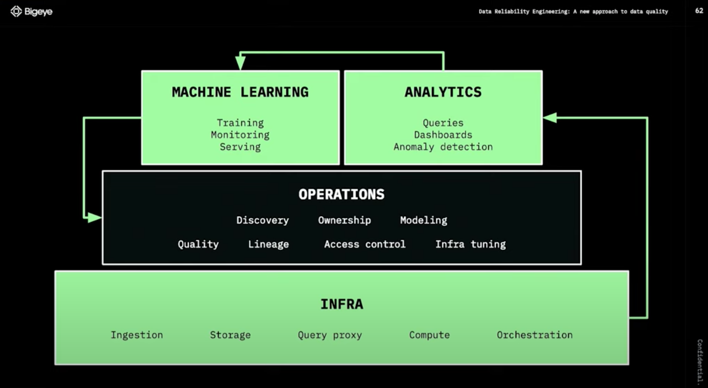

발표자는 데이터 엔지니어링의 종착점은 운영 단계에서 데이터 품질 보장, 데이터 출처 파악 등 데이터의 품질을 향상시키는데 있다고 합니다.

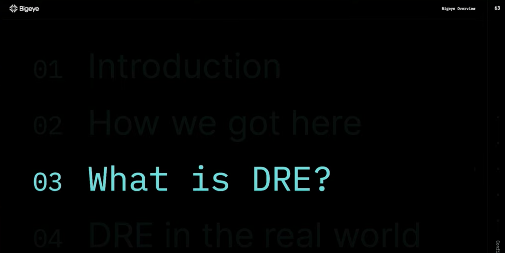

- `SRE Principles`
    - Embrace risk - 위험 감수
    - Set standards - 표준 설정
    - Reduce toil - 수고 줄이기
    - Monitor everything - 모든 것을 모니터링
    - Use automation - 자동화 사용
    - Control releases - 제어 릴리즈
    - Favor simplicity - 단순함 선호

> Treating data quality like an engineering problem
> 

`Data Reliability Engineering`이란 데이터 팀이 데이터 환경의 반복 속도를 잃지 않고 주요 응용 프로그램(의사 결정, AI/ML 프로젝트 및 내장된 분석)에서 사용하기에 적합한 상태를 유지하기 위해 데이터 팀이 채택해야 하는 주요 사례

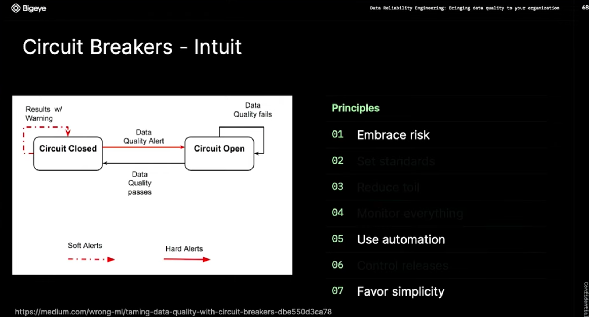

> 새벽 2시에 일어나서 부서진 파이프라인을 수정하는 것을 막아준다. 단 2개의 박스로 표현한 심플함!
> 

](./sub_page_imgs/Untitled_33.png)

출처: [https://modern-cdo.medium.com/taming-data-quality-with-circuit-breakers-dbe550d3ca78](https://modern-cdo.medium.com/taming-data-quality-with-circuit-breakers-dbe550d3ca78)

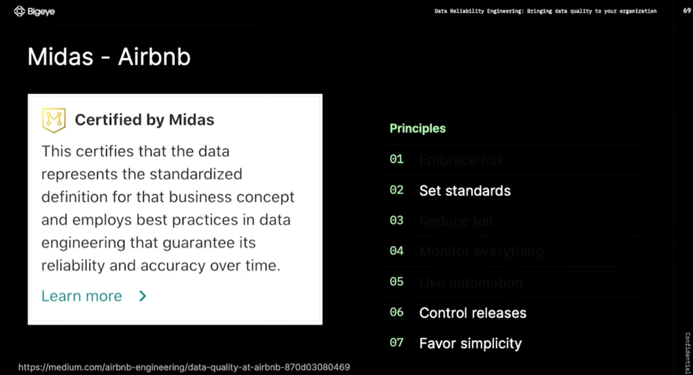

Uber: Data Quality Platform Architecture

- **AWS serverless data analytics pipeline reference architecture (by AWS)**
    
    [AWS serverless data analytics pipeline reference architecture | Amazon Web Services](https://aws.amazon.com/ko/blogs/big-data/aws-serverless-data-analytics-pipeline-reference-architecture/)
    
    ## **Logical architecture of modern data lake centric analytics platforms**
    
    
    
    ## **Serverless data lake centric analytics architecture**
    
    To compose the layers described in our logical architecture, we introduce a reference architecture that uses AWS serverless and managed services. In this approach, AWS services take over the heavy lifting of the following:
    
    - Providing and managing scalable, resilient, secure, and cost-effective infrastructural components
    - Ensuring infrastructural components natively integrate with each other
    - 
    
    This reference architecture allows you to focus more time on rapidly building data and analytics pipelines. It significantly accelerates new data onboarding and driving insights from your data. The AWS serverless and managed components enable self-service across all data consumer roles by providing the following key benefits:
    
    - Easy configuration-driven use
    - Freedom from infrastructure management
    - Pay-per-use pricing model
    
    The following diagram illustrates this architecture.
    
    
    

### 3.3. 데이터 과학 경력의 출발점으로서의 데이터 엔지니어

> 데이터 과학 경력의 출발점으로서 데이터 엔지니어 직군을 선택하셨다면 아래의 필수 스킬에 대한 고민이 필요할 것 같습니다!
> 
- `Coursera Introduction to Data Engineering 중`
    - **`코딩`:** 코딩 언어 능숙도는 이 역할에 필수적이므로 기술을 배우고 연습하는 과정을 수강하는 것이 좋습니다. 일반적인 프로그래밍 언어에는 SQL, NoSQL, Python, Java, R 및 Scala가 포함됩니다.
    - **`관계형 및 비관계형 데이터베이스`:** 데이터베이스는 데이터 저장을 위한 가장 일반적인 솔루션 중 하나입니다. 관계형 및 비관계형 데이터베이스와 작동 방식에 대해 잘 알고 있어야 합니다.
    - **`ETL(추출, 변환 및 로드) 시스템`:** ETL은 데이터베이스 및 기타 소스에서 데이터 웨어하우스와 같은 단일 리포지토리로 데이터를 이동하는 프로세스입니다. 일반적인 ETL 도구에는 Xplenty, Stitch, Alooma 및 Talend가 포함됩니다.
    - **`데이터 저장`:** 특히 빅 데이터의 경우 모든 유형의 데이터를 동일한 방식으로 저장해야 하는 것은 아닙니다. 예를 들어 회사의 데이터 솔루션을 설계할 때 데이터 레이크와 데이터 웨어하우스를 사용할 시기를 알고 싶을 것입니다.
    - **`자동화 및 스크립팅`:** 조직에서 많은 정보를 수집할 수 있기 때문에 자동화는 빅 데이터 작업에 필요한 부분입니다. 반복 작업을 자동화하는 스크립트를 작성할 수 있어야 합니다.
    - **`머신 러닝`:** 머신 러닝은 데이터 과학자의 관심사이지만 팀의 데이터 과학자의 요구 사항을 더 잘 이해하려면 기본 개념을 파악하는 것이 도움이 될 수 있습니다.
    - **빅 데이터 도구:** 데이터 엔지니어는 일반 데이터로만 작업하지 않습니다. 그들은 종종 빅 데이터를 관리하는 임무를 맡습니다. 도구와 기술은 진화하고 있으며 회사마다 다르지만 일부 인기 있는 기술로는 Hadoop, MongoDB 및 Kafka가 있습니다.
    - **`클라우드 컴퓨팅`:** 회사에서 점점 더 클라우드 서비스를 위해 물리적 서버를 거래함에 따라 클라우드 스토리지 및 클라우드 컴퓨팅을 이해해야 합니다. [초보자는 Amazon Web Services(AWS)](https://www.coursera.org/learn/aws-fundamentals-going-cloud-native) 또는 [Google Cloud](https://www.coursera.org/learn/gcp-big-data-ml-fundamentals?specialization=gcp-data-engineering) 과정을 고려할 수 있습니다 .
    - **`데이터 보안`:** 일부 회사에는 전담 데이터 보안 팀이 있을 수 있지만 많은 데이터 엔지니어는 여전히 데이터를 손실 또는 도난으로부터 보호하기 위해 데이터를 안전하게 관리하고 저장해야 합니다.

## 4. 데이터 엔지니어는 어떤 고민을 할까?

---

<aside>
📌 (feat. `발표자 사례, 스터디 러너 사례 취합 예정`)

</aside>

> 데이터 엔지니어는 어떤 고민을 갖고 있을까?
데이터 엔지니어가 갖고 있는 고민을 털어놓고 문제를 하나씩 해결해 나가자! 😃
> 

### 발표자 사례

많은 양의 데이터가 생성되는데 이를 수집.가공.처리하는 `파이프라인을 효율적으로 개선`하는 작업 중에 있습니다.

- 만으로 3년차 이하이기에 Data Camp 기준 ‘`주니어 데이터 엔지니어`’로 정의하겠습니다
    - 지난 1월 18일 실시간 예약 서비스를 제공하는 외식업 스타트업의 데이터 엔지니어로 합류했습니다
    - 지난 1분기를 한 번 회고해봤습니다
- `변화`
    - 자체 프로덕트가 있는 IT 서비스의 인하우스 데이터 엔지니어로 커리어 전환(Data Specialist → Data Engineer)
    - 데이터 지원 조직 합류 → 데이터 사이언스랩(데이터 파트 데이터 엔지니어)
- `한일`
    - 서비스, 데이터, 데이터 환경을 이해하는데 대부분의 시간을 사용
    - 데이터 지원 요청 사항 대응과 동시에 서비스.데이터 구조 파악
        - 다양한 유관부서의 데이터 분석 요청건 처리
        - 데이터 지원 요청 사항을 처리하면서 데이터를 이해하고 비즈니스 및 서비스를 이해하고 있음
    - *(빠른 개발 → 누락된 문서화 → 데이터 구조 및 데이터 이해 필요 → 조직내 문서 참고 → 데이터 이해 → 개발자 인터뷰 → 데이터 구조 및 데이터 이해 → ERD 작성 → 공유 → 분석계 데이터 환경 구성 논의 → PoC 수행)*
    - 협업 및 프로세스 개선을 위한 환경 개선
- `할일`
    
    
    
    통합 분석 환경 구성을 위해 데이터 아키텍처는 어떻게 가져가면 좋을지, 해당 파이프라인의 진행 단계마다 데이터 품질을 어떻게 보장하면 좋을지, 결과 데이터를 유의미하게 활용하기 위해서는 어떻게 해야하는지 고민에 고민에 고민을 더합니다…!
    
    - 통합 분석 환경 구성
    - 데이터 품질 향상
    - 분석 프로세스 최적화
    - 대시보드 개발 및 운영
    - 데이터 파이프라인 개발 및 운영

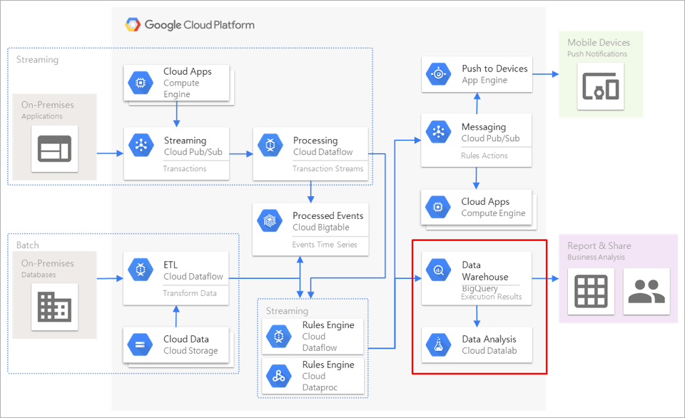

# Recap

---

- [ ]  데이터 엔지니어링이란 무엇인지 이해할 수 있습니다
- [ ]  데이터 엔지니어의 주요 역할과 책임을 알 수 있습니다
- [ ]  데이터 엔지니어의 커리어 패스에 대해서 알아봤습니다
- [ ]  데이터 엔지니어링 분야가 성숙해짐에 따라 데이터 품질의 중요성이 부각되는 것을 확인할 수 있었습니다

# Next

---

<aside>
❓ 어떤 데이터 업무를 하고 계신가요? 어떤 업무를 선택하고 싶으신가요?
(* 아래의 roles를 참고해주세요!)

</aside>

- `Comparing data management roles`
    
    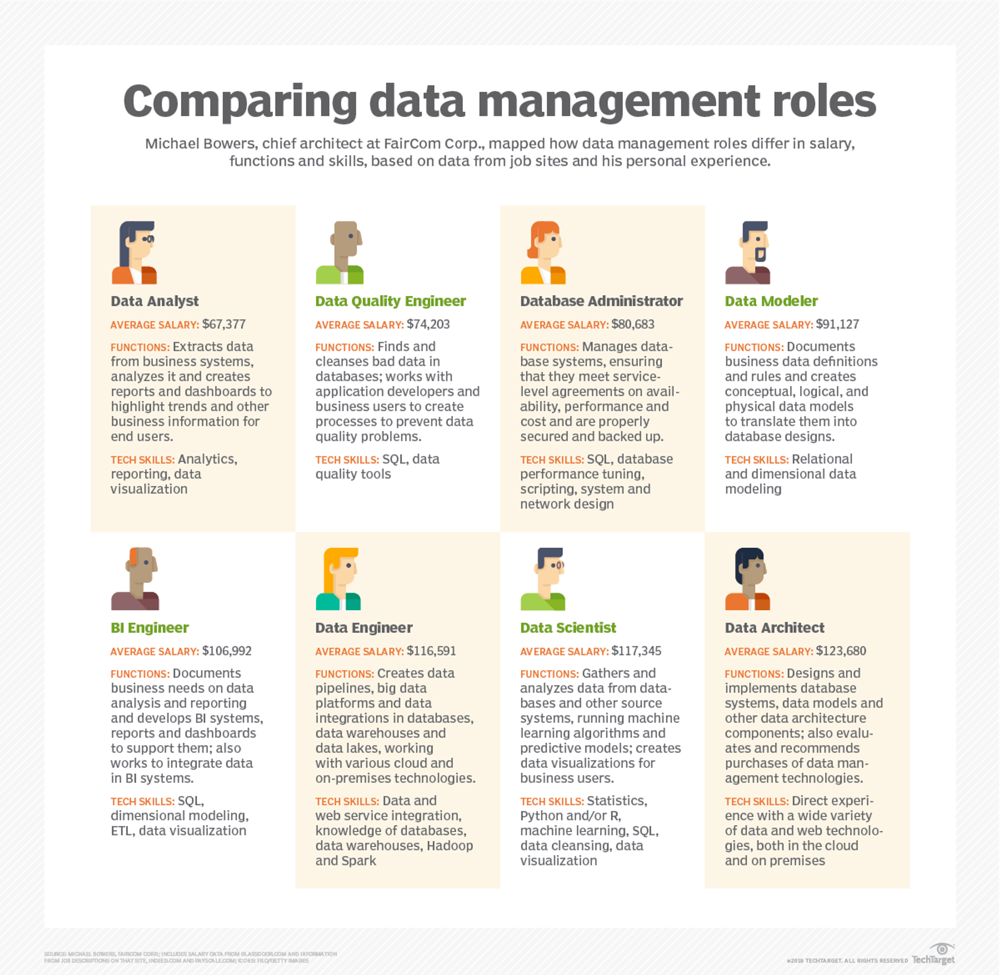
    
- [ ]  Data Analyst
- [ ]  Data Quality Engineer
- [ ]  Database Administrator
- [ ]  Data Modeler
- [ ]  BI Engineer
- [ ]  Data Engineer
- [ ]  Data Scientist
- [ ]  Data Architect

<aside>
❓ 데이터 엔지니어 커리어 패스에서 나는 어디에 위치하고 있을까?

</aside>

- `📌 데이터 엔지니어 커리어 패스(참고)`
    
    ### 주니어 데이터 엔지니어
    
    > 나중에 경력에서 사용해야할 도구에 대해 배우고 실습 경험을 얻는 시간
    > 
    - 기존 시스템 유지 관리.지원업무
    - 시스템 테스트, 디버깅, 기존 시스템 기능 추가 및 개선 작업
    - 선배 동료 지원 역할
    - 다른 팀과 부서와 함께 작업하며 문제와 질문에 대한 해결책을 찾는 방법 학습
    
    경력을 막 시작할 때 주니어 데이터 엔지니어는 일반적으로 기존 시스템을 유지 관리하고 지원하는 작은 작업을 수행합니다. 이것은 시스템을 테스트하고 버그를 찾고 수정하는 것부터 기존 시스템에 기능을 추가하는 것까지 무엇이든 될 수 있습니다. 이러한 초기 단계에서 주니어는 일반적으로 자신의 프로젝트를 수행하지 않고 대신 선배 동료를 지원하는 역할을 맡습니다.
    
    주니어 데이터 엔지니어로서 처음 몇 년 동안 가장 중요한 부분은 나중에 경력에서 사용해야 할 도구에 대해 배우고 실습 경험을 얻는 것입니다. 그들은 또한 다른 팀과 부서가 함께 작업하여 문제와 질문에 대한 해결책을 찾는 방법을 배우고 있습니다.
    
    ### 중간 수준의 데이터 엔지니어(`feat. 중니어 데이터 엔지니어`)
    
    - 프로젝트 관리를 시작할 수 있음. 다른 팀 및 부서와 더 많이 협력해야 할 수도 있음
    - 일반적으로 데이터 과학자 및 분석 팀 구성원을 지원하는 시스템을 설계하고 구축하는 책임이 있음
    - 프로그래밍 기술 개발 능력 향상 단계
    - 발생하는 버그나 문제를 식별하고 수정할 수 있으며 팀 내외 원활하게 협업하는 단계
    
    데이터 엔지니어는 약 1~3년 후에 중간 레벨로 승진할 수 있습니다. 이때 그들은 업무의 더 많은 프로젝트 관리 측면에 노출될 수 있으며 다른 팀 및 부서와 더 많이 협력해야 할 수도 있습니다.
    
    그들은 일반적으로 데이터 과학자 및 기타 분석 팀 구성원을 지원하는 시스템을 설계하고 구축하는 책임이 있습니다. 이 단계에서는 여전히 선임 데이터 엔지니어의 감독을 받고 있을 수 있습니다. 이 일을 효과적으로 수행하기 위해서는 좋은 의사소통 기술을 개발하고 다른 팀과 잘 협력할 수 있어야 합니다.
    
    데이터 엔지니어는 약 3~5년 동안 이 수준에 머물 수 있습니다. 이 기간 동안 그들은 프로그래밍 기술을 개발하고 조직에서 사용되는 모든 도구와 시스템에 익숙해야 합니다. 발생하는 모든 버그나 문제를 식별하고 수정할 수 있으며 팀 내외에서 원활하게 협업합니다.
    
    ### 선임 데이터 엔지니어
    
    - 더 많은 관리 책임을 맡게 됨
    - 기술적 측면에서 능숙하며 비교적 쉽게 시스템을 구축하고 문제를 해결할 수 있음
    - 비즈니스 측면에 더 밀접하게 관여하며 데이터 프로젝트의 방향과 시스템의 장기적인 효율성 및 최적화에 대해 전략적으로 생각하기 시작하는 단계
    - 많은 데이터 엔지니어는 전략 및 비즈니스 책임에 대한 열정이 없을 수 있으므로 회사에서 더 이상 발전하지 않기로 선택할 수 있다고 함
    
    데이터 엔지니어가 고위직에 도달하면 더 많은 관리 책임을 맡게 됩니다. 그들은 한 명 이상의 데이터 엔지니어를 감독해야 할 수 있으며 프로젝트가 나올 때 가르치고 프로젝트를 할당해야 합니다.
    
    이 단계에서 데이터 엔지니어는 역할의 기술적 측면에 능숙하며 비교적 쉽게 시스템을 구축하고 문제를 해결할 수 있습니다. 그러나 그들은 이제 사물의 비즈니스 측면에 더 밀접하게 관여하고 있으며 데이터 프로젝트의 방향과 시스템의 장기적인 효율성 및 최적화에 대해 전략적으로 생각할 필요가 있습니다.
    
    이를 위해서는 데이터 엔지니어가 생각하는 방식의 변화가 필요하며 이는 어려울 수 있습니다. 많은 데이터 엔지니어는 전략 및 비즈니스 책임에 대한 열정이 없을 수 있으므로 회사에서 더 이상 발전하지 않기로 선택할 수 있습니다.
    
    ### 고위 관리 역할
    
    데이터 엔지니어가 약 6년 이상의 경험을 쌓으면 다음과 같은 선택에 따라 더 많은 관리 역할로 이동할 수 있습니다.
    
    - 데이터 엔지니어링 관리자
    - 데이터 엔지니어링 이사
    - 최고 데이터 책임자
    
    ### 이 외에 필요한 역량
    
    - 강력한 데이터 인프라 및 데이터 아키텍처 기술 보유 역량
    - 분석 팀을 관리하고 확장할 수 있는 역량
    - 고성능 시스템 개발을 위한 프로세스 정의
    - 새로운 프로젝트 범위 기획
    - 신규 및 기존 시스템에 대한 SLA 정의 및 관리
    
    낮은 수준에서 얻은 기술에 매우 능숙한 것 외에도 이러한 역할은 데이터 엔지니어가 강력한 데이터 인프라 및 데이터 아키텍처 기술을 보유하고 분석 팀을 관리하고 확장할 수 있어야 합니다. 또한 고성능 시스템을 개발하기 위한 프로세스를 정의하고, 새로운 프로젝트의 범위를 정하고, 신규 및 기존 시스템에 대한 SLA를 정의 및 관리할 수 있어야 합니다.
    
- [ ]  주니어 데이터 엔지니어
- [ ]  중간 수준의 데이터 엔지니어
- [ ]  선임 데이터 엔지니어
- [ ]  고위 관리 역할

<aside>
❓ 데이터 엔지니어로서 현재 마주하고 있는 문제 중 가장 어려운 문제는 무엇인가?

</aside>

- [ ]  데이터 엔지니어링이 무엇인지 모르겠다
- [ ]  어디서부터 어떻게 무엇을 해야 할지 모르겠다
- [ ]  데이터 엔지니어로서 커리어를 잘 쌓고 있는지 모르겠다
- [ ]  투입된 프로젝트에서 기술, 프로그래밍 역량에 한계를 느끼고 있다
- [ ]  관리자로서 나아가기 위해 필요한 역량을 발전시키는데 어려움이 있다
- [ ]  비즈니스 측면에서 데이터의 가치를 더하는데 어려움이 있다
- [ ]  프로젝트의 방향성 제시, 전략 및 효율적인 아키텍쳐 제시에 어려움이 있다
- [ ]  등등…

<aside>
❓ 다음 스터디에 다뤘으면 하는 주제

</aside>

- [ ]  OLTP, OLAP
- [ ]  ETL, ELT
- [ ]  Database
- [ ]  Structured data and unstructured data
- [ ]  SQL and NoSQL

<aside>
📌 스터디 기간 내에 다뤘으면 하는 주제

</aside>

- [ ]  Data Reliability Engineering
- [ ]  Data Quality Platform 원서 번역 - Uber
- [ ]  AirBnb Tech 블로그 번역

# `🗂️ 참고자료(Reference)`

---

## 이전 스터디 자료

<aside>
💡 함께 보시면 좋습니다!

</aside>

- Introduction to Data Engineering
    - Data Engineer vs Data Scientist
    - Introduction to Data Engineering
        - Cloud Computing
    - Data Engineering Toolbox
        - Database
        - Structured data and unstructured data
        - SQL and NoSQL
        - Parallel computing
        - Parallel computation frameworks
        - workflow scheduling frameworks

## 1. 데이터 엔지니어링이란 무엇일까?

- 데이터 엔지니어링이란?
    1. 짧은 영상

[What Is a Data Engineer?: A Guide to This In-Demand Career](https://www.coursera.org/articles/what-does-a-data-engineer-do-and-how-do-i-become-one)

- 데이터 엔지니어링이란?
    - 블로그 포스팅

[What is Data Engineering?](https://www.datacamp.com/blog/what-is-data-engineering)

## 2. 데이터 엔지니어는 어떤 일을 하는 사람일까?

2. Data Camp, Data Engineer:

- Data Camp에서 발행한 문서
- 데이터 과학자 vs 데이터 엔지니어
    
    → 이제는 엄마냐 아빠냐와 같이 다가오는 주제네요…ㅎㅎ
    

[Data Scientist vs Data Engineer](https://www.datacamp.com/blog/data-scientist-vs-data-engineer)

3. 데이터 엔지니어에 대한 정의

- 데이터와 관련된 다양한 직군에 대해서 보여줍니다
- 데이터 엔지니어, 데이터 분석가, 데이터 과학자 외에 다양한 직군에 대해서 일목 요연하게 정리한 인포그래픽이 인상적입니다

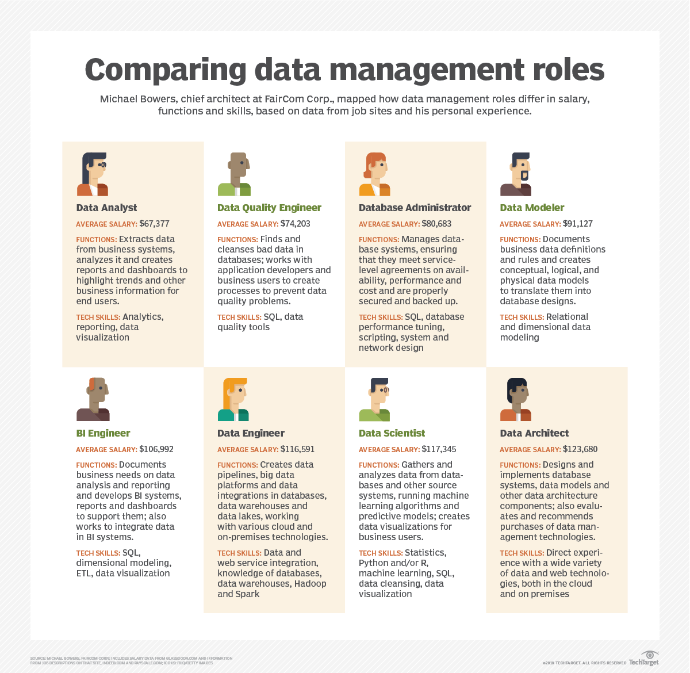

[What is a data engineer and what do they do?](https://www.techtarget.com/searchdatamanagement/definition/data-engineer)

## 3. 데이터 엔지니어의 핵심 역량은 무엇일까?

4. [국내] 카카오 데이터 엔지니어링이란?

- 국내 최대 IT 기업중 한 곳인 카카오의 기술 블로그 글입니다
- 데이터 엔지니어링이란 무엇인지 엔지니어분께서 쉽게 정리해주셨습니다

[데이터 엔지니어링이란](https://tech.kakao.com/2020/11/30/kakao-data-engineering/)

5. [국내] 채용공고 톺아보기. 데이터 엔지니어란?

- 데이터로 일하는 조직, 데이터 직군에 대해서 상세히 정리해둔 글입니다
- 데이터 엔지니어, 데이터 분석가, 데이터 과학자 직군 중 어느 직군으로 가야할지 고민이시라면 한 번 살펴보시기를 권장드립니다

[[채용공고 톺아보기] #6 데이터 엔지니어란?](https://brunch.co.kr/@13335218e68a4e8/96)

6. [국내] 데이터 집중 직무의 모든 것:

- 마찬가지로 데이터 직무에 대한 문서입니다
- 일러스트가 상당히 매력적이네요

[데이터 집중 직무의 모든 것: 데이터 엔지니어, 데이터 사이언티스트, 데이터 분석가 : 다이티 데이터 마켓 - 콘텐츠](https://market.dighty.com/contents/?idx=7614796&bmode=view)

1. Data Engineer vs Software Engineer
- 최근 Google Cloud의 데이터 세션에서 *근마켓 데이터 엔지니어분의 세션을 듣던 중 궁금증이 발생했던 주제입니다
- Data Engineer와 Software Engineer란 어떤 점에서 비슷할까? 그리고 어떤 차이가 있을까?
- 물음에 대한 답을 찾고자 한 번 더 찾아보았습니다

[Data Engineer vs. Software Engineer: Choosing the Right Career Path](https://gb.coursera.org/articles/data-engineer-vs-software-engineer)

## 4. 데이터 엔지니어링은 어떻게 진화하고 있을까?

- 당근마켓과 함께 성장하며 데이터 신뢰성 지켜내기

[20230112 당근마켓과 함께 성장하며 데이터 신뢰성 지켜내기 - 수군수군 데이터 엔지니어 밋업 1회 (공유용)](https://docs.google.com/presentation/d/1tBm4iA_Zx2QtQAUmaYctzz6Ow9RAJTHloDtqZgfL5mU/edit#slide=id.g5ed592767b_0_192)

- Data Reliability Engineer란 무엇일까?

[Data Reliability Engineering: A New Approach to Data Quality | Bigeye](https://www.youtube.com/watch?v=u7sJmmAyJT4)

- 데이터 직군은 어떤 특징을 갖고 있을까?

[A Guide to Data Roles — Data Captains](https://www.datacaptains.com/blog/guide-to-data-roles)

## 5. 국내 검색 트렌드는 어떻게 될까?

[https://trends.google.com/trends/explore?cat=1227&geo=KR&q=데이터 엔지니어,데이터 과학자,머신러닝 엔지니어&hl=ko](https://trends.google.com/trends/explore?cat=1227&geo=KR&q=%EB%8D%B0%EC%9D%B4%ED%84%B0%20%EC%97%94%EC%A7%80%EB%8B%88%EC%96%B4,%EB%8D%B0%EC%9D%B4%ED%84%B0%20%EA%B3%BC%ED%95%99%EC%9E%90,%EB%A8%B8%EC%8B%A0%EB%9F%AC%EB%8B%9D%20%EC%97%94%EC%A7%80%EB%8B%88%EC%96%B4&hl=ko)

# 더 보기

---

## 유용한 GitHub 저장소 모음

- query book

[GitHub - pinterest/querybook: Querybook is a Big Data Querying UI, combining collocated table metadata and a simple notebook interface.](https://github.com/pinterest/querybook)

- awesome-public-datasets
    - 토이프로젝트에 활용 가능한 데이터

[GitHub - awesomedata/awesome-public-datasets: A topic-centric list of HQ open datasets.](https://github.com/awesomedata/awesome-public-datasets)

## Global Tech 기업의 블로그

- Airbnb Data Engineering blog

[Data Engineering – The Airbnb Tech Blog – Medium](https://medium.com/airbnb-engineering/tagged/data-engineering)

- How User Achieves Operational Excellence in the Data Quality Experience
    
    
    
    - 우버의 데이터 품질 보장 사례
    - Data Quality Platform Architecture
    
    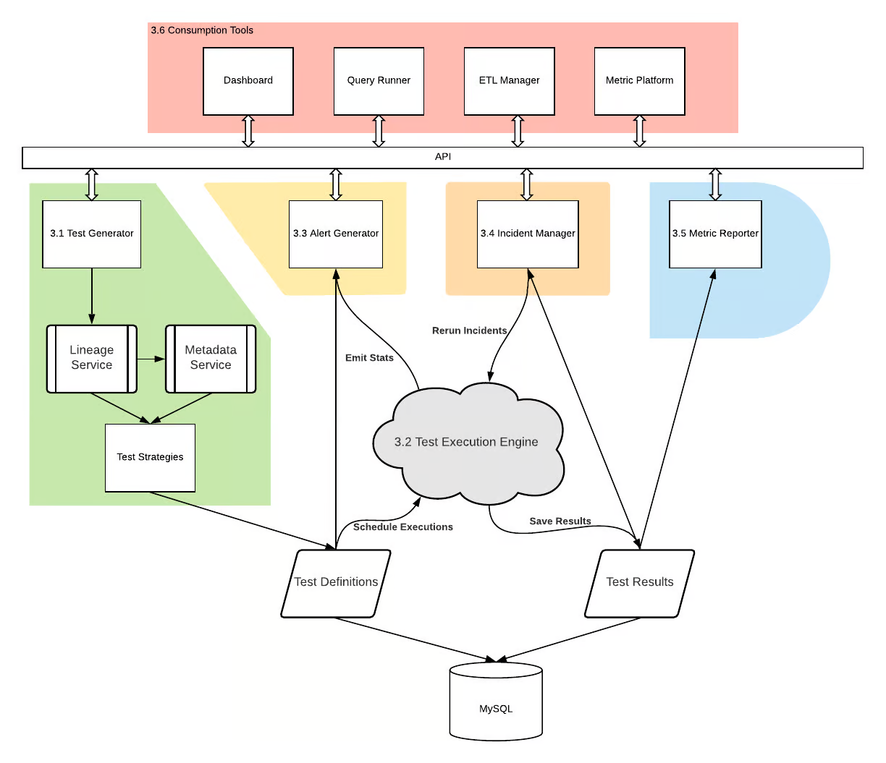
    

[How Uber Achieves Operational Excellence in the Data Quality Experience | Uber Blog](https://www.uber.com/blog/operational-excellence-data-quality/)

## Data Literacy

[Introducing The State of Data Literacy Report 2023](https://www.datacamp.com/blog/introducing-state-of-data-literacy-report)

## How to Write Data Job Description

[How to Write A Data Engineer Job Description](https://www.datacamp.com/blog/data-engineer-job-description)
