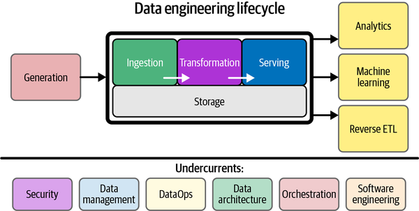

# 2.3 데이터 수집에서의 고려할 점

## Data Pipeline & Undercurrents

- 데이터 엔지니어링 수명주기에서 밑부분을 차지하는 영역(`Undercurrents`)은 데이터 엔지니어가 간과하기 쉽습니다.
- 데이터 엔지니어가 관리하고 기여할 부분이 그다지 많지 않아 보이지만, 사실 데이터 엔지니어링을 보다 원만하게 진행하려면 원천 데이터가 탄생하고 관리되는 과정에 대해서도 잘 알고 있어야 합니다.

## Data Pipeline

- `Garbage In - Garbage Out`: 데이터 업계의 오래된 명언중 하나입니다.
- 데이터 수집에 있어서 고려할 부분은 데이터의 흐름을 잘 정의하는 능력 입니다.
- 다음 단계의 Input으로 Garbage Data혹은 잘못 집계된 데이터가 들어가지 않도록 주의하여야 합니다.
- 결과를 도출하기 위해 어떤 데이터들이 필요하고 어떤 순서로 쌓아져야하는지 잘 정의하여야 합니다.
- 파이프라인 관리에서 필요한 DataOps
    - `Automation(자동화)`: 데이터 원천 시스템 자동화 과정 중 일부에 문제가 생겼을 경우, 데이터 엔지니어의 워크플로우에 영향을 미친다면 이 둘을 서로 분리하는 방안을 고안해볼 것
    - `Observability(모니터링)`: 원천 시스템으로부터 오는 데이터에 품질 문제가 있지는 않은지 사전에 방지할 수 있는 시스템을 마련할 것
    - `Incident response(응급 상황에 대비)`: 원천 시스템의 전원 공급이 꺼졌을 때 데이터 엔지니어의 data pipeline을 어떻게 손상 없이 유지할 수 있는가? 다시 원천 시스템이 복구되었을 때 유실된 데이터를 어떻게 처리할 것인가?

## Data Management

- `Data governance`: 원천 데이터를 누가 관리하는가? 신뢰할 만한 주체(시스템)에 의해, 이해하기 쉬운 방식으로 관리되고 있는가?
- `Data quality/integrity`: 데이터의 품질과 무결성을 upstream 시스템이 보장하고 있는가?
- `Schema`: upstream DB 스키마가 고정되지 않고 변할 수 있음을 예상할 것. 데이터 원천 시스템을 관리하는 팀과 협력할 것
- `Master data management`: upstream에서 마스터 데이터(=비즈니스 주체, 즉 서비스 사용자나 공급업체, 회사 직원, 제품 등에 대한 데이터) 관리 원칙에 따라 데이터가 기록되고 있는가?
- `Privacy and Ethics`: 데이터의 접근성, 데이터 보존 기간

## Data Architecture

- `Reliability`: 원천 시스템이 예측 가능한 output을 만들어내는가? 시스템이 얼마나 자주 고장나는지, 충분히 신뢰성을 확보할 때까지 시스템을 복구하는 데 걸리는 평균 시간은 얼마나 걸리는지 생각하여야 합니다.
- `Durability`: 하드웨어 고장이나 네트워크 끊김이 일어났을 때 원천 시스템이 데이터 손실을 어느 정도 처리할 수 있는가? 를 생각하여야 합니다.
- `Availability`: 필요한 순간마다 데이터 원천 시스템에 접근할 수 있도록 시스템이 보장되어 있는가? 또는 쉽게 접근하지 못하게 하는 방해 요인이 무엇인가? 를 생각하여야 합니다.
- `People`: SLA(Service Level Agreement, 서비스 수준 협약)에 따라 데이터 원천 시스템에 대한 기준(가동시간, 데이터 품질, 접근성 등)을 마련하여 원천 시스템을 관리하는 운영자에게 요구 사항을 전달하고 이해시켜야 합니다.

## 보안(Security)

- 데이터 원천 시스템의 데이터는 안전하고 암호화되어 있는가? (저장/전송) 에 대한 부분입니다.
- 원천 시스템의 접속 방식이 안전한가? (예: `보안되지 않은 공공 네트워크` < `VPN` ) 에 대한 부분입니다.

## 회사 전체 순이익 집계 예시

- 회사 전체 순이익을 계산하기 위해서 다음 그림과 같이 A, B, C 단계로 나누어 볼 수 있습니다.
- 우선 각각의 계열사의 순이익을 집계하기위해 계열사 마다 A단계(사용비용집계, 매출집계) 가 필요합니다.
- `A단계`의 집계는 동시에 진행되어도 문제가 없기때문에 병렬적으로 처리를 하여도 좋습니다.
    - 하지만 `A단계`를 집계함과 동시에 B단계를 집계한다면 B단계의 결과가 올바르지 않을 수 있습니다.
- 이처럼 `C단계`에 해당하는 결과물을 도출해내기 위해 선행되어야 하는 `A,B단계`를 잘 고려하여야 합니다.
- 이처럼 최종결과물을 빠르고 정확하게 도출해내기위한 데이터의 흐름은 어떠한지, 어떤 방법이 있는지 적절히 고려해야합니다.