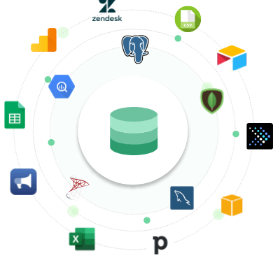

# 데이터 엔지니어가 다루는 데이터

## 데이터는 어디서 발생될까?

- IT서비스가 이루어지는 모든곳에서 데이터는 발생됩니다.
- 우리가 바라볼 수 있는 데이터 원천은 `서비스 DB`, `API`, `Object Storage` 등 다양합니다.
- `서비스DB`는 MySQL과 같은 RDBMS일수도, MongoDB와 같은 NoSQL DataBase일수도 있습니다.
- `API`는 사내에 존재하는 API일수도, 구글 혹은 통계청 과 같은 외부에서 제공하는 API일수도 있습니다.
- `Object Storage`는 AWS S3 일수도, 사내에 존재하는 File System일수도 있습니다.

## 데이터의 종류별 특징은 어떻게 될까?

### Log

- 반정형 데이터라고 할 수 있고 시간정보가 포함됩니다. Event Data를 파일에 남기게되면 일반적으로 로그라고 부르게됩니다.

### Image, Video, GIF...

- 일반적으로 파일 크기가 크고 RDBMS에 넣지 않는경우가 많습니다. (Serialize를 통해 넣을수는 있습니다.)
- 처리하게 된다면 URI만 RDBMS에 저장하고 추가 메타데이터들만 넣게됩니다, 실제 파일은 S3등의 Object Storage에 저장하게됩니다.

### Streaming Data

- 바로 생성되어 저장되지 않는 데이터는 바로 전송하는 방법이 있습니다.
- 실시간으로 생성되는 데이터이기 때문에 데이터 유실이 발생할 수 있습니다.

### DB Data

- 일반적으로 데이터엔지니어가 조회하게 되는 DB데이터는 대용량인 경우가 많습니다.
- 대용량 조회로 CPU, I/O비용을 지나치게 많이 사용하게 된다면 다른작업에 영향이 미칠 수 있음을 고려하여야 합니다.
- 쿼리최적화, 인덱싱, 병렬처리 등을 적절히 고려하여야 합니다.

### IoT Device Data

- MQTT(MQ Telemetry Transport)등의 오버헤드가 작은 프로토콜로 데이터를 전송한다는 특징이 있습니다.
