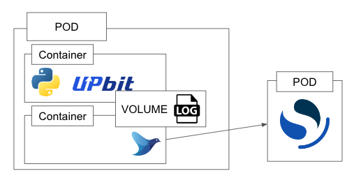
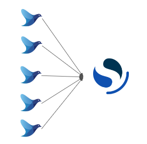
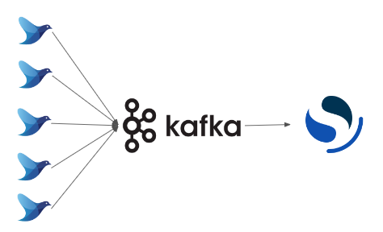
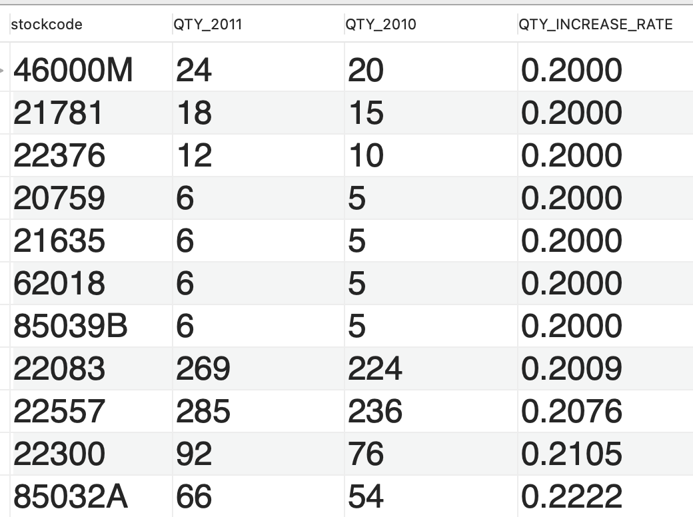
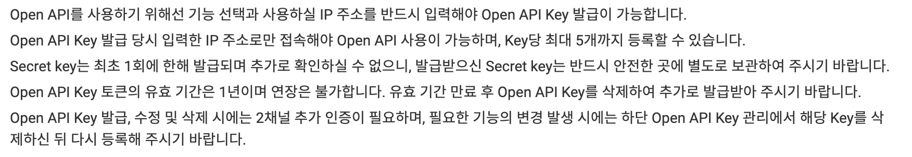
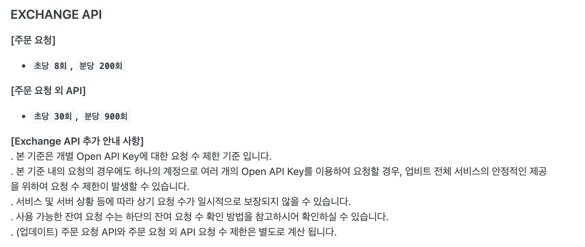
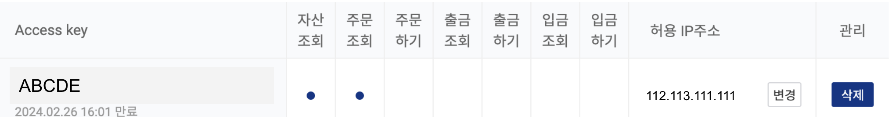

# 데이터를 수집하는 방법

## Source가 로그성 데이터라면

- 시나리오: Upbit에서 실시간으로 생성되는 데이터를 저장하고싶은 상황입니다.

### 간단한 형태



- Upbit API를 통해 생성되는 데이터를 로그로 저장합니다. 
- 저장된 로그는 fluentd에 의해 OpenSearch로 push형의 메시지 배송이 이루어지게 됩니다.
    - push형의 메시지 배송이란 송신측의 제어로 데이터를 보내는 방식을 의미합니다. (↔pull형)


### 문제점



- 하지만 이러한 구조, 즉 분산 스토리지에 직접 메시지를 기록하면 부하 제어가 어려워 성능 한계에 도달하기 쉽게됩니다.


### 문제점 개선



- Kafka와 같은 메시지 브로커를 중간에 두어 일시적으로 데이터를 축적함으로써 분산스토리지에 쓰는 속도를 안정화 하는 구조로 변경한다면 좀 더 안정적으로 데이터를 기록할 수 있습니다.


## Source가 DB라면

- 일반적으로 RDBMS에서 쿼리를 통해 저장된 데이터를 읽어 와야합니다.
- 그 과정에서 Group By, Join 등이 많이 쓰이게 됩니다.



- 다음과 같은 데이터를 추출하고자 합니다.
- 2010년 대비 2011년 판매 수량이 20%이상 증가한 상품의 리스트를 뽑아주세요.
- 증감률의 오름차순, 증감률이 동일할 경우 2011년 판매량의 내림차순으로 정렬해주세요.

<details>
<summary>쿼리 예시</summary>
<div>

    
```sql
## 판매량이 2010년 대비 2011년에 20%이상 증가한 상품 리스트
WITH t_2010 as (
    SELECT StockCode, sum(quantity) as QTY_2010
    FROM commerce
    WHERE substr(invoiceDate,1,4) = '2010'
    GROUP BY StockCode
    ORDER BY StockCode
), t_2011 as (
    SELECT StockCode, sum(quantity) as QTY_2011
    FROM commerce
    WHERE substr(invoiceDate,1,4) = '2011'
    GROUP BY StockCode
    ORDER BY StockCode
)
SELECT *
FROM (
    SELECT t_2010.StockCode,
        QTY_2011,
        QTY_2010,
        (QTY_2011 - QTY_2010) / QTY_2010 as QTY_INCREASE_RATE
    FROM t_2010 join t_2011 on t_2010.StockCode = t_2011.StockCode
) as lst
WHERE QTY_INCREASE_RATE >= 0.2
ORDER BY QTY_INCREASE_RATE, QTY_2011 DESC
;
```

</div>
</details>


## Source가 API라면

- 회사, 회사내 다른 팀, Open API 등 다양한 곳에서 API형태로 제공하는 데이터가 존재합니다.
- Upbit API를 예시로 어떤 점을 고려하여야할지 함께 고민해보려 합니다.

### 제공측의 가이드



- 제공측의 약관을 상세히 읽어보아야합니다.
- 데이터를 제공받기 위해서 어떻게 하여야 하는지, 어떤 규정이 있는지, Key관리는 어떻게 이루어지는지 숙지하여야합니다.


### API Limit 확인



- API가 어느정도까지 요청가능한지, 내가 필요한 데이터가 요청 제한내에 충분히 가져올 수 있는지 확인하여야 합니다.


### Access Key 관리



- 내 Access Key 만료가 언제인지.
- Access Key가 가진 권한은 어느정도 까지인지.
- 호출가능한 IP 등록이 된 IP인지 (↔아무곳에서나 호출가능한지) 확인하여야 합니다.


## Source가 Object Storage라면


- Object Storage는 대량의 비정형 데이터(예 : 사진, 비디오, 문서 등)를 저장하는 데에도 사용되는 데이터 스토리지 방식입니다.
- 비교적 큰 데이터를 다루게 되기때문에 Network IO비용을 고려해야합니다.
    - Source Data가 있는곳은 북미지역인데, 내 ETL에 사용될 VM은 Korea Central에 위치한다면 물리적거리가 멀기때문에 IO비용이 더 나올수 있게됩니다.
- 얼마만큼의 데이터를, 얼마만큼의 주기로 데이터를 가져와야 하는지 결정하여야 합니다.
