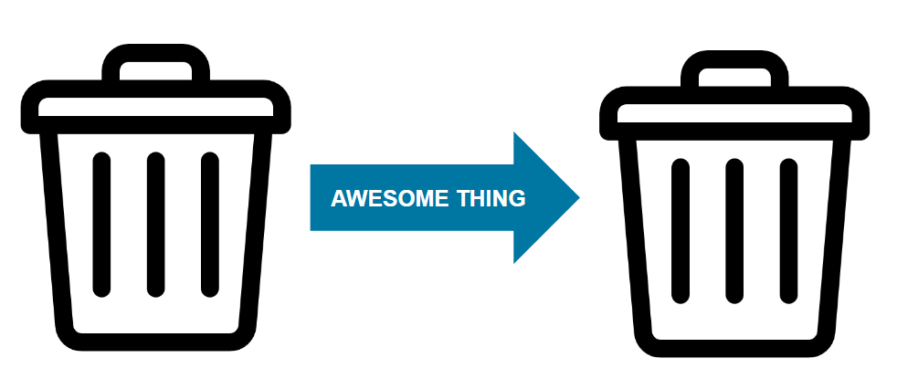
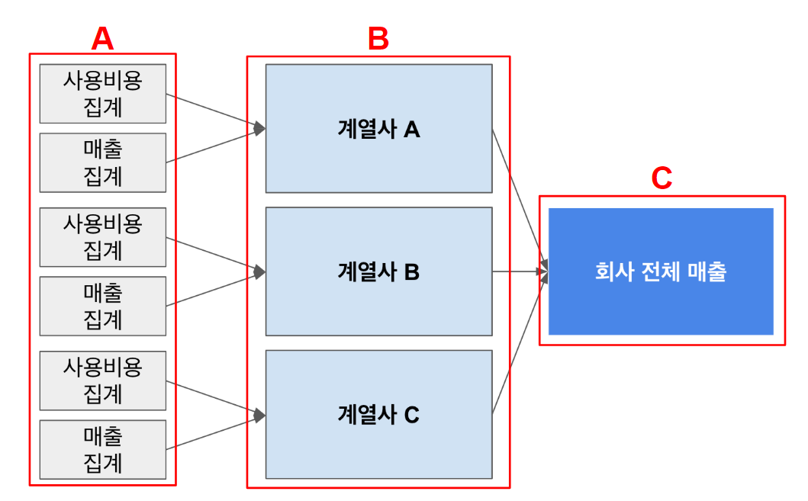

# 데이터 수집에서의 고려할 점

## Data Pipeline

- `Garbage In - Garbage Out`: 데이터 업계의 오래된 명언중 하나입니다.
- 데이터 수집에 있어서 고려할 부분은 데이터의 흐름을 잘 정의하는 능력 입니다.
- 다음 단계의 Input으로 Garbage Data혹은 잘못 집계된 데이터가 들어가지 않도록 주의하여야 합니다.
- 결과를 도출하기 위해 어떤 데이터들이 필요하고 어떤 순서로 쌓아져야하는지 잘 정의하여야 합니다.

## 회사 전체 순이익 집계 예시

- 회사 전체 순이익을 계산하기 위해서 다음 그림과 같이 A, B, C 단계로 나누어 볼 수 있습니다.
- 우선 각각의 계열사의 순이익을 집계하기위해 계열사 마다 A단계(사용비용집계, 매출집계) 가 필요합니다.
- `A단계`의 집계는 동시에 진행되어도 문제가 없기때문에 병렬적으로 처리를 하여도 좋습니다.
    - 하지만 `A단계`를 집계함과 동시에 B단계를 집계한다면 B단계의 결과가 올바르지 않을 수 있습니다.
- 이처럼 `C단계`에 해당하는 결과물을 도출해내기 위해 선행되어야 하는 `A,B단계`를 잘 고려하여야 합니다.
- 이처럼 최종결과물을 빠르고 정확하게 도출해내기위한 데이터의 흐름은 어떠한지, 어떤 방법이 있는지 적절히 고려해야합니다.