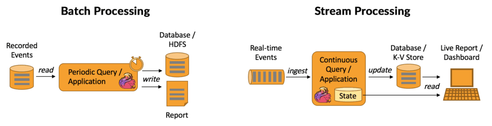
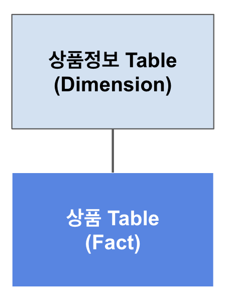

# 데이터 처리방식 알아보기

## SQL vs NoSQL

### SQL (Structured Query Language)

- 관계형 데이터베이스(relational databases) 관리 시스템(이하 RDBMS)을 위한 언어입니다.
- 1980년대 이르러 Oracle 사의 주도로 상업화, 대중화 되었습니다.
- 국제적으로 공인된 표준 SQL이 있지만 DBMS 기업 제품(Oracle, SQL Server, MySQL 등) 별로 지원하는 기능 별로 구문이 다르거나 지원 기능 여부가 조금씩 차이가 있습니다.

### NoSQL (Not Only SQL)

- 관계형 데이터베이스의 한계를 극복하기 위해 만들어진 새로운 DBMS 언어입니다.
- NoSQL 데이터베이스의 예시로는 Redis, MongoDB, Apache Cassandra, Neo4j 등이 있습니다.
- SQL과는 다르게 DB별로 사용되는 문법이 차이가 큰 편입니다.

## Batch Processing vs Streaming Processing

### Batch Processing

- 주로 대용량의 (시간이 흐르면서 축적된 또는 고정된) 입력 데이터를 받아 작업을 실행한 후 output을 내놓게됩니다.
- 실시간으로 정보를 주고받는 것이 아니기 때문에, 데이터 처리 작업이 짧으면 분, 길면 며칠 단위로 소요될 수 있습니다.
- 그렇기 때문에 batch processing의 성능은 latency가 아니라 throughput으로 평가하는 경우가 많습니다.
- 대표적인 batch processing 작업으로 MapReduce를 들 수 있습니다.

### Streaming Processing

- 실제 데이터는 전혀 고정되어 있지 않습니다.
    - 매 시간마다 새로운 데이터가 추가되거나 변경되는 게 현실 → 우리가 다루는 모든 데이터는 사실상 내재적으로 `streaming data`
- 주로 작은 용량의 데이터를 적은 latency 안에 실시간에 가깝게 처리합니다.
    - real-time processing과 구분하기 위해 near-real-time processing이라고도 부릅니다.

## OLTP VS OLAP

### OLTP(Online Transaction Processing)

- OLTP는 특정 정보를 빠르게 조회하고 대규모의 온라인 트랜잭션(INSERT, UPDATE, DELETE)을 처리하는 데 특화되어 있습니다. OLTP 시스템의 주요 부분은 매우 빠른 쿼리 처리, 다중 액세스 환경에서 데이터 무결성 유지, 효율성(초당 거래 수)에 있습니다.
- Low Latency & High Concurrency 를 목적으로 사용됩니다.
- 일반적으로 Row-Oriented 하며, 따라서 분석용으로는 적합하지 않습니다.

#### OLTP Schema 예시

- 다음과 같이 정규화된 테이블 구조를 사용하여 쿼리 실행 속도에서 더 이점을 가져갈 수 있습니다.
- 위 테이블과 같은 구조를 아래 테이블 예시처럼 구현해 볼 수 있습니다.

 

- **상품 Table**

|상품ID|구매유저ID|상품갯수|가격|
|---|---|---|---|
|10001|139242|3|300|
|10002|482030|1|1000|

- **상품 정보 Table**

|상품ID|상품명_StringID|개당가격|구매가능조건ID|
|---|---|---|---|
|10001|12311|100|233|
|10002|22231|1000|311|

- **StringID Table**

|StringID|StringName|Category|
|---|---|---|
|12311|가짜연구소 입장권|상품|
|22231|DE4E 스터디 입장권|상품|
|34283|Hello World|키워드|
|38204|데이터 엔지니어링|타이틀|

- **조건 Table**

|구매가능조건ID|조건명|
|---|---|
|233|제한없음|
|311|가짜연구소 소속인원|
|422|4년이상 실무종사자|

### OLAP(Online Analytical Processing)

- OLAP 데이터베이스는 OLTP 데이터베이스와 달리 대규모 데이터 집합을 처리하여 데이터에 대한 처리를 위해 설계되었습니다.
- 데이터 엔지니어는 일반적으로 OLAP 데이터베이스를 다룰 기회가 많게 됩니다.
- OLTP가 고객의 거래 정보를 실시간으로 빠르게 처리하기 위해 존재한다면, OLAP 시스템에서는 다음과 같은 질문을 주로 다룹니다.
    - A 회사의 지난 1월 기준 전국 지역 매장의 총수입은 얼마인가? 
    - 가장 최근 수행한 온라인 프로모션 행사 이후 자사의 OO제품 판매량이 얼마나 더 증가하였는가?

- 원자성에 대한 요구가 OLTP 보다는 덜 요구되는 경향이 있습니다.
    - OLTP: 예를들어 `돈 차감` -> `상품구매` 과정에서 상품구매에 실패한다면 돈의 차감또한 RollBack되어야합니다.
    - OLAP: 예를들어 집계시 12시간이 걸리는 작업에서 한개의 작업이 실패했을 경우 모두 RollBack 하는 방법도 있지만 실패한 작업에 대해서 Log를 남기고 집계한 후 추후 실패한 작업에 대해 재집계를 수행하고 값을 수정하는 방법또한 있습니다.
        - ※ 단순 예시이며 OLAP에서도 원자성에 대해 고려하는것은 중요합니다. ※

#### OLAP Star Schema 예시

- 최종적으로 유저가 구매한 상품정보를 알기위해서 해야하는 Join을 줄여 이점을 가져갈 수 있습니다.
- 위 테이블과 같은 구조를 아래 테이블 예시처럼 구현해 볼 수 있습니다.

 

- **상품 Table**

|상품ID|구매유저ID|상품갯수|가격|
|---|---|---|---|
|10001|139242|3|300|
|10002|482030|1|1000|

- **상품정보 Table**

|상품ID|상품명|구매가능 조건|
|---|---|---|
|10001|가짜연구소 입장권|제한없음|
|10002|DE4E 스터디 입장권|가짜연구소 소속인원|