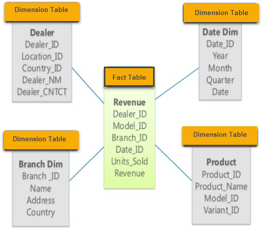
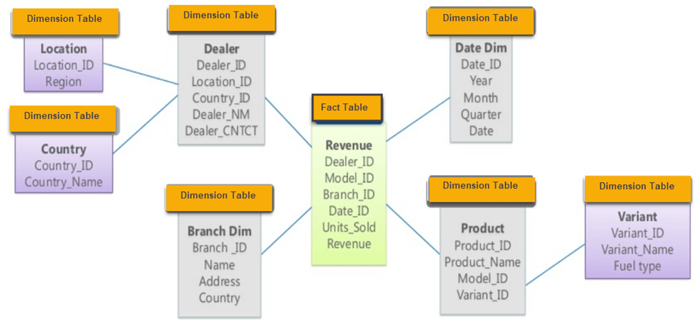

# 4.1.1 Data Warehouse
    
사내에서 발생하는 모든 데이터들을 분석용으로 사용하기 위한 저장소

단순 정보 보관, 재고파악, 저장 용도로 사용하던 데이터들을 분석용으로 사용하기 위함

처음에는 트랜잭션, 분석 query를 동일한 RDB내에서 사용했으나 점차 분석용도의 DB가 분리되었고 이를 Data Warehouse라 칭함

Data Warehouse 구축

- ETL Process
    - **Extract** : source data 추출. 기존에 사용하던 ERP, RDB, File 등 Business에 사용하기 위한 데이터 추출
    - **Transform :** source data 정제 및 가공. data warehouse에 적재하기 위해 여러 format으로 보관중이던 source data를 stuctured data로 변환
    - **Load** : Data Warehouse or Target System에 적재
- Structured Schema
    - **Star Schema**:  fact 테이블과 dimension 테이블로 구성.
        - fact 테이블 :  판매액, 주문량, 수익
        - dimension 테이블 : 장소, 제품, 고객 정보
    - 장점
        1. 쿼리 성능 우수
    - 단점
        1. 중복 데이터 발생
    
    
    
    - **Snowflake Schema**: star schema를 더 정규화한 형식.
    - 장점
        1. 데이터 중복을 줄이며 저장 공간 절약
        2. 데이터를 보다 정확하고 일관성 있게 저장
        3. 데이터를 쉽게 확장하고 변경 가능
    - 단점
        1. 쿼리 성능 저하
        
        
        

- 기능 및 특징
    1. 중앙 집중화: 다양한 데이터 소스에서 추출된 데이터를 중앙에서 저장하고 관리하기 때문에 데이터의 일관성과 정확성을 유지
    2. 데이터 정제: 데이터를 정제하여 일관된 데이터 품질을 유지
    3. 시간적 분석 (time-series analysis) : 과거 데이터와 현재 데이터를 비교하여 비즈니스 동향을 파악하고 예측
    - ex) AWS RedShift, BigQuery
