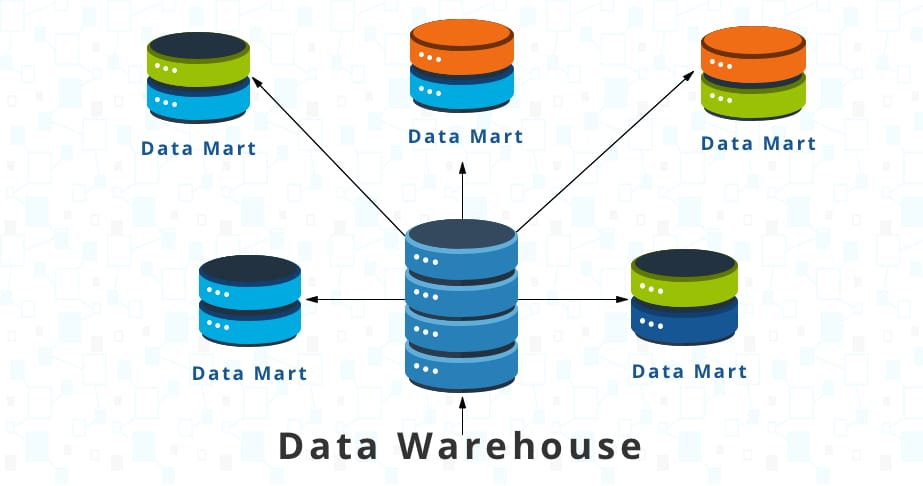

# 4.1.2 Data Mart

    
조직의 사업부와 관련된 정보를 포함하는 데이터 스토리지 시스템. 

Data Warehouse에 저장하는 데이터의 일부만 포함.

- 기능 및 특징
    - 데이터 마트를 사용하여 부서별 정보를 보다 효율적으로 분석.
    - 의사결정 간소화 :주요 이해 관계자가 정보에 입각한 결정을 신속하게 내리는 데 사용할 수 있는 요약 데이터를 제공.
    - 유연한 데이터 처리 : 데이터 웨어하우스보다 더 작으므로 데이터 엔지니어가 주요 데이터베이스 변경 없이 데이터 마트에서 정보를 관리하고 변경 가능.
    
- Database vs Data Mart
    - 데이터 마트는 부서 데이터의 전면 요소 역할을 수행
    - 데이터 마트를 사용하여 정보를 검색하고 분석
    - 데이터베이스는 정보를 수집, 관리 및 저장에만 사용
    - 데이터베이스에선 낮은 지연시간과 높은 가용성 유지를 위해 분석 query 제어
    
- Data Warehouse vs Data Mart
    - 데이터 웨어하우스에는 다양한 주제에 대한 전사적 데이터가 포함
    - 데이터 웨어하우스는 방대해서 시스템 과부하 발생 가능성 존재
    - 데이터 마트는 특정 주제와 밀접하게 관련된 정보를 저장
    - 데이터 마트를 관리하는 부서가 데이터 로드 및 관리를 완전히 제어 가능
