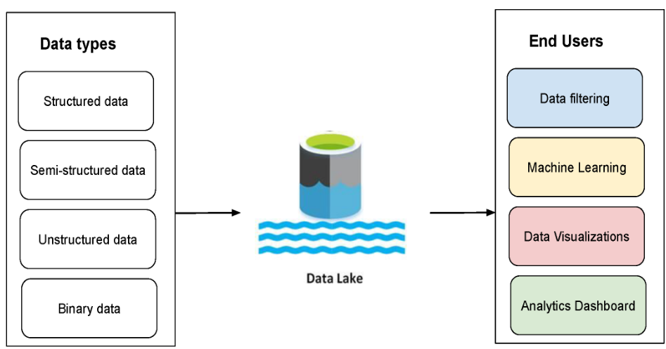

# 4.1.3 Data Lake

    
다양한 형태의 데이터를 저장하기 위한 저장소.

비정형 데이터나 실시간 데이터와 같이 다양한 형태와 크기의 데이터 저장에 적합.

ELT Process 사용.

- 기능 및 특징
    - 비정형 데이터, 정형 데이터, 실시간 데이터 등 모든 종류의 데이터 형태로 저장
    - flexible, durable, and cost-effective and enable organizations to gain advanced insight from unstructured data
- 단점
    - 정제, 구조화, 스키마 정의 등이 진행된 뒤 분석 수행됨
    - 접근 권한 관리, 동시성, ACID Transaction, BI 제품과의 호환성이 기존 data warehouse보다 약함
    - 수정이 필요한 경우 파일을 교체하는 방법밖에 없음. 수시로 변경이 필요한 데이터에 부적합
    
- 객체 스토리지
    
    [https://cloud.google.com/learn/what-is-object-storage?hl=ko#section-4](https://cloud.google.com/learn/what-is-object-storage?hl=ko#section-4)
    
    - ex) gcs, s3
    - 카카오에서 사내 object storage 구축 관련된 내용
    : [https://tech.kakao.com/2022/08/18/radix-tree-for-object-storage/](https://tech.kakao.com/2022/08/18/radix-tree-for-object-storage/) 
    (너무 내용이 딥해서 참고용으로만 볼 것)
