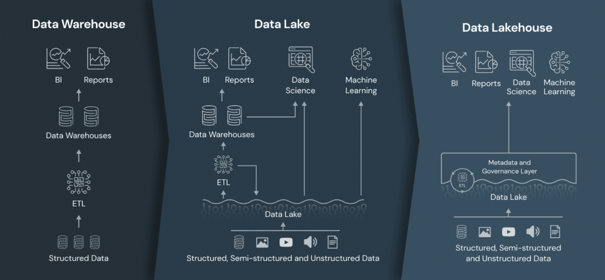

# 4.1.4 Data Lakehouse

데이터 레이크와 데이터 웨어하우스의 개념을 결합한 것으로, 대용량의 비정형 데이터와 정형 데이터를 효율적으로 관리하고 분석할 수 있는 플랫폼.

- Data lakehouse 배경
    - Data Lake는 데이터의 접근 권한 관리, 동시성, ACID Transaction, 기존 BI 제품들과의 호환성의 지원이 기존 Data Warehouse보다 미비
    - 결국 Data Lake에서 특정 데이터들을 다시 Data Warehouse로 보내는 상황 발생
    - 이에 Data Warehouse와 Data Lake의 장점들만 가지고 있는 Data Lakehouse라는 개념이 탄생
- 기능 및 특징
    - 객체 스토리지 기반
    - data lake처럼 다양한 데이터 수집 저장
    → delta lake 형식으로 변환
    - data warehouse처럼 데이터를 스키마 기반으로 정제, 구조화
    - 실시간 데이터 처리도 가능

- data Lakehouse
    
    [Data Warehouse vs. Data Lake vs. Data Lakehouse: An Overview of Three Cloud Data Storage Patterns](https://www.striim.com/blog/data-warehouse-vs-data-lake-vs-data-lakehouse-an-overview/)
    
    
