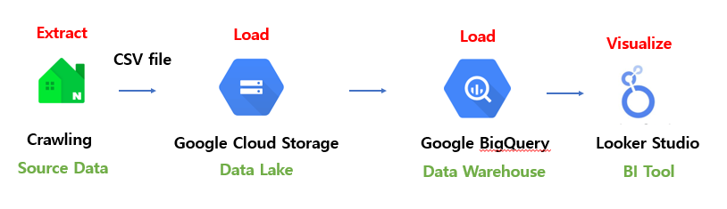
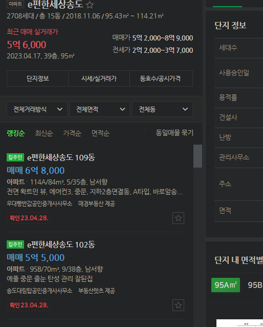
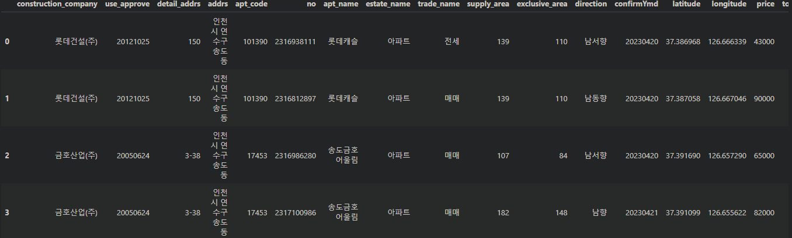
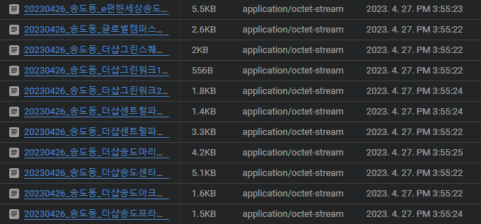
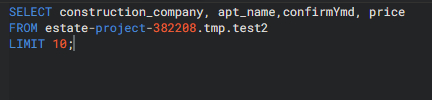
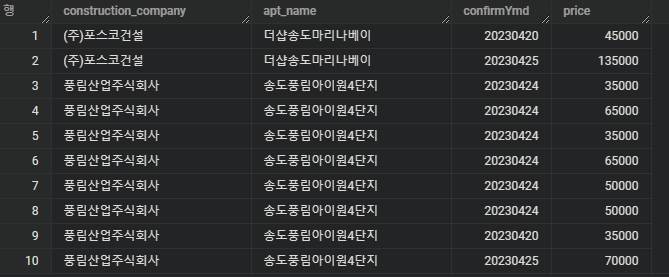
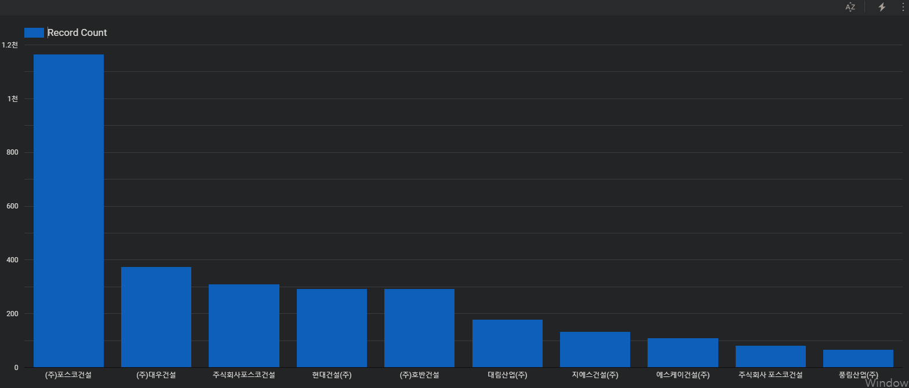

# 4.1.5 Data Pipeline 실습

## 예제 Process

**Source Data**

- 네이버 부동산 데이터
- 현 매물 리스트 크롤링

데이터 정보

**Data Lake**

- source data 원본 저장 용도
- raw file 형태로만 저장
- 쿼리, 데이터 검색 등 불가

**Data Warehouse**

- structured data
- 쿼리 가능

**Visualize**

- bigquery 테이블 load 가능

