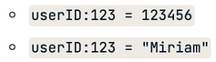
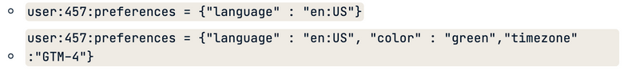

# 2.1 Key-Value Store (KVS)
    - 모든 데이터를 key - value 쌍으로 저장
    - 기본 operation
        - `PUT` : 새로운 key - value 쌍을 입력하거나, (이미 해당 key가 존재할 경우) value를 업데이트 함
        - `GET` : 주어진 key에 대한 value를 반환함
        - `DELETE` : 해당 key가 존재할 경우 key - value 쌍 삭제
    
    ---
    
    - 장점
        - value에 대한 data type 제약이 없음
            
            
            
        - value에 속성을 추가해도 됨
            
            
            
    - 단점
        - key에 의해서만 값을 찾아야 하므로, key 값을 모르면 데이터를 찾을 수 없음
            
            (이를 위해 value 기반으로 검색하는 기능을 제공하거나, 보조 인덱스를 생성하는 데이터베이스도 있음)
            
    
    ---
    
    - 사용 예시
        - 유저별 세션 정보 저장 (key : 세션 ID / value : 세션 정보)
        - 유저별 프로필 및 기본 설정 (key: 유저 ID / value : 유저 정보)
        - 유저별 추천, 광고 등 (key: 유저 ID / value : 해당 유저에 적합한 추천 아이템 및 광고 등)
    
    ---
    
    - Top 10 Key-Value Stores
        
        ](./images/2.1_kvs_rank.png)
        
        [https://db-engines.com/en/ranking/key-value+store](https://db-engines.com/en/ranking/key-value+store)
        
        - Redis (Remote Dictionary Server)
            - in-memory 구조 : 데이터를 디스크에 저장하지 않고 메모리에 저장 → 빠른 속도 보장
            (추가로 데이터를 디스크에 유지할 수도 있음)
            - 비동기 복제 제공 (데이터가 기본 스토리지에 먼저 저장된 뒤, 복제본 생성)
            - Twitter, Pinterest, stackoverflow 등에서 유저별 세션 정보 저장 시 이용중
            - [Redis 튜토리얼](data%20storage%20f4006c86c6754ca488956195c83a9d29/Redis%20%E1%84%90%E1%85%B2%E1%84%90%E1%85%A9%E1%84%85%E1%85%B5%E1%84%8B%E1%85%A5%E1%86%AF%202349ccefabbe410186a0075772d89f84.md)
        - Oracle Berkeley DB
            - 현업에서 간단히 데이터 정제 시 key별 value 정보 이용해야 할 때 많이 사용
            - 임베디드 데이터베이스 : 파일 형식으로 db가 저장됨 (ex: sqlite)
            - 병렬 접근 시 속도가 매우 느려짐 → 다른 DBMS 없을지 변경 시도중 (RocksDB 등)
