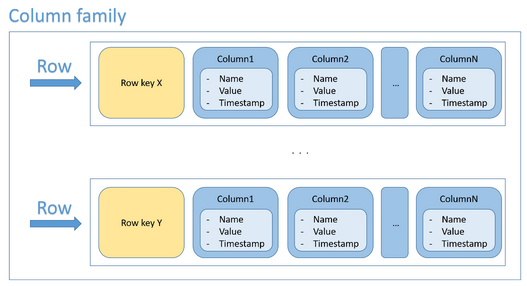
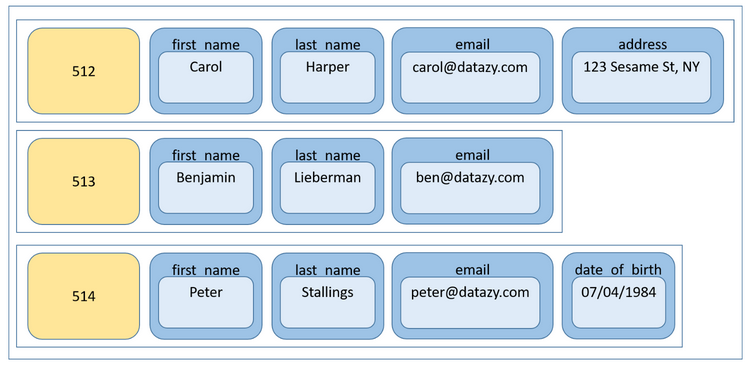

# 4.2.2 Wide-Column Store (Column-family Store)

- Google BigTable 에서 유래됨
- row key와 column name의 조합에 대해 값 저장
- RDBMS에서 column이 지정되지 않고 자유롭게 입력될 수 있는 형태
    
    
    
    
    

---

- 장점
    - row마다 다른 column 개수를 가질 수 있고, 필요할 때마다 원하는 column 추가할 수 있음
    - 특정 column에 대해 default 값으로 채우는 것을 막아줌
    (RDBMS에서는 특정 column 값이 없을 때 default value를 넣어야 했지만, 그럴 필요가 없음)
    - 처리 속도가 빠름 
    (필요한 column 정보만 쓰면 되고, 특정 column에 해당하는 데이터만 읽으면 되기 때문에)
- 단점
    - multi-row 트랜잭션을 지원하지 않음
    - join, subquery 등을 지원하지 않음

---

- 사용 예시
    - event logging (이벤트별 사용자 로그 내역, 애플리케이션 오류 내역 등 저장)
    - 컨텐츠 관리 시스템 (컨텐츠별 댓글, 링크, 태그 등 저장)

---

- Top 10 Wide-Column Stores
    
    ](./images/2.2_wide_column_rank.png)
    
    [https://db-engines.com/en/ranking/wide+column+store](https://db-engines.com/en/ranking/wide+column+store)
    
    - Cassandra
        - 페이스북에서 개발되고, 아파치 재단에서 관리하고 있는 오픈소스
        - 데이터가 노드에 분산되어 저장 (노드를 추가하여 수평적으로 확장)
        - CQL (Cassandra Query Language) 제공
        : SQL과 비슷하지만 join 및 subquery를 제공하지 않고 외래 키가 없음
            
            ```sql
            // 테이블 생성
            CREATE TABLE users (
                user_id uuid PRIMARY KEY,
                first_name text,
                last_name text,
                email text,
                password text,
                created_at timestamp
            );
            ```
            
            ```sql
            // 데이터 삽입
            INSERT INTO users (user_id, first_name, last_name, email, password, created_at) VALUES 
                (uuid(), 'John', 'Doe', 'john.doe@example.com', 'password123', toTimestamp(now()));
            ```
            
            ```sql
            // 데이터 조회
            SELECT * FROM users WHERE user_id = f3f9e3e3-301b-4c8a-ae0a-ccbae7b477a2;
            ```
            
            ```sql
            // 데이터 업데이트
            UPDATE users SET password = 'newpassword123' WHERE user_id = f3f9e3e3-301b-4c8a-ae0a-ccbae7b477a2;
            ```
            
            ```sql
            // 데이터 삭제
            DELETE FROM users WHERE user_id = f3f9e3e3-301b-4c8a-ae0a-ccbae7b477a2;
            ```
            
        - 애플, 넷플릭스, 우버 등에서 이용중
