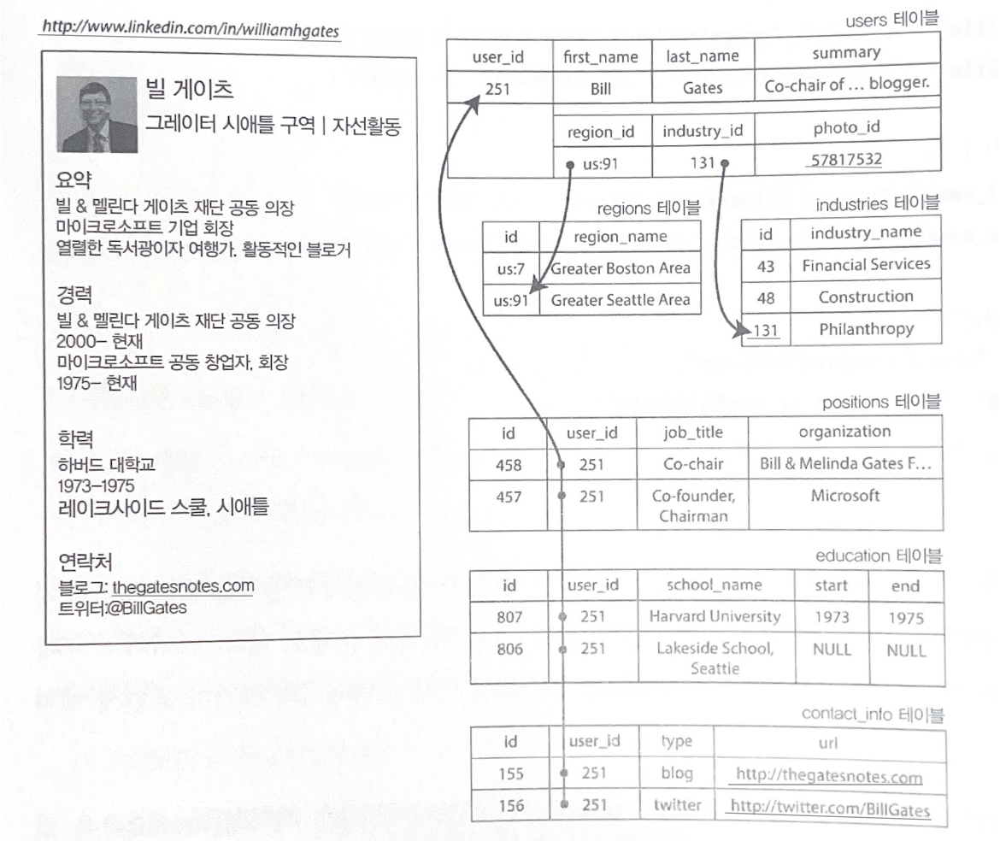
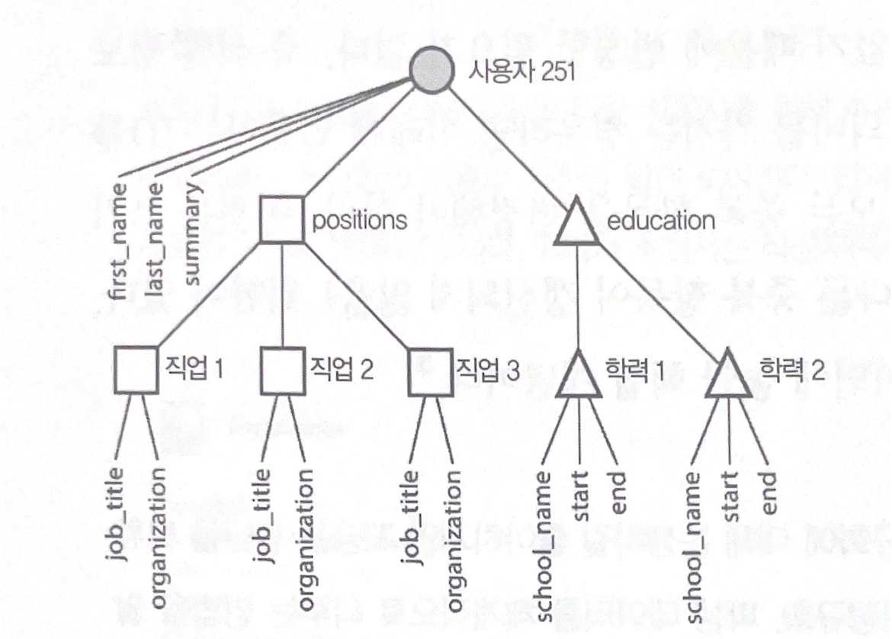
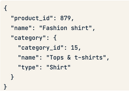
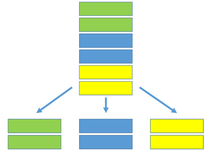

# 2.3 Document Store

    - JSON 형식으로 데이터 저장
    - 각 document가 collection에 저장됨
    (collections : 테이블 / document : 테이블 내 row)
        
        
        
    - collection 내 document들끼리 동일한 구조이지 않아도 됨
    (스키마를 정하지 않고 데이터를 저장할 수 있음)
    
    ---
    
    - 장점
        - 유연성 : document 스키마가 변경되어도 됨
        - 데이터가 직관적이고, 개발 시 객체로 바로 적용 가능
        - 테이블 join이 필요 없음
            
            
            
            기존 RDBMS에서의 조회 방식
            
            
            
            Document store 이용한 조회 방식
            
    - 단점
        - 중복 데이터 관리 어려움 
        (특정 값 다른 문서로 복사한 뒤, 그 값이 변경된다면 다른 문서 내용도 변경하기 위해 중복했던 문서를 기억해야 함)
    
    ---
    
    - 사용 예시
        - 상품 카탈로그
            
            
            
        - Event logging : 유저 로그, 제품 구매 내역, 오류 로그 등
    
    ---
    
    - Top 10 Document Stores
        
        ](./images/2.3_document_db_rank.png)
        
        [https://db-engines.com/en/ranking/document+store](https://db-engines.com/en/ranking/document+store)
        
        - MongoDB
            - BSON (Binary JSON) 형식으로 데이터를 저장함
            - MQL (MongoDB Query Language) 제공
                
                ```sql
                // 데이터 삽입
                db.users.insertOne({
                   "first_name": "John",
                   "last_name": "Doe",
                   "email": "john.doe@example.com",
                   "password": "password123",
                   "created_at": new Date()
                })
                ```
                
                ```sql
                // 데이터 조회
                db.users.find({ "email": "john.doe@example.com" })
                ```
                
                ```sql
                // 데이터 업데이트
                db.users.updateOne(
                   { "email": "john.doe@example.com" },
                   { $set: { "password": "newpassword123" } }
                )
                ```
                
                ```sql
                // 데이터 삭제
                db.users.deleteOne({ "email": "john.doe@example.com" })
                ```
                
            - sharding (여러 서버에 분산 저장) 기능 제공
                
                
                
            - [MongoDB 현업 이용 사례](data%20storage%20f4006c86c6754ca488956195c83a9d29/MongoDB%20%E1%84%92%E1%85%A7%E1%86%AB%E1%84%8B%E1%85%A5%E1%86%B8%20%E1%84%8B%E1%85%B5%E1%84%8B%E1%85%AD%E1%86%BC%20%E1%84%89%E1%85%A1%E1%84%85%E1%85%A8%204e00deb1d93f48c0a47b500c984d64be.md)
