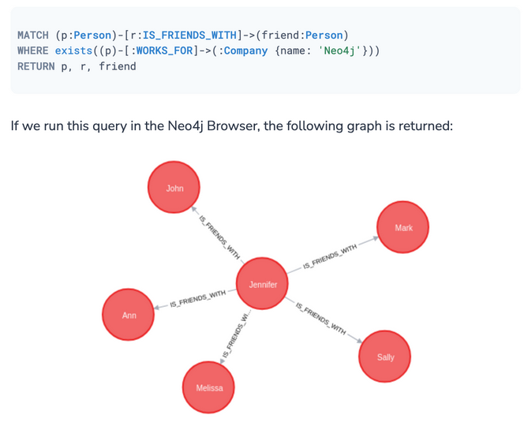
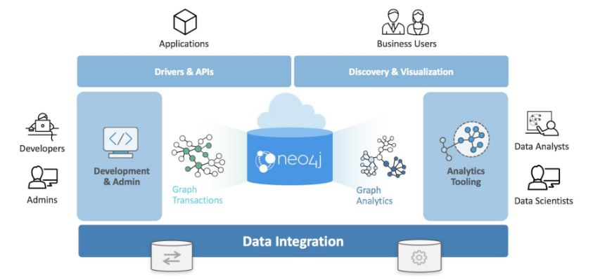

# 4.2.4 Graph Store

- 그래프 구조로 데이터 저장 (node 및 edge 정보 저장)
    
    
    
- 쿼리 형태 : 그래프를 traversing 하는 식으로 진행됨
    - ex) Carol이 팔로우하고 있는 모든 user 찾기 / Carol이 Ben을 언제 팔로우했는지 찾기
    - query language : Cypher, SPARQL 등
        
        

---

- 장점
    - 최종 구조를 미리 정할 필요 없이 
    node, edge 및 해당 속성을 기존 그래프에 추가 또는 삭제할 수 있음
    - 이미 데이터가 서로 연결되어 있기 때문에 
    join을 수행할 필요 없이 특정 node에서부터 다른 node까지 edge를 따라가면 됨
    - 데이터 형식이 직관적이고 시각화하기 쉬움
- 단점
    - 그래프 형식으로 표현 가능한 데이터에만 적합
    - 새로운 쿼리 언어(Cypher, SPARQL 등)를 이용해야 함

---

- 사용 예시
    - 소셜 네트워크 데이터 (사람들 간 팔로우 정보, 게시물 및 좋아요 정보 등)
    - 전염병 데이터 (사람들 간 접촉 정보, 감염 여부 등)
    - 경로 안내 서비스 (장소 간 거리 정보로 최적 경로 제공)
    - 추천시스템 (유사한 사용자가 시청한 다른 영화를 그래프 기반으로 검색)

---

- Top 10 Graph Stores
    
    ](./images/2.4_graph_rank.png)
    
    [https://db-engines.com/en/ranking/graph+dbms](https://db-engines.com/en/ranking/graph+dbms)
    
    - Neo4j
        - 데이터에 접근하기 쉽도록 Neo4j graph 플랫폼 제공
            
            
            
            
            
        - 그래프 관련 알고리즘 기능 제공
        : path finding, centrality, community detection, similarity, 
        link prediction, node embeddings, node classification, …
        - Cypher 쿼리 언어로 데이터 접근 가능
            
            ```sql
            // node 생성
            CREATE (n:Person { name: 'John Doe', age: 30 })
            
            // node 검색
            MATCH (n:Person { name: 'John Doe' }) RETURN n
            ```
            
            ```sql
            // node 간 edge 생성
            MATCH (p1:Person { name: 'John Doe' }), (p2:Person { name: 'Jane Smith' })
            CREATE (p1)-[:FRIENDS_WITH]->(p2)
            
            // node 및 edge 검색
            MATCH (p1:Person)-[:FRIENDS_WITH]->(p2:Person)
            WHERE p1.name = 'John Doe'
            RETURN p1, p2
            
            // edge 수정
            MATCH (p1:Person)-[r:FRIENDS_WITH]->(p2:Person)
            WHERE p1.name = 'John Doe' AND p2.name = 'Jane Smith'
            SET r.since = '2022-01-01'
            
            // edge 제거
            MATCH (p1:Person)-[r:FRIENDS_WITH]->(p2:Person)
            WHERE p1.name = 'John Doe' AND p2.name = 'Jane Smith'
            DELETE r
            ```
            
    - GraphDB
        - 하단의 [GraphDB 현업 이용 사례](data%20storage%20f4006c86c6754ca488956195c83a9d29/GraphDB%20%E1%84%92%E1%85%A7%E1%86%AB%E1%84%8B%E1%85%A5%E1%86%B8%20%E1%84%8B%E1%85%B5%E1%84%8B%E1%85%AD%E1%86%BC%20%E1%84%89%E1%85%A1%E1%84%85%E1%85%A8%20d2ca90287530490a82428ec48c423f51.md) 에서 다룰 예정입니다!
