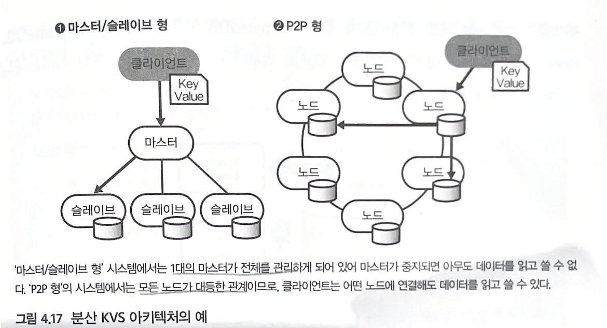

## References

- 도서
    - “빅데이터를 지탱하는 기술” : [http://www.yes24.com/Product/Goods/66277191](http://www.yes24.com/Product/Goods/66277191)
    - “데이터 중심 애플리케이션 설계” : [http://www.yes24.com/Product/Goods/59566585](http://www.yes24.com/Product/Goods/59566585)
- Data Warehouse 관련
    - [https://blog.hwahae.co.kr/all/tech/9409](https://blog.hwahae.co.kr/all/tech/9409) (영전님께서 올려주셨던 화해 블로그)
    - [https://www.slideshare.net/zzsza/bigquery-147073606](https://www.slideshare.net/zzsza/bigquery-147073606)
    - [https://www.guru99.com/star-snowflake-data-warehousing.html](https://www.guru99.com/star-snowflake-data-warehousing.html)
- Object Storage 관련
    - [https://cloud.google.com/learn/what-is-object-storage?hl=ko#section-4](https://cloud.google.com/learn/what-is-object-storage?hl=ko#section-4)
    - [https://tech.kakao.com/2022/08/18/radix-tree-for-object-storage/](https://tech.kakao.com/2022/08/18/radix-tree-for-object-storage/)     
- Data Lakehouse 관련
    - [http://cloudinsight.net/data/data-lakehouse/](http://cloudinsight.net/data/data-lakehouse/)
- Data Mart 관련
    - [https://aws.amazon.com/ko/what-is/data-mart/](https://aws.amazon.com/ko/what-is/data-mart/)
- Database 관련
    - [https://db-engines.com/en/ranking](https://db-engines.com/en/ranking)
    - [https://app.datacamp.com/learn/courses/introduction-to-relational-databases-in-sql](https://app.datacamp.com/learn/courses/introduction-to-relational-databases-in-sql)
    - [https://app.datacamp.com/learn/courses/database-design](https://app.datacamp.com/learn/courses/database-design)
    - [https://app.datacamp.com/learn/projects/1613](https://app.datacamp.com/learn/projects/1613)
    - [https://sungchul-p.github.io/db-on-k8s-vitess-overview](https://sungchul-p.github.io/db-on-k8s-vitess-overview)
- NoSQL 관련
    - [https://app.datacamp.com/learn/courses/nosql-concepts](https://app.datacamp.com/learn/courses/nosql-concepts)
    - [https://www.youtube.com/watch?v=Q_9cFgzZr8Q](https://www.youtube.com/watch?v=Q_9cFgzZr8Q)
    - [MongoDB] [https://app.datacamp.com/learn/courses/introduction-to-using-mongodb-for-data-science-with-python](https://app.datacamp.com/learn/courses/introduction-to-using-mongodb-for-data-science-with-python)
    - [Neo4j] [https://wikidocs.net/book/3724](https://wikidocs.net/book/3724)
    - DynamoDB
        - 아마존에서 개발한 P2P 형태의 분산 아키텍처
            - (참고) P2P / master-slave
                
                
                
                - master/slave형
                - master 서버에서 데이터를 쓰고, slave 서버는 master 서버로부터 데이터를 동기화하여 읽음
                - master 서버가 중지되면 아무도 데이터를 읽고 쓸 수 없는 단점이 있음
                - P2P형
                - 각 key마다 어느 노드에 배치할지 결정 → 노드 간 부하를 균등하게 분산
                - 노드 개수에 따라 성능 변경 가능
                - 모든 서버가 동등한 입장에서 데이터를 저장하고 읽음 → 분산 처리가 어려움
        - 데이터 애플리케이션에 지연 발생 시 곤란한 데이터 처리에 유용
        - ex) 듀오링고 (언어학습 어플) 에서 이용 - 매초 24,000개의 읽기 지원