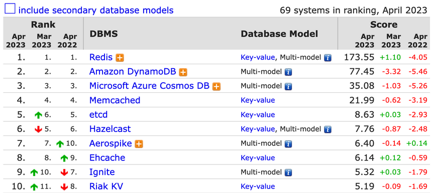

# 4.2.1 Key-Value Store (KVS)

Key-Value Store (KVS) 는 모든 데이터를 key - value 쌍으로 저장하는 데이터베이스로, 해시 함수나 python에서의 dictionary 형식과 유사한 형태로 저장됩니다.

## 기본 operation
- `PUT`: 새로운 key - value 쌍을 입력합니다. (이미 해당 key가 존재할 경우에는 value를 업데이트 합니다.)
- `GET`: 주어진 key에 대한 value를 반환합니다.
- `DELETE`: 해당 key가 존재할 경우, key - value 쌍을 삭제합니다.

## 장점
- value에 대한 data type 제약이 없습니다.
- value에 각각 다른 속성을 추가할 수도 있습니다.
    ```
    user:123:preferences = {"language": "ko"}
    user:123:preferences = {"language": "en", "color": "blue"}
    ```
## 단점
- key에 의해서만 값을 찾아야 하므로, key 값을 알 수 없는 경우 데이터를 찾을 수 없습니다.
- 이를 위해 value 기반으로 검색하는 기능을 제공하거나, 보조 인덱스를 생성하는 데이터베이스도 있습니다.

## 사용 예시
- 유저별 세션 정보 저장 (key : 세션 ID / value : 세션 정보)
- 유저별 프로필 및 기본 설정 (key: 유저 ID / value : 유저 정보)
- 유저별 추천, 광고 등 (key: 유저 ID / value : 해당 유저에 적합한 추천 아이템 및 광고 등)

## Top 10 Key-Value Stores

그렇다면 어떤 Key-Value Store가 많이 사용되고 있을까요? 
<br>[https://db-engines.com](https://db-engines.com)를 기반으로 Top 10 Key-Value Stores를 살펴보겠습니다.
    

(출처: [https://db-engines.com/en/ranking/key-value+store](https://db-engines.com/en/ranking/key-value+store))

### Redis
가장 많이 사용되는 KVS는 바로 Redis(Remote Dictionary Server) 입니다.
<br>Twitter, Pinterest, stackoverflow 등 다양한 회사에서도 유저별 세션 정보 저장 시 이용하고 있는 Redis는 다음과 같은 특징을 가지고 있습니다.
- in-memory 구조
    - 데이터를 디스크에 저장하지 않고 메모리에 저장하기 때문에 빠른 속도를 보장하게 됩니다.
    - 추가로 데이터를 디스크에 유지할 수도 있습니다.
- 비동기 복제 제공
    - 데이터가 기본 스토리지에 먼저 저장된 뒤, 복제본을 생성합니다.

### Oracle Berkeley DB
(인기 있는 DB는 아니지만) 현업에서 많이 사용하고 있는 KVS 중 하나로 Oracle Berkeley DB가 있습니다.
- 현업에서 간단한 데이터 정제 시 key별 value 정보가 필요할 경우 사용되고 있습니다.
- 임베디드 데이터베이스로, sqlite와 같이 파일 형식으로 DB가 저장됩니다.
- 다만 병렬 접근 시 속도가 매우 느려진다는 단점이 있으며, 이러한 점이 보완된 RocksDB 등이 제시되고 있습니다.
