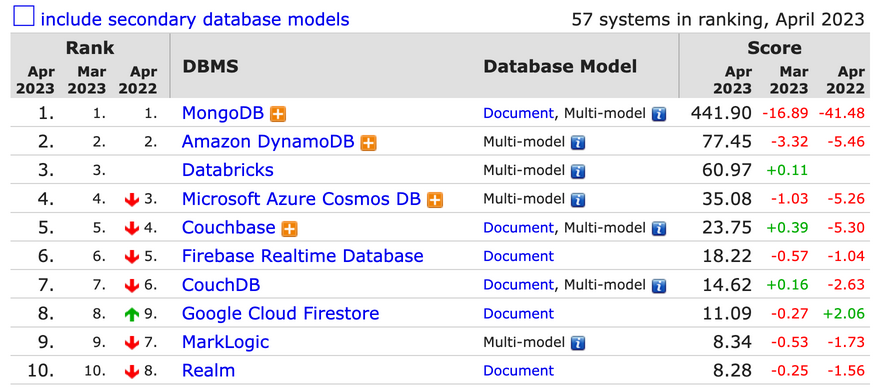

# 4.2.3 Document Store

Document Store는 흔히 알고 있는 JSON 형식으로 데이터가 저장되는 데이터베이스 입니다.
<br>
<br>Document Store에는 테이블을 나타내는 `collection`과 테이블 내 row를 나타내는 `document`가 있습니다.
<br>(각 document가 collection에 저장된다고 볼 수 있습니다.)

## 장점
- collection 내 document들끼리 동일한 구조이지 않아도 되기 때문에
<br>스키마를 정하지 않고 데이터를 저장할 수 있으며, 스키마가 변경되어도 데이터를 계속 저장할 수 있습니다.
- 데이터가 직관적이고, 개발 시 객체로 바로 적용할 수도 있습니다.
- 테이블 간 join 또한 필요하지 않습니다.

## 단점
- 중복 데이터에 대한 관리가 어렵다는 단점이 있습니다.
- 만약 특정 값을 다른 문서로 복사한 다음 그 값이 변경된다면,
<br>다른 문서 내용도 변경하기 위해 복사를 해왔던 문서를 기억해야 하는 번거로움이 있습니다.

## 사용 예시
- 상품 카탈로그
    ```json
    {
        "product_id": 123,
        "name": "Macbook M2 Pro",
        "category": {
            "category_id": "345",
            "name": "laptop"
        }
    }
    ```
- Event logging : 유저 로그, 제품 구매 내역, 오류 로그 등

## Top 10 Document Stores

Document Store에서는 어떤 데이터베이스가 많이 사용되고 있을까요?
<br>앞에서와 같이 [https://db-engines.com](https://db-engines.com)를 통해 Top 10 Document Stores를 살펴보겠습니다.


(출처: [https://db-engines.com/en/ranking/document+store](https://db-engines.com/en/ranking/document+store))

### MongoDB
- 랭킹에서 압도적인 score를 보이는 만큼 Document Store를 대표한다고 볼 수 있는 MongoDB는 BSON(Binary JSON) 형식으로 데이터를 저장합니다.
- Cassandra가 CQL을 제공하는 것과 유사하게 자체 쿼리 언어인 MQL(MongoDB Query Language)을 제공합니다.
    ```sql
    // 데이터 삽입
    db.users.insertOne({
        "first_name": "John",
        "last_name": "Doe",
        "email": "john.doe@example.com",
        "password": "password123",
        "created_at": new Date()
    })

    // 데이터 조회
    db.users.find({
        "email": "john.doe@example.com"
    })

    // 데이터 업데이트
    db.users.updateOne(
        {"email": "john.doe@example.com"},
        {$set: {"password": "newpassword123"}}
    )

    // 데이터 삭제
    db.users.deleteOne({
        "email": "john.doe@example.com"
    })
    ```
- 또한 sharding 기능을 제공하여 여러 서버에 분산 저장을 할 수도 있습니다.
    
