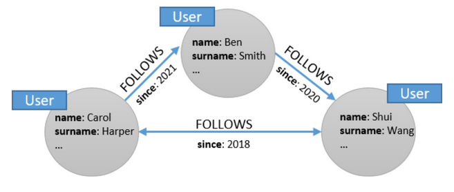
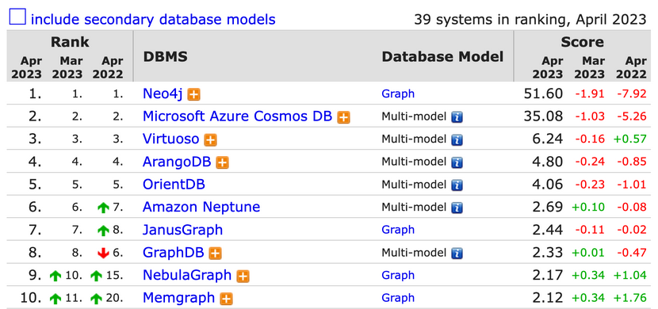
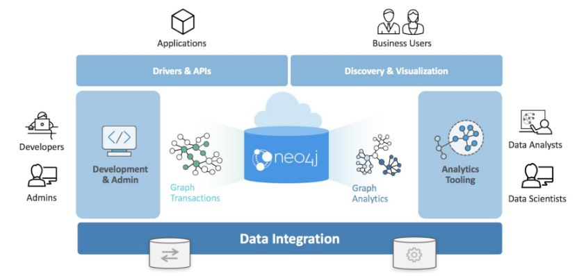
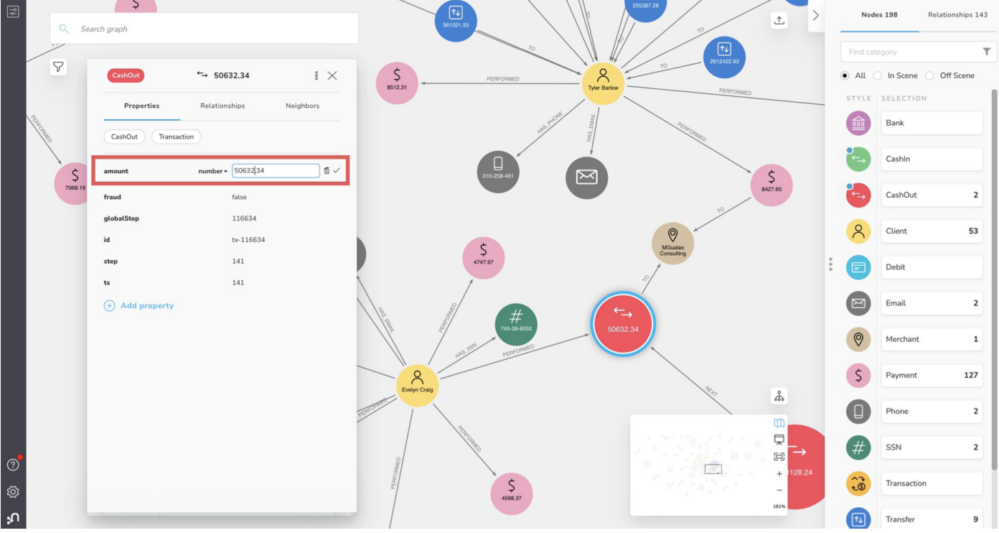

# 4.2.4 Graph Store

Graph Store는 말 그대로 그래프 구조로 데이터를 저장하며, node 및 edge 정보를 저장하게 됩니다.
<br>

Graph Store의 주요 특징으로는 쿼리 형태가 그래프를 traversing 하는 식으로 진행된다는 점이 있습니다.
<br>예를 들어 A가 팔로우하고 있는 모든 user 찾으려고 할 때, user A에 대한 node에서 팔로우와 관련된 edge를 통해 다른 user node 정보를 얻는 등과 같이 그래프의 node와 edge를 따라가면 원하는 정보를 얻을 수 있습니다.

## 장점
- 최종 구조를 미리 정의할 필요 없이 node, edge 및 해당 속성을 기존 그래프에 추가하거나 삭제할 수 있습니다.
- 이미 데이터가 서로 연결되어 있기 때문에 join을 수행할 필요 없이 특정 node에서부터 다른 node까지 edge를 따라가면 원하는 값을 얻을 수 있습니다.
- 데이터 형식이 직관적이고 시각화하기 쉽습니다.

## 단점
- 그래프 형식으로 표현 가능한 데이터에만 적합합니다.
- 새로운 쿼리 언어(Cypher, SPARQL 등)를 이용해야 하기 때문에 러닝커브가 있습니다.

## 사용 예시
- 소셜 네트워크 데이터 (사람들 간 팔로우 정보, 게시물 및 좋아요 정보 등)
- 전염병 데이터 (사람들 간 접촉 정보, 감염 여부 등)
- 경로 안내 서비스 (장소 간 거리 정보로 최적 경로 제공)
- 추천시스템 (유사한 사용자가 시청한 다른 영화를 그래프 기반으로 검색)

## Top 10 Graph Stores

마지막으로 Graph Store에서는 어떤 데이터베이스가 많이 사용되고 있을까요?
<br>Graph Store 또한 [https://db-engines.com](https://db-engines.com)를 통해 Top 10 Graph Stores를 살펴보겠습니다.


(출처: [https://db-engines.com/en/ranking/graph+dbms](https://db-engines.com/en/ranking/graph+dbms))

### Neo4j
- 대표적인 Graph Store인 Neo4j는 아래와 같은 아키텍쳐를 지니고 있습니다.
    
- 자체적으로 Neo4j graph 플랫폼을 제공하고 있어서 데이터에 접근하기에 용이합니다.
    
- 그래프와 관련된 다양한 알고리즘 기능 또한 제공합니다.
    - path finding
    - centrality
    - community detection
    - similarity
    - link prediction
    - node embeddings
    - node classification
    - …
- 데이터 접근 시에는 Cypher 쿼리 언어를 통해 접근할 수 있습니다.
    ```sql
    // node 생성
    CREATE (n:Person { name: 'John Doe', age: 30 })
    
    // node 검색
    MATCH (n:Person { name: 'John Doe' }) RETURN n

    // node 간 edge 생성
    MATCH (p1:Person { name: 'John Doe' }), (p2:Person { name: 'Jane Smith' })
    CREATE (p1)-[:FRIENDS_WITH]->(p2)
    
    // node 및 edge 검색
    MATCH (p1:Person)-[:FRIENDS_WITH]->(p2:Person)
    WHERE p1.name = 'John Doe'
    RETURN p1, p2
    
    // edge 수정
    MATCH (p1:Person)-[r:FRIENDS_WITH]->(p2:Person)
    WHERE p1.name = 'John Doe' AND p2.name = 'Jane Smith'
    SET r.since = '2022-01-01'
    
    // edge 제거
    MATCH (p1:Person)-[r:FRIENDS_WITH]->(p2:Person)
    WHERE p1.name = 'John Doe' AND p2.name = 'Jane Smith'
    DELETE r
    ```
