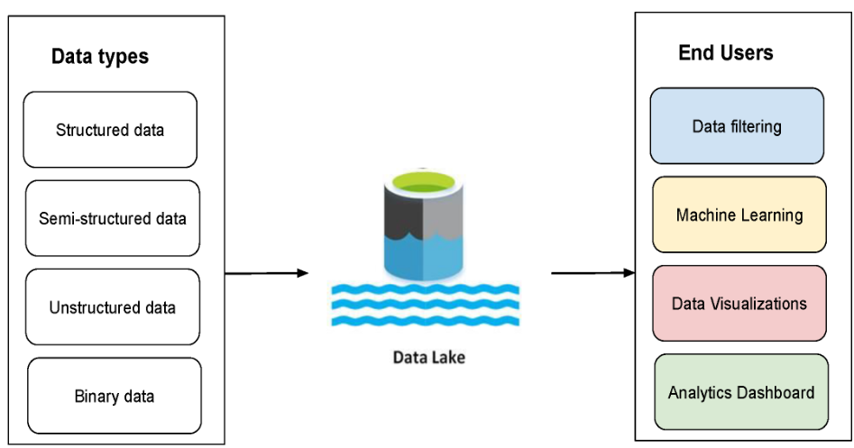

# 4.4 Data Lake

    
Data Lake는 다양한 형태의 데이터를 저장하기 위한 객체 스토리지 형식의 저장소입니다.

비정형 데이터나 실시간 데이터와 같이 다양한 형태와 크기의 데이터 저장에 적합합니다.

데이터를 수집 후 바로 정제 과정을 진행하는 ETL Process와는 다르게 먼저 데이터를 기존 형태로 저장한 후, 이후에 스키마를 정의하고 적재하는 ELT Process를 사용합니다.

---

- 기능 및 특징
    - 비정형 데이터, 정형 데이터, 실시간 데이터 등 모든 종류의 데이터를 기존 형태로 저장합니다.    
    - 유연하고 비용절감이 가능하며 비정형 데이터를 정제하지 않고도 ad-hoc 분석 등에 활용 할 수 있습니다.
- 단점    
    - 접근 권한 관리, 동시성, ACID Transaction, BI 제품과의 호환성이 기존 data warehouse보다 약합니다.
    - 수정이 필요한 경우 파일을 교체하는 방법밖에 없기 때문에 수시로 변경이 필요한 데이터에 부적합합니다.
      
- 객체 스토리지  
    - 객체 스토리지는 데이터가 저장될 떄, 다수의 컴퓨터를 사용하여 부하 분산이 이뤄지는 저장소입니다.    
    - 객체 스토리지 기반의 저장소는 방대한 양의 데이터를 저장하여도 성능에 크게 지장이 없지만 소량의 데이터를 저장하기엔 비효율적입니다.    
    - ex) gcs, s3, HDFS

