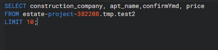
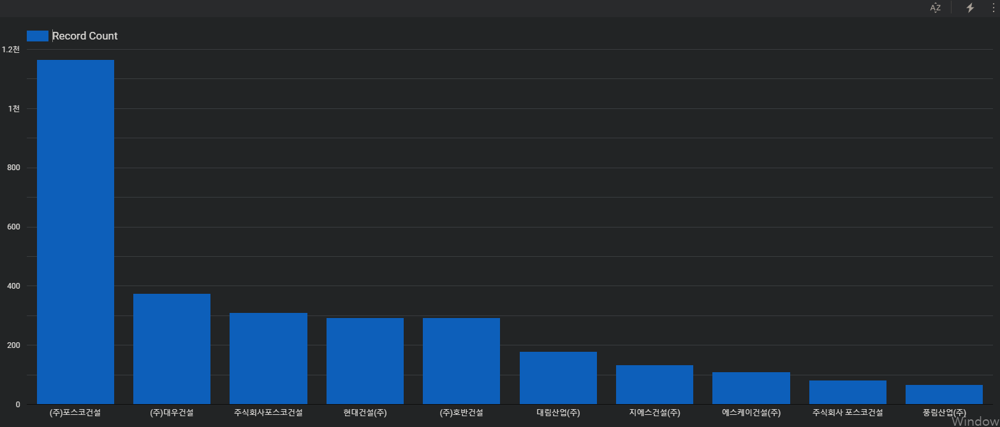

# 4.6 💻 Data Pipeline 실습

## 예제 Process

**Source Data**

- 네이버 부동산 데이터 중 현 매물 리스트를 Crawling하여 데이터를 수집했습니다.

**데이터 정보**

**Data Lake**

- Data Lake는 source data 원본 저장 용도로 사용하였습니다.
- raw file인 csv 형태로 저장되어 있으며 Data Lake에선 쿼리, 데이터 탐색 등은 불가능한 상태입니다.

**Data Warehouse**

- Data Lake에 저장된 데이터를 Data Warehouse에 Load하면서 structured data로 변환하였습니다.
- Data Warehouse에선 쿼리를 통해 데이터 탐색이 가능합니다.

**Visualize**

- Looker studio를 활용하여 bigquery 테이블을 load하여 시각화하는 과정까지 진행했습니다.

