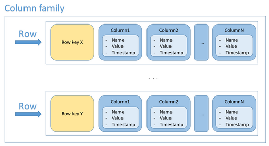
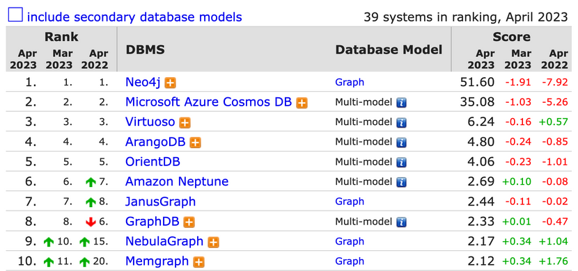

# 4.7 Databases

데이터를 저장하기 위해 사용되는 데이터베이스는 크게 `RDBMS`와 `NoSQL(Not only SQL)`로 나눌 수 있습니다.
<br>이번 챕터에서는 그 중 NoSQL 데이터베이스의 종류 및 특징에 대해 알아보고자 합니다.

## Key-Value Store (KVS)

Key-Value Store (KVS) 는 모든 데이터를 key - value 쌍으로 저장하는 데이터베이스로, 해시 함수나 python에서의 dictionary 형식과 유사한 형태로 저장됩니다.

### 기본 operation
- `PUT`: 새로운 key - value 쌍을 입력합니다. (이미 해당 key가 존재할 경우에는 value를 업데이트 합니다.)
- `GET`: 주어진 key에 대한 value를 반환합니다.
- `DELETE`: 해당 key가 존재할 경우, key - value 쌍을 삭제합니다.

### 장점
- value에 대한 data type 제약이 없습니다.
- value에 각각 다른 속성을 추가할 수도 있습니다.
    ```
    user:123:preferences = {"language": "ko"}
    user:123:preferences = {"language": "en", "color": "blue"}
    ```
### 단점
- key에 의해서만 값을 찾아야 하므로, key 값을 알 수 없는 경우 데이터를 찾을 수 없습니다.
- 이를 위해 value 기반으로 검색하는 기능을 제공하거나, 보조 인덱스를 생성하는 데이터베이스도 있습니다.

### 사용 예시
- 유저별 세션 정보 저장 (key : 세션 ID / value : 세션 정보)
- 유저별 프로필 및 기본 설정 (key: 유저 ID / value : 유저 정보)
- 유저별 추천, 광고 등 (key: 유저 ID / value : 해당 유저에 적합한 추천 아이템 및 광고 등)

### Top 10 Key-Value Stores

그렇다면 어떤 Key-Value Store가 많이 사용되고 있을까요? 
<br>[https://db-engines.com](https://db-engines.com)를 기반으로 Top 10 Key-Value Stores를 살펴보겠습니다.
    

(출처: [https://db-engines.com/en/ranking/key-value+store](https://db-engines.com/en/ranking/key-value+store))

### Redis
가장 많이 사용되는 KVS는 바로 Redis(Remote Dictionary Server) 입니다.
<br>Twitter, Pinterest, stackoverflow 등 다양한 회사에서도 유저별 세션 정보 저장 시 이용하고 있는 Redis는 다음과 같은 특징을 가지고 있습니다.
- in-memory 구조
    - 데이터를 디스크에 저장하지 않고 메모리에 저장하기 때문에 빠른 속도를 보장하게 됩니다.
    - 추가로 데이터를 디스크에 유지할 수도 있습니다.
- 비동기 복제 제공
    - 데이터가 기본 스토리지에 먼저 저장된 뒤, 복제본을 생성합니다.

### Oracle Berkeley DB
(인기 있는 DB는 아니지만) 현업에서 많이 사용하고 있는 KVS 중 하나로 Oracle Berkeley DB가 있습니다.
- 현업에서 간단한 데이터 정제 시 key별 value 정보가 필요할 경우 사용되고 있습니다.
- 임베디드 데이터베이스로, sqlite와 같이 파일 형식으로 DB가 저장됩니다.
- 다만 병렬 접근 시 속도가 매우 느려진다는 단점이 있으며, 이러한 점이 보완된 RocksDB 등이 제시되고 있습니다.


---

## Wide-Column Store (Column-family Store)

Google BigTable 에서 유래된 Wide-Column Store(Column-family Store)는 row key와 column name의 조합으로 값을 저장합니다. 
<br>
<br>RDBMS와 유사한 형태로 볼 수 있지만, column이 지정되지 않고 자유롭게 입력될 수 있는 형태로 되어 있다는 차이점이 있습니다.

### 장점
- row마다 다른 column 개수를 가질 수 있고, 필요할 때마다 원하는 column 추가할 수 있습니다.
- RDBMS에서는 특정 column 값이 없을 때 default value를 넣어야 했지만,
<br>Wide-Column Store에서는 특정 column에 대해 default 값으로 채우지 않아도 됩니다.
- 필요한 column 정보만 쓰면 되고 특정 column에 해당하는 데이터만 읽으면 되기 때문에 처리 속도가 빠릅니다.

### 단점
- multi-row 트랜잭션을 지원하지 않습니다.
- join, subquery 등 또한 지원하지 않습니다.

### 사용 예시
- event logging: 이벤트별 사용자 로그 내역, 애플리케이션 오류 내역 등을 저장합니다.
- 컨텐츠 관리 시스템: 컨텐츠별 댓글, 링크, 태그 등을 저장합니다.

### Top 10 Wide-Column Stores

그렇다면 어떤 Wide-Column Store가 많이 사용되고 있을까요? 
<br>Key-Value Store와 마찬가지로 [https://db-engines.com](https://db-engines.com)에서 Top 10 Wide-Column Stores를 살펴보겠습니다.


(출처: [https://db-engines.com/en/ranking/wide+column+store](https://db-engines.com/en/ranking/wide+column+store))

### Cassandra
- 페이스북에서 개발되고 애플, 넷플릭스, 우버 등에서 이용중인 Cassandra는 아파치 재단에서 관리하고 있는 오픈소스입니다.
- 데이터가 노드에 분산되어 저장되므로 노드를 추가하여 수평적으로 확장할 수 있습니다.
- Cassandra 전용 쿼리 언어인 CQL(Cassandra Query Language)을 제공합니다.
<br>이는 SQL과 비슷하지만 join 및 subquery를 제공하지 않고 외래 키가 없다는 특징이 있습니다.
    ```sql
    // 테이블 생성
    CREATE TABLE users (
        user_id uuid PRIMARY KEY,
        first_name text,
        last_name text,
        email text,
        password text,
        created_at timestamp
    );

    // 데이터 삽입
    INSERT INTO users (user_id, first_name, last_name, email, password, created_at) VALUES 
        (uuid(), 'John', 'Doe', 'john.doe@example.com', 'password123', toTimestamp(now()));

    // 데이터 조회
    SELECT * FROM users WHERE user_id = f3f9e3e3-301b-4c8a-ae0a-ccbae7b477a2;

    // 데이터 업데이트
    UPDATE users SET password = 'newpassword123' WHERE user_id = f3f9e3e3-301b-4c8a-ae0a-ccbae7b477a2;

    // 데이터 삭제
    DELETE FROM users WHERE user_id = f3f9e3e3-301b-4c8a-ae0a-ccbae7b477a2;
    ```

---

## Document Store

Document Store는 흔히 알고 있는 JSON 형식으로 데이터가 저장되는 데이터베이스 입니다.
<br>
<br>Document Store에는 테이블을 나타내는 `collection`과 테이블 내 row를 나타내는 `document`가 있습니다.
<br>(각 document가 collection에 저장된다고 볼 수 있습니다.)

### 장점
- collection 내 document들끼리 동일한 구조이지 않아도 되기 때문에
<br>스키마를 정하지 않고 데이터를 저장할 수 있으며, 스키마가 변경되어도 데이터를 계속 저장할 수 있습니다.
- 데이터가 직관적이고, 개발 시 객체로 바로 적용할 수도 있습니다.
- 테이블 간 join 또한 필요하지 않습니다.

### 단점
- 중복 데이터에 대한 관리가 어렵다는 단점이 있습니다.
- 만약 특정 값을 다른 문서로 복사한 다음 그 값이 변경된다면,
<br>다른 문서 내용도 변경하기 위해 복사를 해왔던 문서를 기억해야 하는 번거로움이 있습니다.

### 사용 예시
- 상품 카탈로그
    ```json
    {
        "product_id": 123,
        "name": "Macbook M2 Pro",
        "category": {
            "category_id": "345",
            "name": "laptop"
        }
    }
    ```
- Event logging : 유저 로그, 제품 구매 내역, 오류 로그 등

### Top 10 Document Stores

Document Store에서는 어떤 데이터베이스가 많이 사용되고 있을까요?
<br>앞에서와 같이 [https://db-engines.com](https://db-engines.com)를 통해 Top 10 Document Stores를 살펴보겠습니다.


(출처: [https://db-engines.com/en/ranking/document+store](https://db-engines.com/en/ranking/document+store))

### MongoDB
- 랭킹에서 압도적인 score를 보이는 만큼 Document Store를 대표한다고 볼 수 있는 MongoDB는 BSON(Binary JSON) 형식으로 데이터를 저장합니다.
- Cassandra가 CQL을 제공하는 것과 유사하게 자체 쿼리 언어인 MQL(MongoDB Query Language)을 제공합니다.
    ```sql
    // 데이터 삽입
    db.users.insertOne({
        "first_name": "John",
        "last_name": "Doe",
        "email": "john.doe@example.com",
        "password": "password123",
        "created_at": new Date()
    })

    // 데이터 조회
    db.users.find({
        "email": "john.doe@example.com"
    })

    // 데이터 업데이트
    db.users.updateOne(
        {"email": "john.doe@example.com"},
        {$set: {"password": "newpassword123"}}
    )

    // 데이터 삭제
    db.users.deleteOne({
        "email": "john.doe@example.com"
    })
    ```
- 또한 sharding 기능을 제공하여 여러 서버에 분산 저장을 할 수도 있습니다.
    

***

## Graph Store

Graph Store는 말 그대로 그래프 구조로 데이터를 저장하며, node 및 edge 정보를 저장하게 됩니다.
<br>

Graph Store의 주요 특징으로는 쿼리 형태가 그래프를 traversing 하는 식으로 진행된다는 점이 있습니다.
<br>예를 들어 A가 팔로우하고 있는 모든 user 찾으려고 할 때, user A에 대한 node에서 팔로우와 관련된 edge를 통해 다른 user node 정보를 얻는 등과 같이 그래프의 node와 edge를 따라가면 원하는 정보를 얻을 수 있습니다.

### 장점
- 최종 구조를 미리 정의할 필요 없이 node, edge 및 해당 속성을 기존 그래프에 추가하거나 삭제할 수 있습니다.
- 이미 데이터가 서로 연결되어 있기 때문에 join을 수행할 필요 없이 특정 node에서부터 다른 node까지 edge를 따라가면 원하는 값을 얻을 수 있습니다.
- 데이터 형식이 직관적이고 시각화하기 쉽습니다.

### 단점
- 그래프 형식으로 표현 가능한 데이터에만 적합합니다.
- 새로운 쿼리 언어(Cypher, SPARQL 등)를 이용해야 하기 때문에 러닝커브가 있습니다.

### 사용 예시
- 소셜 네트워크 데이터 (사람들 간 팔로우 정보, 게시물 및 좋아요 정보 등)
- 전염병 데이터 (사람들 간 접촉 정보, 감염 여부 등)
- 경로 안내 서비스 (장소 간 거리 정보로 최적 경로 제공)
- 추천시스템 (유사한 사용자가 시청한 다른 영화를 그래프 기반으로 검색)

### Top 10 Graph Stores

마지막으로 Graph Store에서는 어떤 데이터베이스가 많이 사용되고 있을까요?
<br>Graph Store 또한 [https://db-engines.com](https://db-engines.com)를 통해 Top 10 Graph Stores를 살펴보겠습니다.


(출처: [https://db-engines.com/en/ranking/graph+dbms](https://db-engines.com/en/ranking/graph+dbms))

### Neo4j
- 대표적인 Graph Store인 Neo4j는 아래와 같은 아키텍쳐를 지니고 있습니다.
    
- 자체적으로 Neo4j graph 플랫폼을 제공하고 있어서 데이터에 접근하기에 용이합니다.
    
- 그래프와 관련된 다양한 알고리즘 기능 또한 제공합니다.
    - path finding
    - centrality
    - community detection
    - similarity
    - link prediction
    - node embeddings
    - node classification
    - …
- 데이터 접근 시에는 Cypher 쿼리 언어를 통해 접근할 수 있습니다.
    ```sql
    // node 생성
    CREATE (n:Person { name: 'John Doe', age: 30 })
    
    // node 검색
    MATCH (n:Person { name: 'John Doe' }) RETURN n

    // node 간 edge 생성
    MATCH (p1:Person { name: 'John Doe' }), (p2:Person { name: 'Jane Smith' })
    CREATE (p1)-[:FRIENDS_WITH]->(p2)
    
    // node 및 edge 검색
    MATCH (p1:Person)-[:FRIENDS_WITH]->(p2:Person)
    WHERE p1.name = 'John Doe'
    RETURN p1, p2
    
    // edge 수정
    MATCH (p1:Person)-[r:FRIENDS_WITH]->(p2:Person)
    WHERE p1.name = 'John Doe' AND p2.name = 'Jane Smith'
    SET r.since = '2022-01-01'
    
    // edge 제거
    MATCH (p1:Person)-[r:FRIENDS_WITH]->(p2:Person)
    WHERE p1.name = 'John Doe' AND p2.name = 'Jane Smith'
    DELETE r
    ```


<script src="https://utteranc.es/client.js"
        repo="Pseudo-Lab/data-engineering-for-everybody"
        issue-term="pathname"
        label="comments"
        theme="preferred-color-scheme"
        crossorigin="anonymous"
        async>
</script>