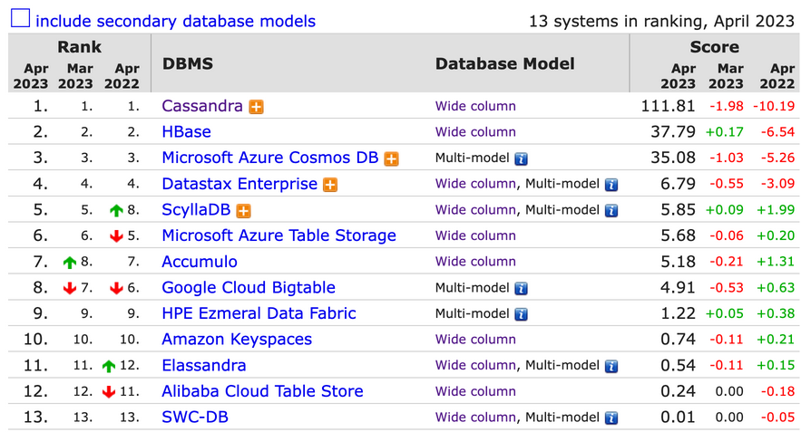

# 4.9 Wide-Column Store (Column-family Store)

Google BigTable 에서 유래된 Wide-Column Store(Column-family Store)는 row key와 column name의 조합으로 값을 저장합니다. 
<br>
<br>RDBMS와 유사한 형태로 볼 수 있지만, column이 지정되지 않고 자유롭게 입력될 수 있는 형태로 되어 있다는 차이점이 있습니다.

## 장점
- row마다 다른 column 개수를 가질 수 있고, 필요할 때마다 원하는 column 추가할 수 있습니다.
- RDBMS에서는 특정 column 값이 없을 때 default value를 넣어야 했지만,
<br>Wide-Column Store에서는 특정 column에 대해 default 값으로 채우지 않아도 됩니다.
- 필요한 column 정보만 쓰면 되고 특정 column에 해당하는 데이터만 읽으면 되기 때문에 처리 속도가 빠릅니다.

## 단점
- multi-row 트랜잭션을 지원하지 않습니다.
- join, subquery 등 또한 지원하지 않습니다.

## 사용 예시
- event logging: 이벤트별 사용자 로그 내역, 애플리케이션 오류 내역 등을 저장합니다.
- 컨텐츠 관리 시스템: 컨텐츠별 댓글, 링크, 태그 등을 저장합니다.

## Top 10 Wide-Column Stores

그렇다면 어떤 Wide-Column Store가 많이 사용되고 있을까요? 
<br>Key-Value Store와 마찬가지로 [https://db-engines.com](https://db-engines.com)에서 Top 10 Wide-Column Stores를 살펴보겠습니다.


(출처: [https://db-engines.com/en/ranking/wide+column+store](https://db-engines.com/en/ranking/wide+column+store))

### Cassandra
- 페이스북에서 개발되고 애플, 넷플릭스, 우버 등에서 이용중인 Cassandra는 아파치 재단에서 관리하고 있는 오픈소스입니다.
- 데이터가 노드에 분산되어 저장되므로 노드를 추가하여 수평적으로 확장할 수 있습니다.
- Cassandra 전용 쿼리 언어인 CQL(Cassandra Query Language)을 제공합니다.
<br>이는 SQL과 비슷하지만 join 및 subquery를 제공하지 않고 외래 키가 없다는 특징이 있습니다.
    ```sql
    // 테이블 생성
    CREATE TABLE users (
        user_id uuid PRIMARY KEY,
        first_name text,
        last_name text,
        email text,
        password text,
        created_at timestamp
    );

    // 데이터 삽입
    INSERT INTO users (user_id, first_name, last_name, email, password, created_at) VALUES 
        (uuid(), 'John', 'Doe', 'john.doe@example.com', 'password123', toTimestamp(now()));

    // 데이터 조회
    SELECT * FROM users WHERE user_id = f3f9e3e3-301b-4c8a-ae0a-ccbae7b477a2;

    // 데이터 업데이트
    UPDATE users SET password = 'newpassword123' WHERE user_id = f3f9e3e3-301b-4c8a-ae0a-ccbae7b477a2;

    // 데이터 삭제
    DELETE FROM users WHERE user_id = f3f9e3e3-301b-4c8a-ae0a-ccbae7b477a2;
    ```


<script src="https://utteranc.es/client.js"
        repo="Pseudo-Lab/data-engineering-for-everybody"
        issue-term="pathname"
        label="comments"
        theme="preferred-color-scheme"
        crossorigin="anonymous"
        async>
</script>