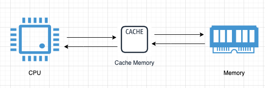
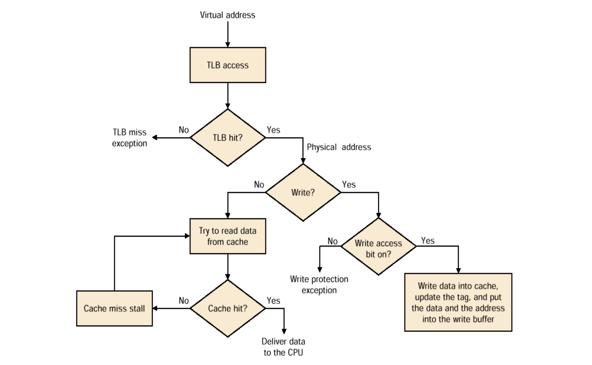

# 1.3 캐싱(Cache + ing)

Cache: 자주 필요한 데이터나 값의 복사본을 일시적으로 저장, 보관하기 위해 사용하는 곳



병목 현상을 완화하기 위해 CPU와 메인 메모리(RAM) 사이에 크기는 작지만 속도가 빠른 **캐시 메모리**를 두고, 향후 재사용할 가능성이 클 것으로 예상되는 데이터의 복사본을 저장해 둔 CPU 가 요청하는 데이터를 바로바로 전달할 수 있도록 한다. 


위로 올라갈수록 CPU와 가깝고 속도가 빠르고 비싸고 용량이 작습니다.

- 더 자세히 (캐시는 왜 빠르지만 크기가 작고, 메모리는 캐시에 비해 왜 느릴까요?)
    
    기본적으로 캐시는 SRAM, 메모리는 DRAM으로 구성되어 있습니다. SRAM은 Static Random Access Memory이고 DRAM은 Dynamic Random Access Memeory입니다. 용어에서도 알 수 있듯이 SRAM과 DRAM의 차이점은 바로 Static 하냐 아니면 Dynamic 하냐인데요, 이것만 들으면 감이 안 오실 수 있습니다. DRAM에서의 Dynamic은 refresh time마다 매번 DRAM 내의 모든 cell에 대해서 refresh를 해야하는 것을 뜻합니다. 그래서 이 부분에서 overhead가 발생하기 때문에 상대적으로 SRAM에 비해서 느립니다. 그러나 한개의 transistor와 한개의 capacitor로 구성할 수 있기 때문에 단위 면적당 들어가는 비용이 적어 용량을 키우는데 비용 효율적입니다. 
    
    반면에 SRAM은 항상 supply voltage가 공급되고 있으며 refresh를 하지 않습니다. 그렇기 때문에 같은 용량이라고 가정했을 때 DRAM에 비해 상대적으로 빠르게 access 할 수 있습니다. 그러나 이러한 구조를 만들기 위해선 SRAM은 6개의 transistor가 필요합니다. 그래서 단위 면적당 들어가는 비용이 DRAM에 비해 비싸기 때문에 용량을 키우는데 적합하지 않은 것이죠. 여기서 같은 용량이라고 가정한 이유는 용량이 작을 수록 access time이 줄어들기 때문입니다.
    
- 더 자세히 (Typical Memory Hierarchy workflow)
    
    
    

🤷‍♂️ **재사용할 가능성이 큰 지는 어떻게 알 수 있나요?**

데이터 지역성의 원리

- 시간적 지역성
    - 한 번 접근한 데이터에 대해서 다시 접근할 가능성이 높다는 가정
- 공간적 지역성
    - 특정 데이터에 접근할때, 그 특정 데이터 뿐만 아니라 그 특정 데이터 근처에 있는 다른 데이터들도 접근할 확률이 높을 것이라는 가정
- 자세한 설명
    
    컴퓨터 아키텍처에서 지역성의 원리는 시간적 지역성과 공간적 지역성으로 구분할 수 있습니다. 
    
    먼저 시간적 지역성은 한번 접근한 데이터에 대해서 다시 접근할 가능성이 높다는 가정이 깔려있습니다. 그래서 memory에서 cache로 데이터를 가져왔을 때 이를 추후에 다시 접근할 가능성이 높기 때문에 재사용 가능성이 크다고 하는 것이고 이를 시간적 지역성이라고 합니다.
    
    공간적 지역성은 cache의 구조를 살펴봐야 이해할 수 있는데요 memory에서 cache로 데이터를 가져올 때 block size로 미리 정해진 크기만큼 잘라서 가져오게 됩니다. 그래서 만약 block size가 4bytes라 하고 만약 데이터를 1 byte 단위, 혹은 2 byte 단위로 저장하고 있다고 한다면 당장 접근했던 1 byte 혹은 2bytes만을 cache로 가져오는 것이 아니라 block size인 4 bytes 전부를 가져오게 됩니다. 이는 최근에 접근했던 데이터의 근처 데이터를 다시 접근할 확률이 높을 것이라는 공간적 지역성의 특성을 활용한 설계입니다. 
    
    예를 들어 다음의 프로그램을 실행시킨다고 가정해봅니다. 
    
    ```c
    int arr[100] = { // data... }
    
    for(i=0; i < 100; i++){
    	printf("%d\n", arr[i]);
    }
    ```
    
    그리고 block size는 16 bytes라 가정해 봅시다. arr 배열은 int 형이기에 한 원소의 size는 4bytes이고 전체 배열의 sizes는 4bytes x 100 = 400 bytes가 될 것입니다. 이제 for 문을 돌면서 한 원소씩 접근하게 됩니다. cache는 모두 비어있다고 가정해봅시다. arr[0]에 접근했을 때 cache miss이기에 memory에서 arr[0]에 해당하는 data를 cache로 가져오게 됩니다. 그러나 이때 arr[0]만 가져오는 것이 아닌 block size인 16 bytes를 통채로 가져오기 때문에 arr[0], arr[1], arr[2], arr[3]의 데이터가 모두 cache에 저장되게 됩니다. 그러면 다음 접근 시에는 위의 데이터에 대해서 cache miss가 나질 않겠죠? 이런 식으로 공간적 지역성을 활용한 설계를 했기 때문에 memory 접근을 최대한으로 줄일 수 있게 됩니다!
    
    다시 정리하면 메모리 계층구조는 **최근에 접근했던 데이터들을 프로세서 가까이 적재함으로써 시간적 지역성**을 이용합니다. 또한 **필요한 데이터뿐만 아니라 이와 인접한 다량의 데이터들로 이루어진 블록을 메모리의 상위 계층으로 옮김으로써 공간적 지역성을 이용합니다.**