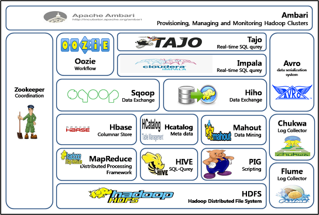
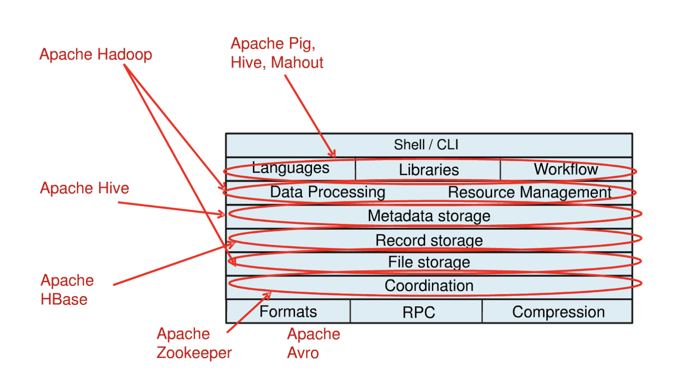
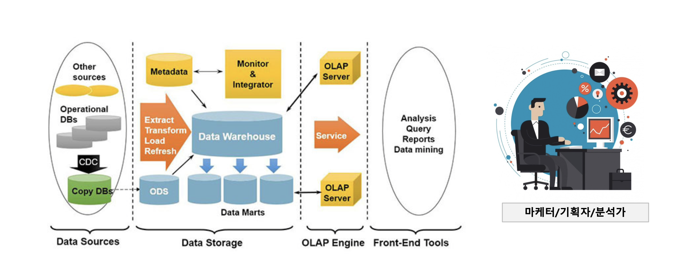

# 2.1 Hadoop Ecosystem

Apache Hadoop 에코시스템이란 Apache Hadoop 소프트웨어 라이브러리를 이루는 다양한 구성 요소를 말합니다. Hadoop Ecosystem은 분산 컴퓨팅을 위한 오픈 소스 프레임워크로, 대규모 데이터를 처리하고 저장하는데 사용됩니다. Hadoop Ecosystem은 여러 구성 요소로 구성되어 있으며, 다양한 데이터 처리 기능을 제공합니다. 이러한 구성 요소 중 일부는 다음과 같습니다.

## HDFS

HDFS는 Hadoop Distributed File System의 약자로 대용량 데이터를 분산 저장하는 하둡의 기본 스토리지 시스템입니다.

## Hive

Hive는 HDFS에 저장된 데이터를 SQL로 쿼리하려는 목적에서 탄생된 툴입니다. 정확하게 SQL과 동일하진 않지만 SQL과 유사한 구문을 활용합니다. RDB의 데이터베이스, 테이블과 같은 형태로 HDFS에 저장된 데이터의 구조를 정의하는 방법을 제공하며, 이 데이터를 대상으로 SQL과 유사한 **HiveQL 쿼리**를 이용하여 데이터를 조회하는 방법을 제공합니다. 

가장 큰 특징으로는 **메타스토어**라는 것이 존재하는데, 하이브는 기존의 RDB와는 다르게 미리 스키마를 정의하고 그 틀에 맞게 데이터를 입력하는 것이 아닌, **데이터를 저장하고 거기에 스키마를 입히는(메타스토어에 입력하는) 것이 가장 큰 특징**입니다.

HiveQL이라는 쿼리 문법을 활용해 MapReduce를 편하게 사용하려는 것이 목적입니다.

## Apache Pig

MapReduce를 사용하지 않고 분산 파일 시스템을 처리할 수 있는 스크립트 언어입니다.

## MapReduce

MapReduce는 분산 파일 시스템인 HDFS의 데이터를 병렬로 처리할 수 있는 소프트웨어 프레임워크 구현체입니다. 

## YARN

YARN은 Yet Another Resource Negotiator의 약어인데, 통상 약어만 써서 지칭합니다. 이것은 오픈 소스 Apache Hadoop의 핵심 구성 요소 중 하나로, 리소스 관리에 적합합니다. 워크로드 관리, 모니터링, 보안 관리 구현 등의 작업을 담당합니다. 또한 시스템 리소스를 하둡 클러스터에서 실행되는 다양한 애플리케이션에 할당하면서 동시에 각각의 클러스터 노드에서 어느 작업을 실행하는 것이 좋은지 할당하기도 합니다. YARN은 크게 두 가지 구성 요소로 이루어져 있습니다.

- 리소스 관리자
- 노드 관리자

## Apache Spark

Apache Spark는 무척 광범위한 상황에 사용하기 적합한 고속, 메모리 내 데이터 처리 엔진입니다. Spark는 여러 가지 방식으로 배포할 수 있고 Java, Python, Scala와 R 프로그래밍 언어를 포함하며 SQL 스트리밍 데이터, 머신 러닝과 그래프 처리를 지원하여 주어진 애플리케이션 한 개에서 이를 함께 사용할 수 있습니다.

## 정리

결국 Hadoop 생태계의 발전으로 빅데이터를 저장하는데 드는 비용이 많이 줄어들었습니다. 많은 기업에서 Hadoop을 기반으로 빅데이터를 저장하기 위한 인프라를 구축하였고 이제는 쌓아둔 data를 분석하고 활용하여 새로운 기회를 창출하는 시대에 돌입했다고 합니다. 

