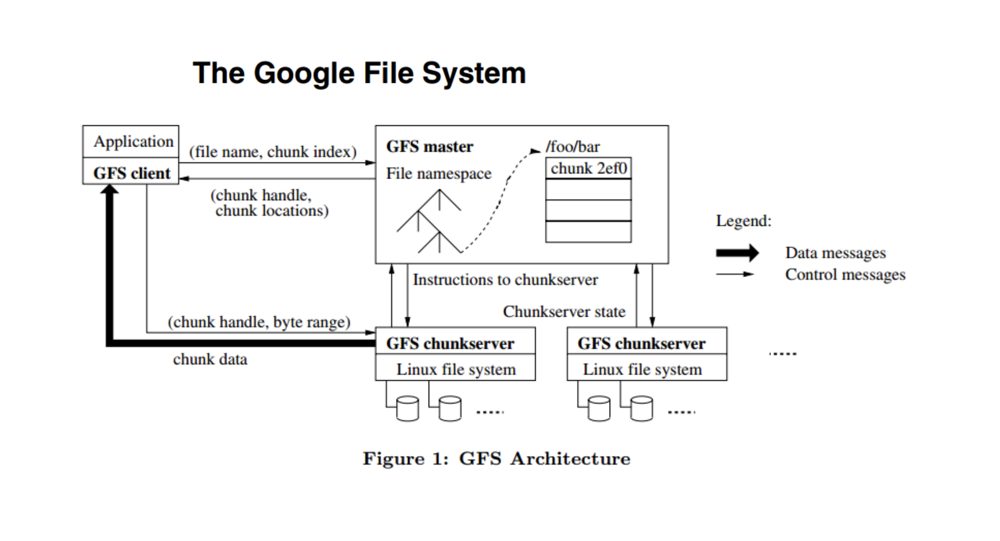
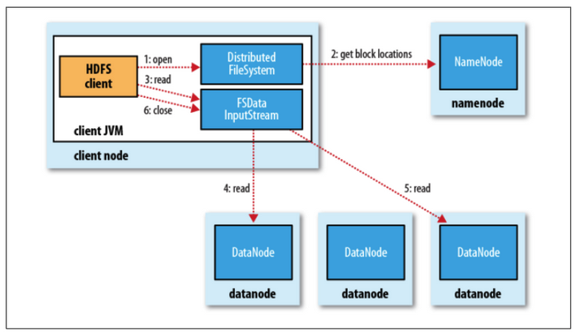
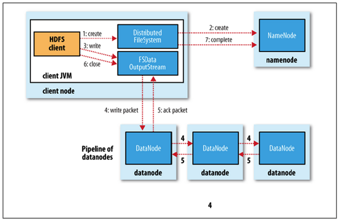
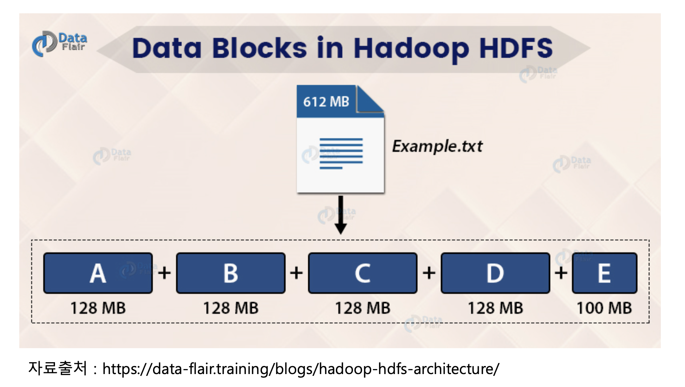
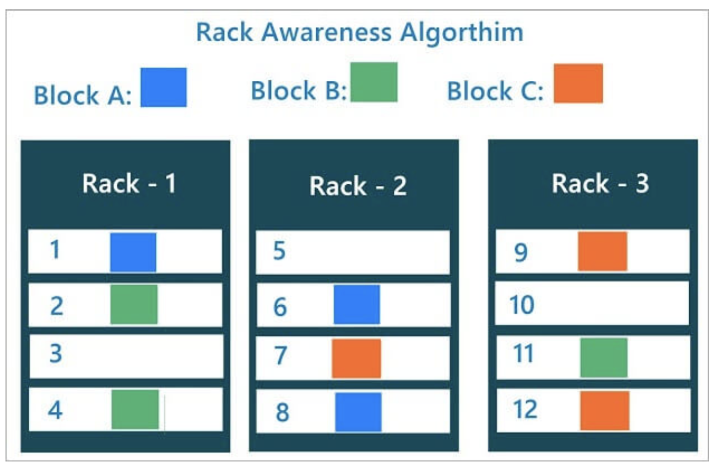
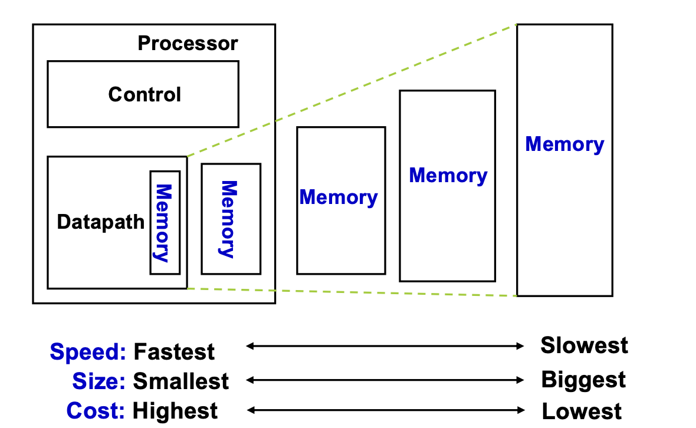
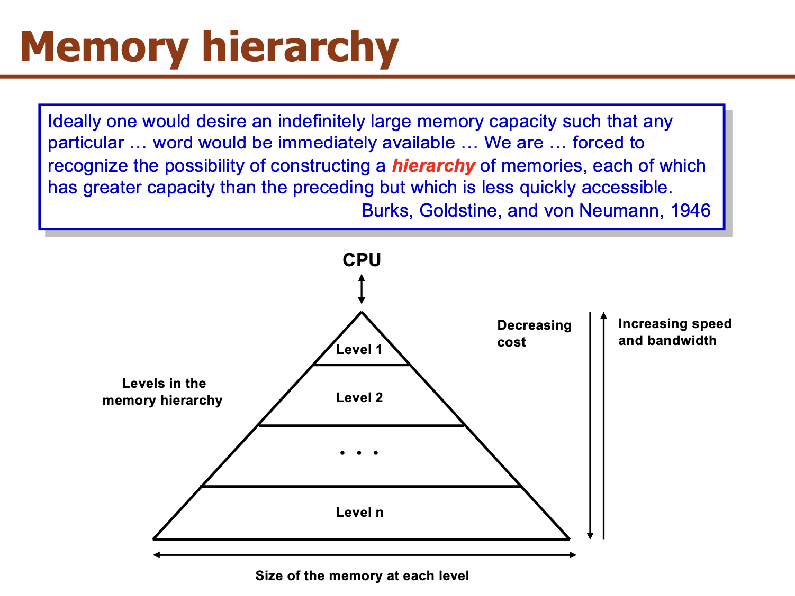

# 2.2 HDFS
Apache Hadoop은 HDFS를 비롯한 분산 컴퓨팅을 위한 오픈 소스 프레임워크입니다. HDFS는 대용량 데이터를 분산 저장하는 파일 시스템으로, 높은 내구성과 확장성을 제공합니다. HDFS는 데이터를 여러 블록으로 나누어 여러 노드에 저장하므로, 데이터 손실 가능성을 줄이고 데이터 처리 속도를 높일 수 있습니다.

## Google File System

분산 환경이라고 하면 물리적으로 여러 대의 서버를 하나의 클러스터에서 동작하는 것처럼 구축된 환경을 뜻합니다. 이러한 분산 클러스터 아키텍처의 구조를 크게 두가지로 나누면 **Master-Slave**와 Master-Slave가 아닌 것으로 구분 됩니다. GFS와 이를 소프트웨어로  구현한 HDFS의 경우 Master-Slave 구조로 구성이 되어 있습니다. 이러한 설계 구조의 경우 여러 대의 저가 장비를 scale-out 하기 용이하다는 점에서 장점이 있습니다.

Master-Slave에서 가장 중요한 점은 **Master에 부하가 가하지 않은 상황을 항상 만들어주어야 한다는 점**입니다. 만약 master node에 장애가 발생하게 되면 전체 node에 장애가 발생하기 때문에 master node의 안정성을 보장할 수 있는 아키텍처를 설계해야 합니다.  위의 그림을 보시면 GFS client와 GFS chunkserver가 data를 주고 받고 있음을 볼 수 있는데 이것이 의미하는 바는 분산 시스템에서 **master와 직접 data를 주고 받지 않고 master가 아닌 chunkserver와 data를 주고 받고 있음**을 말합니다. 이를 통해 master에 가해지는 부하를 최소화할 수 있습니다. 즉, GFS master에서 data processing을 한다던지 data를 주거나 보내는 일은 일어나지 않습니다.  

## HDFS
HDFS는 앞서 살펴본 GFS와 동일하게 master-slave 구조의 분산 파일 시스템입니다. 

### NameNode는 어떤 역할을 할까요?
NameNode의 주요 역할은 메타데이터 관리와 데이터노드의 관리입니다. NameNode는 블록 복제에 관한 모든 결정을 내립니다. 클러스터의 각 DataNode에서 정기적으로 Heartbeat 및 Blockreport를 수신합니다. 하트비트 수신은 DataNode가 제대로 작동하고 있음을 의미합니다. Blockreport에는 DataNode의 모든 블록 목록이 포함되어 있습니다.

#### 메타데이터 파일 종류
- Fsimage 파일
    - 네임스페이스와 블록 정보
- Edits 파일
    - 파일의 생성, 삭제에 대한 트랜잭션 로그
    - 메모리에 저장하다가 주기적으로 생성

### 보조 네임노드(SNN : Secondary Name Node)

- Namenode가 구동되고 나면 Edits 파일이 주기적으로 생성
    - 네임노드의 트랜잭션이 빈번하면 빠른 속도로 Edits 파일이 생성됩니다.
    - 이는 네임노드의 디스크 부족 문제를 야기할 수 있음
- SNN은 Fsimage와 Edits 파일을 주기적으로 merge하여 최신 블록의 상태로 파일을 생성
    - 파일을 merge하면서 Edits 파일을 삭제하기 때문에 디스크 부족 문제도 해결

### Hadoop 2.0 - Standby NameNode

- HDFS는 구조상 namenode가 단일 실패 지점
- HDFS에서 고가용성(High Availability)를 제공하기 위해 namenode를 이중화
    - Active namenode
    - Standby namenode
- Active namenode와 Standby namenode는 데이터 노드로부터 블록 리포트와 하트비트를 모두 받아서 동일한 메타데이터를 유지하고, 공유 스토리지를 이용하여 에디트파일을 공유합니다.
- Active namenode
    - 기존의 namenode의 역할
- Standby namenode
    - Active namenode와 동일한 메타데이터를 유지
    - 만일 active namenode에 문제가 생기면 이를 대체함
    - 다만 active namenode에 문제가 생기는 것을 자동으로 확인하기 어려워서 주키퍼를 활용해 장애 발생시 자동으로 변경될 수 있도록 함
    - 더불어 Standby namenode는 SNN의 역할도 동시에 수행하기 때문에 고가용성 모드에선 SNN을 사용하지 않음

### DataNode
- 파일을 저장하는 역할
- 주기적으로 네임노드에 하트비트와 블록리포트를 전달
    - 네임노드는 하트비트가 전달되지 않는 데이터노드는 동작하지 않는 것으로 판단
    - 블록리포트로 블록의 변경사항을 체크하고, 네임노드의 메타데이터를 갱신합니다.

### HDFS Read mechanism

1. 네임노드에 파일이 보관된 블록 위치 요청
2. 네임노드가 블록 위치 반환
3. 각 데이터 노드에 파일 블록을 요청
    - 노드의 블록이 깨져 있으면 네임노드에 이를 통지하고 다른 블록 확인

### HDFS Write mechanism

1. 네임노드에 파일 정보를 전송하고, 파일의 블록을 써야할 노드 목록 요청
2. 네임노드가 파일을 저장할 목록 반환
3. 데이터 노드에 파일 쓰기 요청
    - 데이터 노드간 복제가 진행
    - 첫번째 datanode에 데이터를 쓰기 시작하고 다른 datanode에 복제 데이터를 완료하면 쓰기 작업이 완료

### 다수의 클라이언트가 같은 블록에 접근한다면?
HDFS는 다수의 클라이언트가 동시에 같은 블록에 접근하는 경우를 고려해 설계되었습니다. HDFS에서는 기본적으로 읽기 작업은 동시에 수행될 수 있지만, 쓰기 작업은 동시에 수행될 수 없습니다.

만약 다수의 클라이언트가 동시에 같은 블록에 쓰기 작업을 시도한다면, HDFS는 일관성을 유지하기 위해 하나의 클라이언트만 쓰기 작업을 수행하도록 합니다. 이를 위해 HDFS는 NameNode에서 Locking을 사용하여 블록에 대한 상호배제(Mutual Exclusion)를 구현합니다. 하나의 클라이언트가 블록을 쓰는 동안, 다른 클라이언트들은 해당 블록에 대한 쓰기 요청을 대기하게 됩니다.

이와 같은 방식으로 HDFS는 다수의 클라이언트가 동시에 같은 블록에 접근하는 경우에도 일관성을 유지하고, 쓰기 작업에 대한 상호배제를 보장합니다.

### HDFS가 높은 내고장성을 보장하는 방법 : 데이터 복제

HDFS가 높은 내고장성(Fault Tolerance)를 보장하기 위해서 저장된 파일의 복제본을 유지하고 있습니다. 예를 들어 100MB의 파일이 저장되었다고 한다면 기본적으로 3개의 복제본으로 저장되기 때문에 300MB의 용량을 차지하게 됩니다. 

### HDFS의 Block

그렇다면 이 파일은 어떻게 저장이 될까요? HDFS에선 파일을 블록 단위로 저장하게 됩니다. 

HDFS의 기본적인 블록 단위는 128 MB인데요, 이렇게 큰 블록 사이즈를 갖게 된 이유는 탐색 비용을 줄이기 위해서 입니다. 블록 사이즈가 크면 하드디스크에서 블록의 시작점을 찾는데 걸리는 시간을 줄일 수 있습니다. 

### Locality of HDFS

일단 기본적으로 data를 가지고 있는 node에 job을 할당합니다. 그러나 만약 해당 node가 이미 다른 작업으로 바쁜 상태라면 같은 렉 안에서 data를 가지고 있는 node의 근처의 node에 job을 할당하게 됩니다. 이는 **네트워크를 통한 데이터 전송 시간을 최소화**하기 위함이고 이것이 HDFS에서의 locality를 뜻합니다. 

1. 같은 노드
2. 같은 랙(Rack)의 노드
3. 다른 랙의 노드

순으로 할당

### Rack Awareness

- 하둡의 데이터를 적재를 할 때 서로 다른 랙에 블록이 최소 하나는 복사가 될 수 있도록 설정
    - 블록을 저장할 때, 2개의 블록은 같은 랙에, 나머지 하나의 블록은 다른 랙에 저장하도록 구성

### Block Caching

- 데이터 노드에 저장된 데이터 중 자주 읽는 블록은 블록 캐시(block cache)라는 데이터 노드의 메모리에 명시적으로 캐싱
- 파일 단위로 캐싱할 수도 있어서 조인에 사용되는 데이터들을 등록하여 읽기 성능을 높일 수 있음
    - **자주 나오는 것을 빠르게 하기!**
- 참고자료) 컴퓨터 구조에서의 캐시와 비교
    
    
    컴퓨터 구조에서의 캐쉬는 CPU와 메인 메모리 사이의 병목현상을 제거하기 위해 그 사이에 SRAM을 두어 자주 나오는 것을 더 빠르게 접근할 수 있도록 한 것입니다.
    
    애플리케이션 설계에서의 caching이나 하둡에서의 block caching이 컴퓨터 구조에서와 같이 SRAM에 저장하는 것을 의미하는 것은 아니지만 **메모리 계층 구조**에 따라 자주 나오는 것을 더 빠르게 하기 위한 것임은 일맥상통합니다. DB 혹은 object storage, HDFS까지 가서 가져오는 것이 아니라 자주 사용되는 데이터를 메모리에 미리 올려두어 더 빨리 데이터를 가져올 수 있도록 함에 있습니다. 
    
    
    

### HDFS 세이프모드

- HDFS의 세이프모드(safemode)는 데이터 노드를 수정할 수 없는 상태
    - 읽기 전용 상태
    - 데이터 추가, 수정, 복제 불가능
- 관리자가 서버 운영 정비를 위해 세이프 모드를 설정 하거나 네임노드에 문제가 생겨서 정상적인 동작을 할 수 없을 때 자동으로 세이프 모드로 전환
- `fsck` 명령으로 HDFS의 무결성을 체크하고, `hdfs dfsadmin -report` 명령으로 각 데이터 노드의 상태를 확인하여 문제를 확인하고 해결한 후 세이프 모드를 해제

### 하둡 명령어
* [https://wikidocs.net/26496](https://wikidocs.net/26496)