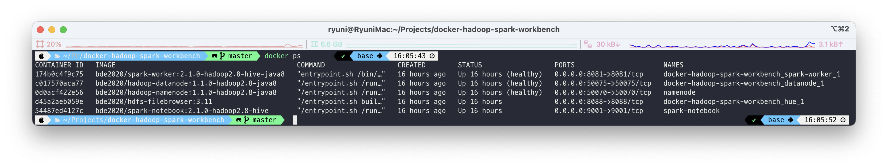
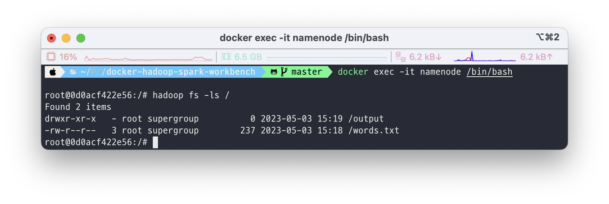
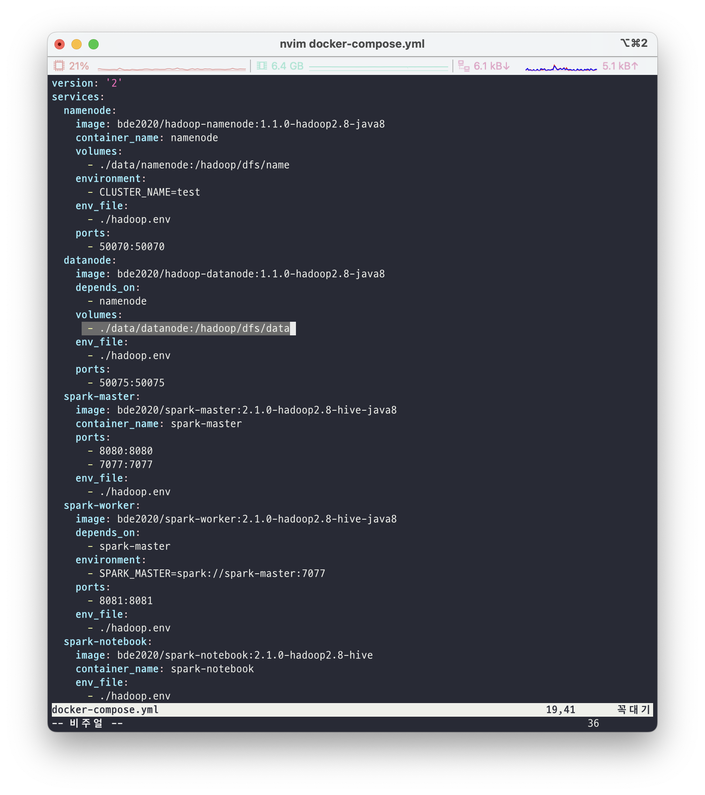
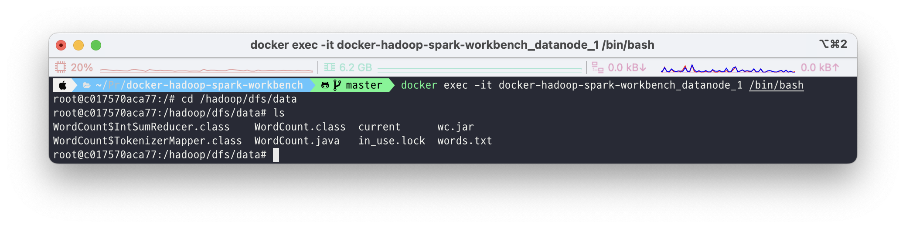
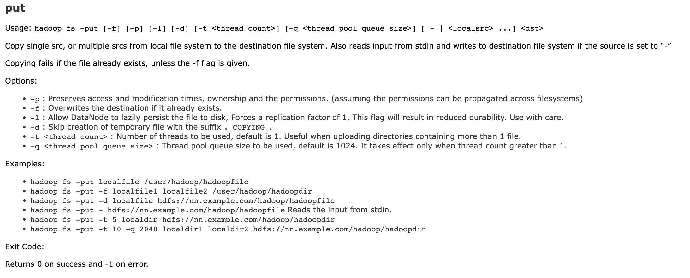
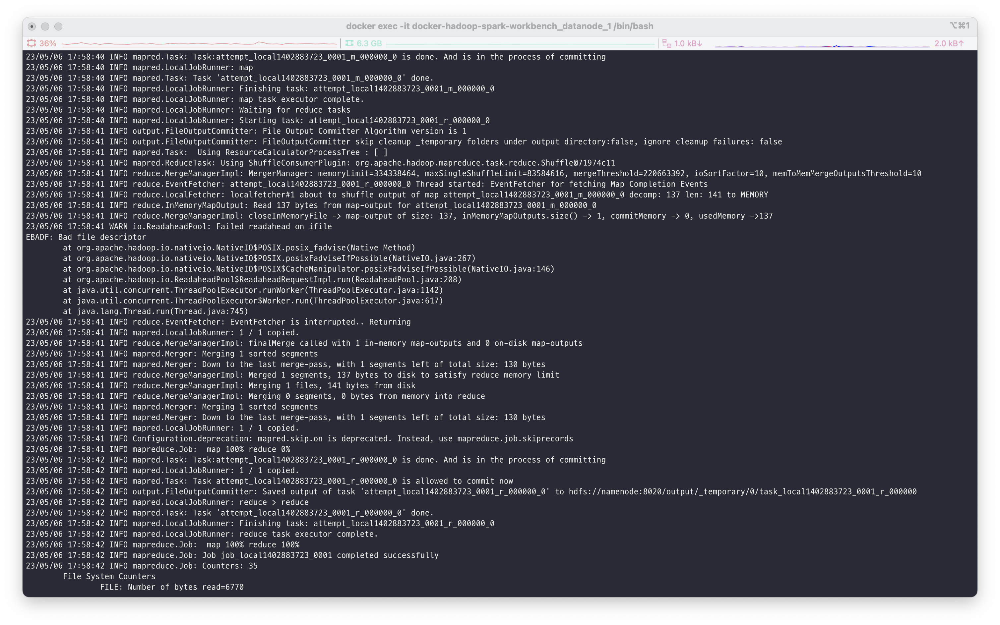
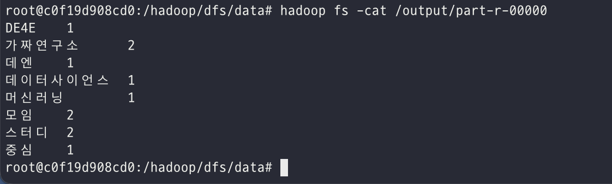

# 2.4 MapReduce 실습

## 1) Docker 설치
* MacOS 기준으로 작성하였습니다.

```bash
brew install cask
```

```bash
brew install docker --cask
```

## 2) HDFS/Spark Workbench Quick Start

> [https://github.com/big-data-europe/docker-hadoop-spark-workbench](https://github.com/big-data-europe/docker-hadoop-spark-workbench)

- Container 띄우기
    - Hadoop, Spark까지 모두 띄우고 싶다면
        
        ```bash
        docker-compose up -d
        ```
        
    - Hadoop만 띄우고 싶다면
        
        ```bash
        docker-compose -f docker-compose-hive.yml up -d namenode
        docker-compose -f docker-compose-hive.yml up -d datanode
        ```
        
- Container 확인

```bash
docker ps
```



- Hadoop check

```bash
docker exec -it namenode /bin/bash
```

```bash
hadoop fs -ls /
```



(첫 설치 후에는 아무 것도 없는게 정상입니다!)

## 3) MapReduce 실습

MapReduce 실습으로 많이 활용되는 WordCount를 진행해볼 예정입니다. WordCount는 말 그대로 텍스트에서 등장하는 단어의 개수를 세는 프로그램입니다. 그렇다면 왜 Hadoop 실습으로 WordCount를 진행할까요? Hadoop은 기본적으로 분산 병렬 처리 시스템입니다. 그래서 분산 저장된 txt 파일을 각각의 node에서 WordCount를 진행한 후 결과를 보여주게 됩니다. 물론 이번 실습에선 datanode를 하나만 띄웠기 때문에 진정한 의미의 분산 처리를 수행할 순 없으나 Hadoop의 구조와 MapReduce의 작동 방식을 이해하는데는 무리가 없을 것입니다. 



먼저 앞서 구성한 hadoop 클러스터의 datanode와 namenode는 local machine의 volumes과 연결을 해두었는데요, yml 파일에서 volume 구성이 `./data/datanode:/hadoop/dfs/data` 이렇게 되어있는 것을 볼 수 있습니다. 이는 local에서 `./data/datanode`의 위치와 컨테이너 안에서 `/hadoop/dfs/data`의 경로를 연동시킨 것입니다. 따라서 저희는 현재 디렉토리에서 `cd ./data/datanode`를 통해 위치를 이동해줍니다. 

이후 저희가 실습에 사용할 파일을 하나 만들어 줍니다!

- `words.txt`
    
    ```
    DE4E 스터디 가짜연구소 데엔 스터디 모임
    가짜연구소 머신러닝 데이터사이언스 중심 모임
    ```
    

이제 MapReduce 코드를 작성할 차례입니다.


[https://docs.google.com/presentation/d/1nIMJN3m9n9EEDtTSa_rRYwyAKlNUtQg6KSHTOfAVD_A/edit#slide=id.p](https://docs.google.com/presentation/d/1nIMJN3m9n9EEDtTSa_rRYwyAKlNUtQg6KSHTOfAVD_A/edit#slide=id.p)

- `WordCount.java` (Apache Hadoop 공식 Tutorial)
    
    ```java
    import java.io.IOException;
    import java.util.StringTokenizer;
    
    import org.apache.hadoop.conf.Configuration;
    import org.apache.hadoop.fs.Path;
    import org.apache.hadoop.io.IntWritable;
    import org.apache.hadoop.io.Text;
    import org.apache.hadoop.mapreduce.Job;
    import org.apache.hadoop.mapreduce.Mapper;
    import org.apache.hadoop.mapreduce.Reducer;
    import org.apache.hadoop.mapreduce.lib.input.FileInputFormat;
    import org.apache.hadoop.mapreduce.lib.output.FileOutputFormat;
    
    public class WordCount {
    
      // Mapper 클래스 정의
      public static class TokenizerMapper
           extends Mapper<Object, Text, Text, IntWritable>{
    
        private final static IntWritable one = new IntWritable(1);
        private Text word = new Text();
    
        // Map 메서드 구현
        public void map(Object key, Text value, Context context
                        ) throws IOException, InterruptedException {
          StringTokenizer itr = new StringTokenizer(value.toString());  // 입력 데이터를 토큰화
          while (itr.hasMoreTokens()) {  // 토큰이 존재하는 동안 반복
            word.set(itr.nextToken());  // 토큰을 Text 객체에 저장
            context.write(word, one);  // 출력 키/값 쌍 생성 후 출력
          }
        }
      }
    
      // Reducer 클래스 정의
      public static class IntSumReducer
           extends Reducer<Text,IntWritable,Text,IntWritable> {
        private IntWritable result = new IntWritable();
    
        // Reduce 메서드 구현
        public void reduce(Text key, Iterable<IntWritable> values,
                           Context context
                           ) throws IOException, InterruptedException {
          int sum = 0;
          for (IntWritable val : values) {  // 동일한 키를 가진 값들을 합산
            sum += val.get();
          }
          result.set(sum);  // 합산 결과를 IntWritable 객체에 저장
          context.write(key, result);  // 출력 키/값 쌍 생성 후 출력
        }
      }
    
      public static void main(String[] args) throws Exception {
        Configuration conf = new Configuration();  // Hadoop 설정 정보 객체 생성
        
        Job job = Job.getInstance(conf, "word count");  // Job 객체 생성
        job.setJarByClass(WordCount.class);  // Job 클래스 설정
        job.setMapperClass(TokenizerMapper.class);  // Mapper 클래스 설정
        job.setCombinerClass(IntSumReducer.class);  // Combiner 클래스 설정
        job.setReducerClass(IntSumReducer.class);  // Reducer 클래스 설정
        job.setOutputKeyClass(Text.class);  // 출력 키 클래스 설정
        job.setOutputValueClass(IntWritable.class);  // 출력 값 클래스 설정
        
        FileInputFormat.addInputPath(job, new Path(args[0]));  // 입력 파일 경로 설정
        FileOutputFormat.setOutputPath(job, new Path(args[1]));  // 출력 디렉토리 경로 설정
        
        System.exit(job.waitForCompletion(true) ? 0 : 1);  // Job 실행 후 종료
      }
    }
    ```
    
    - 더 자세히
        
        ```java
         private final static IntWritable one = new IntWritable(1);
        ```
        
        이 코드는 IntWritable 타입의 변수 one을 생성하고, 이 변수의 초기값을 1로 설정합니다. IntWritable은 Hadoop에서 사용되는 정수형 타입이며, MapReduce 작업에서 출력할 값을 저장하는 데 사용됩니다. 이 코드는 WordCount 예제에서 Mapper 클래스에서 출력할 값의 초기값으로 사용됩니다. Mapper 클래스는 입력 데이터를 토큰화하고, 각 단어별로 (단어, 1)의 형태로 출력을 생성합니다. 이때 1이라는 값을 IntWritable 타입의 변수 one에 저장하고, 이 변수를 출력 값으로 사용합니다. 즉, Mapper에서 생성되는 출력 값은 (단어, one)의 형태로 생성됩니다.
        
        ```java
         // Map 메서드 구현
            public void map(Object key, Text value, Context context
                            ) throws IOException, InterruptedException {
              StringTokenizer itr = new StringTokenizer(value.toString());  // 입력 데이터를 토큰화
              while (itr.hasMoreTokens()) {  // 토큰이 존재하는 동안 반복
                word.set(itr.nextToken());  // 토큰을 Text 객체에 저장
                context.write(word, one);  // 출력 키/값 쌍 생성 후 출력
              }
            }
        ```
        
        위 코드는 Mapper 클래스의 map 메서드를 구현한 것입니다.
        
        이 메서드는 입력 데이터를 토큰화하여 토큰이 존재하는 동안 토큰을 하나씩 가져와서 키-값 쌍을 생성하고 출력합니다.
        
        여기서는 입력 값으로 들어온 Text 객체를 StringTokenizer 클래스를 사용하여 공백을 기준으로 토큰화하고, while문을 이용하여 토큰이 존재하는 동안 반복적으로 처리합니다.
        
        그리고 각각의 토큰을 word 변수에 저장한 후, context.write 메서드를 사용하여 출력 키-값 쌍을 생성합니다.
        
        이때, 출력 값으로는 Mapper 클래스 내부에 미리 선언된 one 변수를 사용합니다. 이 변수는 IntWritable 클래스 타입의 객체로, 그 값은 1로 초기화됩니다. 따라서 모든 출력 값은 1이 됩니다.
        

이제 datanode에 접속해서 앞서 만들어둔 파일을 HDFS에 올리고 작성해둔 MapReduce 프로그램을 실행해보려 합니다. 그러기 위해선 먼저 datanode 컨테이너 안에 작성해둔 파일이 있는 위치로 이동을 해야합니다.

```bash
docker exec -it docker-hadoop-spark-workbench_datanode_1 /bin/bash
```

```bash
cd /hadoop/dfs/data
ls
```



(필자는 이미 한번 실행했기 때문에 class 파일이랑 jar 파일 등 여러 잡다한 파일이 많이 있습니다..!)

어떤 디렉토리에서든 hadoop 명령어를 실행하기 위해선 java와 hadoop 관련 환경 변수를 설정해주어야 합니다! 간단하게 다음의 명령어를 입력하면 됩니다!

```bash
export PATH=${JAVA_HOME}/bin:${PATH}
export HADOOP_CLASSPATH=${JAVA_HOME}/lib/tools.jar
```

이제 class 파일을 만들고 이를 jar 파일로 패키징 하는 작업만 하면 준비는 끝났습니다!

```bash
hadoop com.sun.tools.javac.Main WordCount.java
jar cf wc.jar WordCount*.class
```

- "hadoop com.sun.tools.javac.Main"은 Hadoop에서 제공하는 자바 컴파일러를 사용하여 소스 코드를 컴파일하는 명령어입니다.
- "WordCount.java"는 컴파일하려는 자바 파일의 이름입니다. 이 명령어를 실행하면 "WordCount.class"라는 바이너리 파일이 생성됩니다. 이 파일은 MapReduce 작업을 실행하는 데 필요합니다.

자! 이제 HDFS에 올릴 시간입니다.

```bash
hadoop fs -put ./words.txt /
```



이후 앞서 만들어둔 jar 파일을 실행하면 됩니다.

```bash
hadoop jar wc.jar WordCount /words.txt /output
```



→ 작업이 수행되고 있습니다!

output 파일을 열어보면 다음과 같은 결과를 보실 수 있습니다!
```bash
hadoop fs -ls /output
hadoop fs -cat /output/part-r-00000
```

