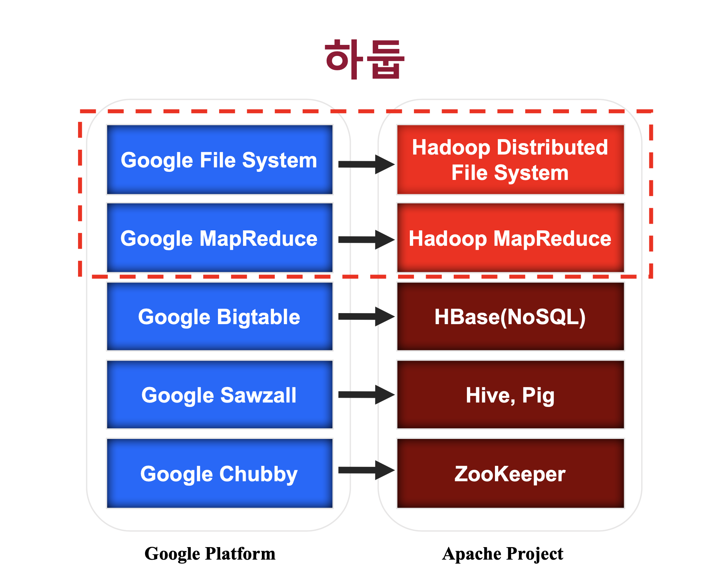

# 2 Hadoop

우리는 지금 데이터의 홍수 속에 살고 있습니다. 이러한 빅데이터를 다루기 위해서 Hadoop은 가장 적절한 플랫폼입니다. 왜 Hadoop이 빅데이터 분산 처리에서 핵심 기술로 자리 잡았는지 알아가보려 합니다.

Hadoop은 **High Availability Distributed Object Oriented Platform**의 약자로 고가용성 분산형 객체 지향적 플랫폼을 의미합니다. 하둡은 검색 엔진을 만드는 Nutch project에서 시작이 됐는데요, 검색엔진을 만들기 위해 웹 크롤링한 데이터를 저장 후 인덱싱 하는 과정을 거쳐야 했습니다. 그러나 이러한 전세계에 퍼져있는 대규모 데이터를 처리하기 위해선 분산, 병렬 처리를 해야만 했고 이 과정에서 구글의 GFS(Google File System)와 MapReduce 논문을 보고 해당 아키텍처를 구현하면서 탄생하게 되었습니다.

출처 : SKplanet Tacademy 하둡 강의

→ 구글의 빅데이터 아키텍처 논문 발표에 맞춰서 Apache 재단에서 오픈소스로 구현하여 만들어진 것이 Hadoop ecosystem입니다.

하둡의 가장 큰 핵심은 분산 컴퓨팅에 있습니다. 예를 들어 64GB의 파일을 하둡을 통해 저장할 때 우리의 눈엔 하나의 파일로 보이지만 내부적으론 이를 나누어 분산 저장하게 됩니다. 이것이 어떻게 가능한지에 대해 앞으로 설명해보려 합니다. 

