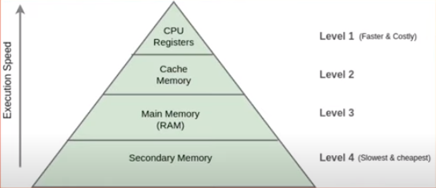

# 5.1.6 인메모리 디비란?

## 🤔 인메모리 디비는 무슨뜻일까요?
 
외부 저장 장치나 디스크에 데이터를 저장하지 않고 **메모리**에서 데이터를 읽고 쓰는 DB를 의미합니다.

## 🤔 인메모리 디비는 왜 빠를까요?

- 디스크 검색보다 자료 접근이 빠릅니다.

- 외부 저장 장치나 디스크에 있는 데이터를 읽고자 할 경우, 해당 데이터를 바로 사용할 수 없습니다.
 데이터를 읽어서 메모리에 올리고, 메모리에 올라간 데이터를 읽어서 사용할 수 있습니다. 

- 인메모리 DB의 경우 애초에 데이터가 모두 메모리에 올라가 있기 때문에 지연이 적습니다.

- 위로 올라갈수록 CPU와 가깝고 속도가 빠르고 비싸고 용량이 작습니다.

📌 대표적인 인메모리 디비로는 **Redis** 가 있습니다. 

- 주요 Redis 의 사례로는 캐싱, 세션관리 등이 있습니다.