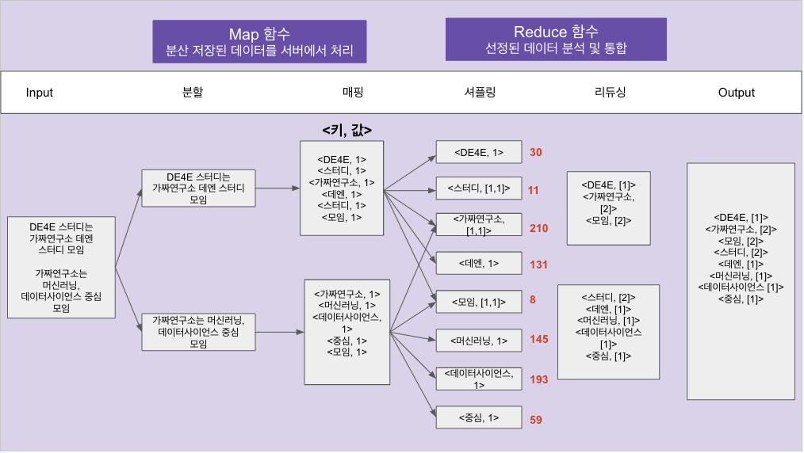

# 5.2.3 MapReduce

MapReduce는 대규모 데이터 처리를 위한 분산 컴퓨팅 프레임워크로, Apache Hadoop의 일부입니다. **MapReduce는 데이터 처리를 맵 함수와 리듀스 함수로 분할하여 수행**합니다. 맵 함수는 입력 데이터를 읽고 키-값 쌍으로 변환하며, 리듀스 함수는 맵 함수에서 생성된 키-값 쌍을 가져와 처리합니다. MapReduce는 **데이터 처리를 여러 노드에 분산하여 병렬 처리를 수행하므로, 대규모 데이터 처리에 효과적**입니다.

## 구글에서 맵리듀스 논문이 나오게 된 이유

- 데이터가 늘어나면서 검색속도가 저하되는 문제가 있었습니다.
- 고성능 서버 도입에 한계가 있었습니다.
    - 고성능 서버를 추가하거나 교환하는데 비용의 문제로 한계가 있습니다.
    
    
    
    - 더불어 서버를 증설하는 것보다 데이터 증가 추이가 더 빠르다는 문제가 있습니다.
    
    
    

## MapReduce의 등장

💁‍♂️ **성능이 약하고 저렴한 데이터 서버를 많이 연결하자!**

각 데이터 서버에서 연산해서 최종 결과를 합산해서 계산하는 기술을 고안하였고 여기에서 **MapReduce 기술**이 사용됩니다!

MapReduce란 여러 대의 서버가 연결되어 하나의 시스템처럼 작동하는 컴퓨터 클러스터 환경에서 대용량 데이터를 병렬 처리하도록 지원하는 기술을 의미합니다.

### Map 단계
분산 저장되어 있는 파일을 각 서버의 cpu, memory 등 하드웨어를 이용해 빠르게 분석합니다.

### Reduce 단계
분석 대상으로 선정된 데이터들을 분석, 통합 시켜서 원하는 데이터를 얻을 수 있게 합니다.

아래의 예시를 살펴보면서 MapReduce의 흐름을 이해해 봅시다.

[MapReduce 예시](https://docs.google.com/presentation/d/1nIMJN3m9n9EEDtTSa_rRYwyAKlNUtQg6KSHTOfAVD_A/edit#slide=id.p)

## MapReduce 이후

하지만 MapReduce 기술이 나오고 시간이 한참 지난 뒤부터 여러 단점이 보이기 시작했고, 그 대안으로 나온 것이 스파크입니다. MapReduce와 비슷한 목적의 업무를 수행하지만 메모리를 활용하기 때문에 굉장히 빠른 데이터 처리 특징을 가지고 있습니다.