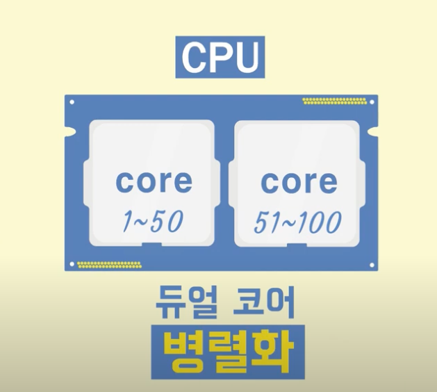
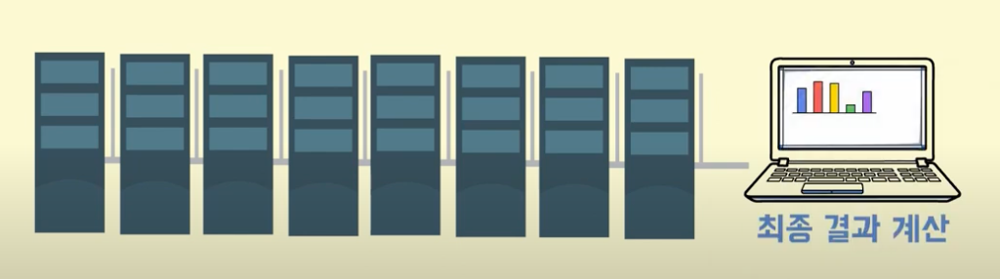

# 5.1.2 분산처리와 병렬처리

## 병렬처리(Parallel Processing)

병렬처리는 하나의 작업을 둘 이상의 작은 작업으로 나누어 각각의 작은 작업을 동시에 처리함으로써 전체적인 작업 시간을 단축시키는 것입니다. 병렬처리는 CPU나 GPU, 멀티코어 프로세서, 클러스터 등을 사용하여 수행될 수 있습니다.

## 분산처리(Distributed Processing)

분산처리는 여러 대의 컴퓨터가 네트워크를 통해 연결되어 하나의 큰 작업을 처리하는 것입니다. 분산처리는 클러스터, 그리드, 클라우드 컴퓨팅 등을 사용하여 수행될 수 있습니다.

## 🤔 둘 다 어떤 작업을 동시에 처리하는 것 같은데 차이점이 무엇일까요?

병렬처리의 경우 **단일 시스템** 내에서 여러 프로세서를 사용하여 작업을 처리합니다.

반면 분산처리의 경우 **여러 시스템**이 네트워크를 통해 연결되어 작업을 처리합니다.

### 데이터 공유에서의 관점

- **병렬처리**
  - 하나의 컴퓨터 안에서 작업 처리하기에 공유 메모리를 이용하여 데이터 공유합니다.
- **분산처리**
  - 여러 대의 컴퓨터에 작업 분산되어 있기에 데이터를 공유하기 위해서는 다른 방법이 필요합니다.

### 실패 시 대처 방법

- **병렬처리**
  - 하나의 작업이 실패하면 전체 작업이 실패할 가능성이 있습니다.
- **분산처리**
  - 여러 대의 컴퓨터에 작업이 분산되기 때문에, 한 대의 컴퓨터가 실패해도 다른 컴퓨터에서는 작업을 계속할 수 있습니다.