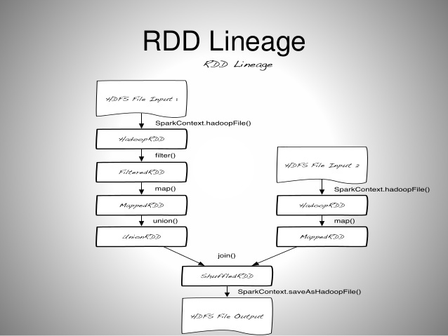
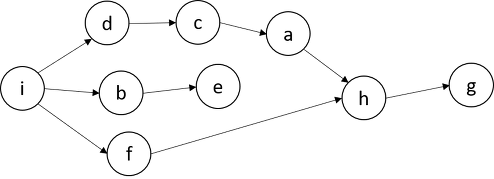

# 6.2 아파치 스파크(Apache Spark)

## Intro

> Apache Spark는 **대규모 데이터를 처리하는 데 사용되는 오픈 소스 데이터 처리 엔진**입니다. 이 엔진은 2009년 UC Berkeley에서 개발되었으며, 기존의 클러스터 컴퓨팅 방식인 MapReduce의 한계를 극복하기 위해 만들어졌습니다. Spark는 Hadoop의 MapReduce 엔진과 비슷한 원칙을 사용하여 구축되었습니다.

Spark는 주로 일괄 처리 워크로드의 속도를 높이기 위해 전체적인 **인메모리 계산과 최적화**에 중점을 두고 있습니다. 가장 큰 차이점은 MapReduce가 데이터를 처리한 후 디스크에 쓰거나 읽는 반면, Spark는 데이터를 메모리에 보관하여 처리 속도를 훨씬 빠르게 만든다는 점입니다.

## Core


- Spark streaming: **원하는 언어(Python, SQL, Scala, Java, R 등)** 을 사용하여 Batch or Streaming 데이터 처리 가능
- Spark SQL : 대부분의 데이터 웨어하우스보다 빠르고 분산된 ANSI SQL 쿼리를 실행
    - Adaptive Query Execute
        - Spark가 3.x 로 버전이 업그레이드되면서 생긴 기능으로, SQL config 에 spark.sql.adaptive.enabled 을 true 로 세팅하면 AQE 를 사용할 수 있다.
        - 내부적으로 동적 셔플 파티션 통합, 동적 전환 조인 전략, 스큐 조인 동적 최적화 기능을 제공한다고 합니다.
        - 개발자가 신경쓰지 않아도 자동으로 적용되므로 효율적인 작업이 가능하다.
        - [TPC-DS 스키마](https://datacadamia.com/data/type/relation/benchmark/tpcds/schema) 데이터 기준 쿼리 속도 최대 8배, 32개의 쿼리에선 1.1배 이상의 속도 향상이 확인됩니다.
        
        ](images/2.2_speedcomparision.png)
        
        [https://www.databricks.com/blog/2020/05/29/adaptive-query-execution-speeding-up-spark-sql-at-runtime.html](https://www.databricks.com/blog/2020/05/29/adaptive-query-execution-speeding-up-spark-sql-at-runtime.html)
        
    - Pandas vs Spark
        - pandas와 spark는 dataframe이라는 데이터 타입은 SQL 테이블 또는 Excel 같이 유형이 지정된 열이있는 데이터를 다루게 될 때 아주 적합합니다.
        - 대부분의 데이터처리에는 pandas 라이브러리를 통해 해결했었는데, pandas와 spark의 가장 큰 차이는 **핸들링하는 데이터의 양의 크기**
        - pandas는 통상적으로 spark보다 작은 데이터 처리에 대해서는 속도가 빠르다고 하는데, **10GB이상 파일의 크기가 커지게 되면, pandas는 메모리용량의 부족으로 인해 성능이 저하**됩니다.
            
            
            |  | pandas | spark |
            | --- | --- | --- |
            | 공통점 | dataframe을 통해 데이터 처리를 합니다. | 
            | 차이점 | 적은 양의 데이터 일 때 성능이 좋다 | 큰 양의 데이터일 때 성능이 좋다 |
- Machine learning
    - MLlib
        - 반복계산 기준 MapReduce보다 최대 100배 빠른 알고리즘 지원
        - 분류, 회귀, 트리, 클러스터링 등 기본적인 머신러닝 알고리즘 내장
        - databricks에서 개발한 deep learning 라이브러리인 SparkDL이 있지만 다양한 모델을 개발하기엔 어려움이 보입니다. (레퍼런스를 찾아봤지만, 딥러닝에 최적화된 라이브러리는 없었습니다)
    

## Architecture


- 스파크는 사용 가능한 자원을 파악하기 위해 `클러스터 매니저`를 사용합니다.
    - Cluster?
        
        
        
        - 여러 컴퓨터들의 자원을 한 대의 컴퓨터처럼 활용하는 방법론
- 드라이버 프로세스
    - 클러스터 노드 중 하나에서 실행(master)
    - 스파크 애플리케이션 정보에 대한 유지관리, 배포, 스케줄링 등 책임
- 익스큐터 프로세스
    - 드라이버 프로세스가 할당한 일을 수행
- 정리: 사용자 프로그램을 수행하기 위하여, **Spark Driver** 내의**Spark Context**가 Job을 **task** 단위로 쪼갠다. **Cluster Manager**로부터 할당받은 **Executor**로 task를 넘긴다.

### SparkSession


- 여러가지 언어를 제공해주는 Spark는 SparkSession이라는 인터페이스를 통해 JVM에서 명시적으로 작성하지 않고 Python, R, Scala등 여러 언어를 실행시킬 수 있습니다.
- SparkSession? SparkContext?
    
    [SparkSession이란?](https://velog.io/@6v6/SparkSession-SparkContext-차이)
    
    
    
    #### Spark 계층 구조
    
    **SparkContext**
    
    - spark2.x 이전에 SparkContext가 모든 Spark 애플리케이션의 진입점
    - 모든 Spark기능에 엑세스 할 수 있는 메인 채널
    
    **SparkSession**
    
    - spark2.x 이후에 모든 Spark 기능의 진입점
    - SparkContext에서 사용할 수 있는 기능은 모두 SparkSession에서 사용할 수 있습니다.
    
    ```python
    ###############
    ### Spark Conf
    ################
    
    spark_conf = (SparkConf()
               .setAppName("Your App Name"))
               .set("spark.some.config.option", "some-value")
    
    sc = SparkContext(conf = spark_conf)
    
    ###################
    ## Spark Session
    ###################
    spark = (SparkSession
              .builder
              .appName("Your App Name")
              .config("spark.some.config.option", "some-value")
              .getOrCreate())  
    ```
    

### 파티션

- 데이터가 컴퓨터 클러스터에서 **물리적으로 분산**되는 방식으로, RDD나 Dataset를 구성하고 있는 **최소 단위 객체**
- 각 Partition은 서로 다른 노드에서 분산 처리됩니다.
- Spark에서는 하나의 최소 연산을 Task라고 표현하는데, 이 하나의 Task에서 하나의 Partition이 처리되고, 하나의 Task는 하나의 Core가 연산 처리합니다. **1 Core = 1 Task = 1 Partition**
- 설정된 Partition 수에 따라 각 Partition의 크기가 결정됩니다. 그리고 이 Partition의 크기가 결국 Core 당 필요한 메모리 크기를 결정하게 됩니다.
    - **Partition 수 → Core 수**
    - **Partition 크기 → 메모리 크기**
- 따라서, Partition의 크기와 수가 Spark 성능에 큰 영향을 미치는데, 통상적으로는 Partition의 크기가 클수록 메모리가 더 필요하고, Partition의 수가 많을수록 Core가 더 필요합니다.
    - **적은 수의 Partition = 크기가 큰 Partition**
    - **많은 수의 Partition = 크기가 작은 Partition**

### RDD(**Resilient Distributed Dataset)**

[[Spark] Spark RDD(Resillient Distributed Data)란?](https://artist-developer.tistory.com/17)

- 회복력 있는 분산 데이터로, **Lineage**를 가짐 (Lineage의 사전적 의미 : 혈통)


#### Lineage 예시

- RDD는 Resillient 즉, 불변의 특성을 가지는데(**Read Only**), 그렇기 때문에 특정 동작을 위해서는 기존 RDD를 변형한 새로운 RDD가 생성될 수밖에 없습니다. 그래서 위처럼 **Spark 내의 연산에 있어 수많은 RDD들이 생성**되게 됩니다. 이 때 생성되는 연산 순서가 바로 Lineage입니다.
- 특정 동작에 의해 생성되는 RDD Lineage는 **DAG**(Directed Acyclic Graph)의 형태입니다.
    
    
    
    DAG 예시
    
- **노드간의 순환(cycle : 시작점과 끝점이 같은 형태)이 없으며, 일정한 방향성을 가지기 때문에** 각 노드 간에는 의존성이 있으며, 순서가 중요한 형태입니다.
- 이러한 DAG에 의하여, 특정 RDD 관련 정보가 메모리에서 유실되었을 경우, 그래프를 복기하여 다시 계산하고, **자동으로 복구** 할 수 있습니다.
- 스파크는 이러한 특성 때문에 **Fault-tolerant**(작업 중 장애나 고장이 발생하여도 예비 부품이나 절차가 즉시 그 역할을 대체 수행합니다.으로써 서비스의 중단이 없게 하는 특성)를 보장하는 강력한 기능을 가지고 있다.
- **RDD 동작 원리의 핵심**은 **Lazy Evaluation**(느긋한 연산)이라는 키워드에 있는데, 함수를 1) Transformation 2) Action으로 나눠 Action에 해당하는 함수를 호출할 때 실행됩니다.
- **Transformation:** RDD에서 새로운 RDD를 생성하는 함수, 스파크의 동작중에서 데이터를 처리하는 명령 ex)**map, filter, flatMap, join**
- **Action:** RDD에서 RDD가 아닌 타입의 data로 변환하는 함수,Transformation의 결과를 저장하는 명령
- action이 일어날 때, transformation함수가 memory에 비로소 올라오게 됩니다. ex)**count, collect, reduce, save**
- Pyspark에서 UDF(사용자 정의 함수)선언 시 인터프리터와 JVM사이 커뮤니케이션으로 속도가 저하됩니다.( Python의 경우 Scala의 2배), built in 함수를 활용함
