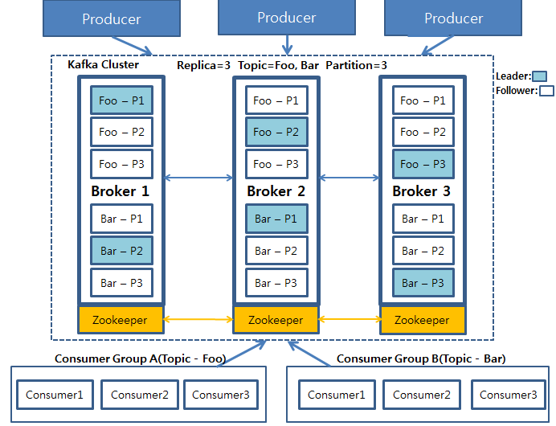

# 6.3 아파치 카프카 (Apache Kafka)

> 카프카는 링크드인에서 개발해 아파치 오픈소스로 등록되었습니다. 이후 링크드인에서 카프카를 개발한 몇몇 엔지니어들이 컨플루언트(Confluent, Inc.)를 창립해 지금까지 카프카를 발전시키고 있습니다. **카프카 스트림즈는 카프카 기능의 일부로 스트림 프로세싱을 위한 경량 라이브러리**입니다. 스파크나 플링크보다 강력하진 않지만 ***Exactly-once의 이벤트 처리를 보장**합니다. 다른 스트림 프로세서들이 실행 프레임워크인 것에 비해 사용이 쉽다는 이점이 있습니다.
> 

<aside>
💡 아파치 카프카는 기본으로 At-least-once 처리를 보장하지만, Exatly-once 보장을 제공하도록 구성할 수 있습니다.
Kafka Streams는 Kafka의 특징은 유지하며 더 간단한 API를 제공합니다.
</aside>

- 아파치 카프카는 **분산 스트리밍 플랫폼**
- 데이터 파이프 라인을 만들 때 주로 사용되는 오픈소스 솔루션
- 대용량의 **실시간 로그처리에 특화**되어 있는 솔루션
- 데이터를 유실없이 안전하게 전달하는 것이 주목적인 메세지 시스템

## Kafka 주 특징

- *pub/sub model
    - **Publish/Subcribe 구조는 분산 시스템에서 서로 다른 컴포넌트 또는 서비스 간의 비동기 통신을 위해 사용되는 아키텍처 디자인 패턴입니다.**
    - pub/sub는 분리된 각 구성요소가 서로의 identity를 인식하지 않고 broker에 메시지를 전달하는 것이 핵심입니다.
    
    
    
    source:  ([https://ably.com/topic/pub-sub](https://ably.com/topic/pub-sub))
    
- Kafka는 위에서 말한 것과 같이 **Publish/Subscribe (발행/구독) 모델** 구조를 가지고 있습니다.

- **고가용성(High availability) 및 확장성(Scalability**): 카프카는 클러스터로서 작동하므로 **Falut-tolerant**한 고가용성 서비스를 제공하고 분산 처리를 통해 빠른 데이터 처리를 가능하게 합니다.
또한, 서버를 수평적으로 늘려 안정성 및 성능을 향상시키는 **Scale-out**이 가능합니다.
- **디스크 순차 저장 및 처리(Sequential Store and Process in Disk):** 메시지를 메모리 큐에 적재하는 기존 메시지 시스템과 다르게 카프카는 메시지를 디스크에 순차적으로 저장합니다. 그럼으로서 아래와 같은 두가지 이점을 얻습니다.
    - 서버에 장애가 나도 메시지가 디스크에 저장되어 있으므로 유실되지 않음
    - 디스크에 순차적으로 저장되어 있으므로 디스크 I/O가 줄어들어 성능이 빨라짐
    

        
❓왜 디스크에 저장해도 속도가 빨라지나요?

        Kafka가 Disk I/O를 사용하더라도 속도가 빠른 이유는 최적화 기술이 결합되어 있기 때문입니다.  

        1. Disk에 데이터를 순차적으로 쓰기때문에 랜덤 액세스가 줄어듦
        2. Kafka는 데이터를 배치로 처리함. 작은 메세지를 일괄적으로 처리하여 Disk I/O를 줄임
        3. Disk에서 데이터를 읽을 때 메모리 캐시를 사용함
        4. 프로듀서와 컨슈머의 버퍼링을 사용하여 빠른 데이터 전송을 제공함
    

- **분산 처리(Distributed Processing):** 카프카는 Partition이라는 개념을 통해 여러개의 파티션을 서버들에 분산시켜 나누어 처리합니다.

## Kafka 구조 및 구성요소

- Kafka Producer: 프로듀서는 하나 이상의 카프카 토픽에 레코드를 쓰는 프로세스
- Kafka Cluster: 카프카 서버로 이루어진 클러스터를 말합니다. 
카프카 클러스터를 이루는 요소는 아래와 같다.
    - Kafka Broker
        - 카프카 플랫폼을 실행하는 서버.
        - 브로커는 여러 개의 파티션을 가질 수 있고, 각 파티션은 여러개의 복제본을 가질 수 있습니다.
    - Kafka Topic
        - 클러스터에 데이터를 관리할 때 그 기준이 되는 개념. 토픽은 카프카 클러스터에서 여러개 만들 수 있고 하나의 토픽은 1개 이상의 파티션으로 구성되어 있습니다.
    - Zookeeper
        - 주키퍼는 카프카가 브로커를 관리하는 데 사용하는 분산 코디네이션 시스템입니다.
        - 클러스터의 Leader를 발탁하는 방식도 주키퍼가 제공하는 기능을 이용합니다.
    - Leader, Follower
        - 복제된 파티션 중 하나의 리더가 선출되어 모든 읽기, 쓰기 연산을 담당합니다.
        - 리더를 제외한 나머지는 팔로워가 되어 단순히 리더의 데이터를 복제하는 역할만 수행합니다.
        - 리더가 죽었을 때, 팔로워중 하나가 리더로 선출되어 메시지를 처리합니다.
- Consumer Group
    - 컨슈머는 하나 이상의 카프카 토픽을 구독하고 해당 토픽에 있는 레코드를 읽는 주체입니다.
    - 컨슈머는 그룹으로서 데이터를 처리하며 컨슈머 그룹 안에 컨슈머 수만큼 파티션의 데이터를 분산처리하게 됩니다.

해당 그림은 Producer가 데이터를 카프카에 적재하고 있으며 저장된 데이터를 Consumer Group A와 B가 각각 자신이 처리해야 할 Topic Foo와 Bar를 가져오는 그림입니다.

replica를 3으로 설정해 3개의 broker를 볼 수 있으며, Foo와 Bar는 각 3개의 파티션으로 나뉘어져 있고, 각 파티션들은 3개의 복제본으로 복제됩니다. 3개의 복제본 중에 하나의 리더가 선출되고, 이 리더가 모든 연산을 담당합니다.

중요한 것은 이 파티션들은 운영 도중 그 수를 늘릴 수 있지만 **절대 줄일 수 없기 때문**에 **파티션을 늘리는 것은 신중하게 고려해야 할 문제**가 됩니다.

(보통의 경우에는 파티션 개수와 Consumer 개수를 맞춰주는 것을 권장하지만, 실제 메시지가 쌓이는 속도보다 처리하는 속도가 빠르다면 파티션개수 ≥ 컨슈머 개수 로 설정하는 것도 나쁘지 않습니다.😊)