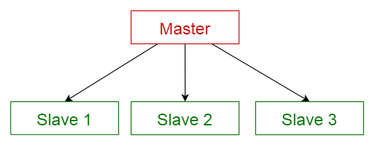
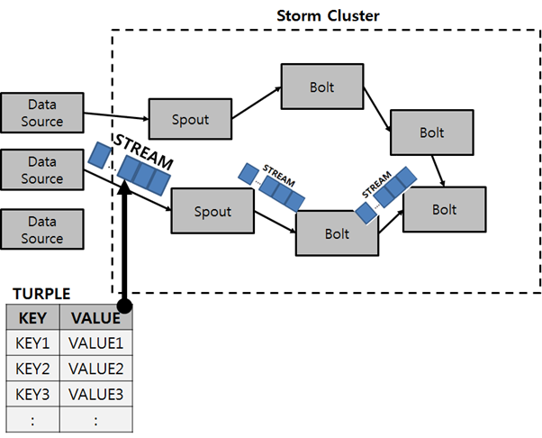

# 6.4 아파치 스톰 (Apache Storm)

> 초창기 오픈소스 스트림 프로세싱 프레임워크의 하나로 트위터(Twitter, Inc.)에 의해 오픈소스화되었습니다. **지연이 매우 짧고 복잡하지 않은 스트림에 적합**합니다. 하지만, 소규모 일괄처리 스트림 모델인 스톰 트라이던트(Storm Trident)를 사용하지 않으면 **At-least-once의 이벤트 처리를 보장**합니다. 또한 **상태 관리가 지원되지 않아 집계, 윈도우, 워터마크 등을 사용할 수 없기 때문에 고급 분석에 제약**이 있습니다.
> 
- 아파치 카프카는 **분산 스트리밍 플랫폼**
- 인메모리 기반의 플랫폼

## Storm 특징

- **고가용성(High availability) 및 확장성(Scalability**): Zookeeper를 활용해 고가용성을 제공하고, 클러스터링을 통해 수평적 확장 가능
- **신뢰성**: At-least-once 보장을 지원하지만, Trident 확장을 통해 정확하게 하나의 메시지를 보장 (Exactly-once)
- **유연성**: Thrift(cross-language service 개발을 위한 sofrware framework)를 통해 모든 프로그래밍 언어에서 사용가능

## Storm 구조 및 구성요소

- Storm은 Master/Salve architecture 를 사용하고 있습니다.
    
    
    
    마스터 슬레이브 구조는 마스터와 슬레이브 두 부분으로 구성되어 있으며, 마스터 컴포넌트는 동등한 구조를 지닌 슬레이브 컴포넌트들에 작업을 분산하고, 슬레이브가 반환한 결과값으로부터 최종 결과값을 계산합니다.
    
- Nimbus: **마스터 노드**로 주요 설정 정보를 가지고 있고, Nimbus를 통해서 프로그래밍 된 토폴로지를 Supervisor 노드로 배포합니다. 일종의 중앙 컨트롤러 역할을 수행합니다.
- Supervisor: 실제 워커노드로 Nimbus로 프로그램을 배포 받아 탑재하고, 배정된 작업을 실행하는 역할을 합니다. 하나의 클러스터에는 여러개의 Supervisor 노드를 가질 수 있으며, 이를 통해서 여러개의 서버로 작업을 분산처리 할 수 있습니다.
- Zookeeper: 여러개의 Supervisor를 관리하기 위해서, 각 노드의 상태를 모니터링하고, 작업의 상태들을 공유시킵니다.

- Spout: 데이터 소스에서 데이터스트림을 생성해 Bolt로 전달합니다. 이 때 전달되는 데이터는 Tuple(키와 값 형태로 정의) 형태입니다.
- Bolt: 데이터 스트림을 받아 데이터를 처리하고 내부의 로직에 따라 가공한 다음에 데이터 스트림으로 다른 Bolt로 넘겨주거나 종료합니다.

- Topology: Spout와 Bolt의 데이터 흐름을 정의하는 것을 토폴로지라고 합니다.

 
위 그림에서 각 Spout로 부터 빨간색 선 , 파란색 선으로 데이터 흐름이 정의 된 것을 볼 수 있습니다.

 
앞서 나온 튜플과 데이터 흐름을 시각화하면 위와 같은 그림으로 정리할 수 있습니다.