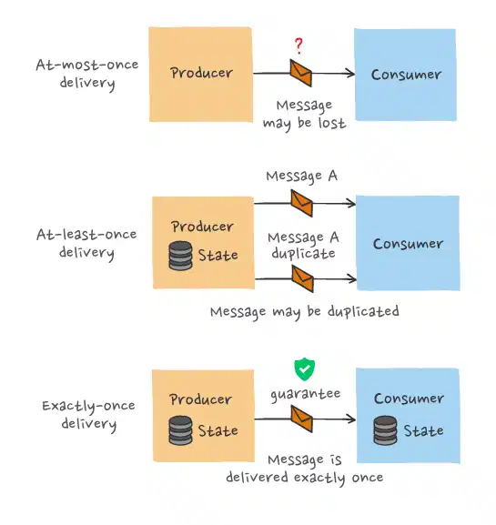

# 6.1 Stream Processing Framework

> **스트림 프로세싱(Stream Processing)** 은 "in motion" 이동중인 데이터를 **실시간 혹은 준실시간(near-realtime)** 으로 처리하는 방법입니다. 스트림 프로세싱은 연속적인 데이터 스트림을 쿼리 및 분석하고 짧은 시간 안에 중요한 이벤트에 대응할 수 있습니다. 이러한 방식은 데이터를 수집해서 처리하는 배치 프로세싱과는 다르게 연속적인 데이터 스트림을 쿼리 및 분석하고 짧은 시간(밀리초) 안에 중요한 이벤트에 대응할 수 있습니다.

스트림 프로세싱은 **이벤트 스트리밍**과 밀접한 관련이 있는데, 데이터가 연속적으로 발생하는 시스템에서 일련의 데이터 포인트에 대해 특정한 조치를 하는 것을 이벤트 스트리밍이라고 합니다.

이 때, 이벤트는 데이터 포인트를 의미하며, 스트리밍은 그러한 이벤트의 연속적인 전달을 의미합니다.

이러한 프로세싱은 단순한 수집에서부터 집계(합계, 평균 등의 계산), 분석(패턴 분석 및 예측), 변환 및 다른 데이터 소스와 결합을 의미합니다.

)](images/1.1_streamprocessing.png)

**[An overview of event stream processing](https://hazelcast.com/glossary/event-stream-processing/)**

스트림 프로세싱은 배치 프로세싱과 비교되곤 하는데, 스트림 프로세싱이 모든 배치 프로세싱을 대체하는 것을 의미하지 않습니다.

배치 프로세스는 정적 데이터 세트를 대상으로 작업하는 경우에 알맞으며, 스트림 프로세싱은 동적으로 흘러가는 데이터 처리에 적합합니다.

두 방식은 상호 보완적으로 사용되며 이들을 결합한 하이브리드 모델도 존재합니다. 

| 기준 | 배치 프로세싱 | 스트림 프로세싱 |
|---|---|---|
| 처리 방식 | • 일정기간 단위로 수집하여 한 번에 처리 | • 연속된 데이터를 하나씩 처리 |
| 처리량 | • 대규모 데이터 단위 | • 주로 소량의 레코드 단위 |
| 속도 | • 수분~시간의 지연시간 | • (준)실시간 |
| 사용환경 | • 복잡한 분석이 요구되는 환경  • 데이터 처리량이 많은 환경  • 데이터를 스트림으로 전달할 수 없는 레거시 시스템 환경 | • 실시간 처리 및 분석 정보가 요구되는 환경  • 고급 메시징 |
| 사용 예 | • 급여 및 청구 시스템 | • 은행 ATM  • 부정행위 탐지 및 모니터링 시스템  • SNS 데이터 분석 |

스트림 프로세싱의 특성으로는 이벤트 처리 보장, 내결함성(Fault Tolerance) 및 상태 관리 등을 통하여 지원된다는 것입니다. 이벤트 처리 보장은 데이터 파이프라인에서 데이터를 전달하는 방법으로, **At-least-once**, **At-most-once**, **Exactly-once 가 있습니다.**

## 이벤트 처리 보장

### At-most-once

> 메시지를 최대 한 번만 전송하고, 수신자가 메시지를 받았는 지 확인하지 않음

use cases: 누락되어도 상관없는 log data

- 장점: 빠른속도(오버헤드 없음), 간단한 구현
- 단점: 메시지가 누락 될 수 있음

### At-least-once

> 메시지를 전송하고 수신 확인 답변이 올 때까지 메시지를 연속적으로 전송

use cases: 데이터의 누락이 중요한 경우, 중복된 값을 저장해도 상관없거나 처리가능한 경우

- 장점: 메시지가 누락되지 않음, 간단한 구현
- 단점: 중복된 메시지가 전달 될 수 있음

### Exactly-once

> 메시지를 정확히 한 번만 전송
> 
- 장점: 누락과 중복 없이 메시지를 전달 할 수 있음
- 단점: 복잡한 구현

## 스트림 프로세싱 구현 방식

| 구현 방식 | 특성 | 대표 제품 |
|---|---|---|
| 네이티브 스트림 | • 지연시간 최소  • 이벤트 처리 보장 방식에 따라 내결함성 유지가 어려움 | • 플링크(Flink)  • 카프카 스트림즈(Kafka Streams) |
| 소규모 일괄처리 | • 네이티브 스트림 대비 지연시간 발생  • *로드밸런싱 용이 | • 스파크(Spark) |

<b>❓소규모 일괄처리가 로드밸런싱이 용이한 이유?</b>

native stream은 데이터 스트림을 받는 즉시 처리 후 저장하는 반면, micro batching은 처리할 수 있는 단위로 묶어서 보내기 때문에 로드밸런싱이 용이하다고 합니다.

[[참고사이트](https://www.databricks.com/blog/2015/07/30/diving-into-apache-spark-streamings-execution-model.html)]
링크된 사이트의 그림을 보면 이해에 도움이 될 수 있습니다.

