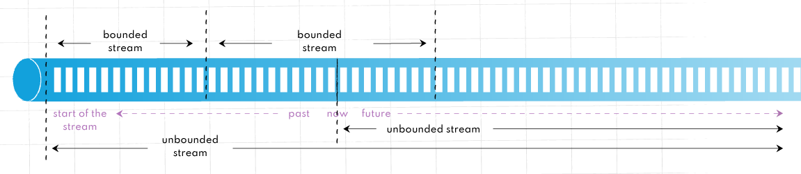
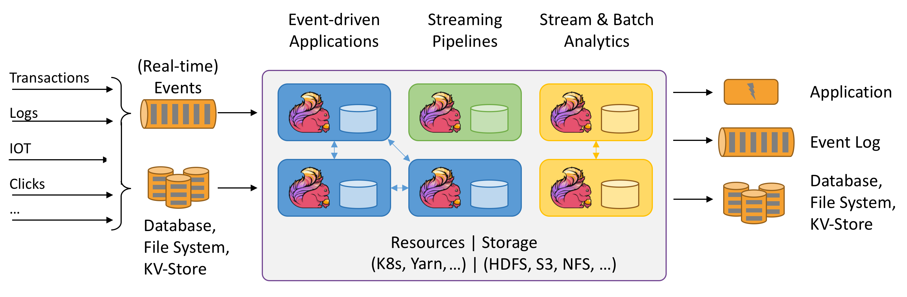
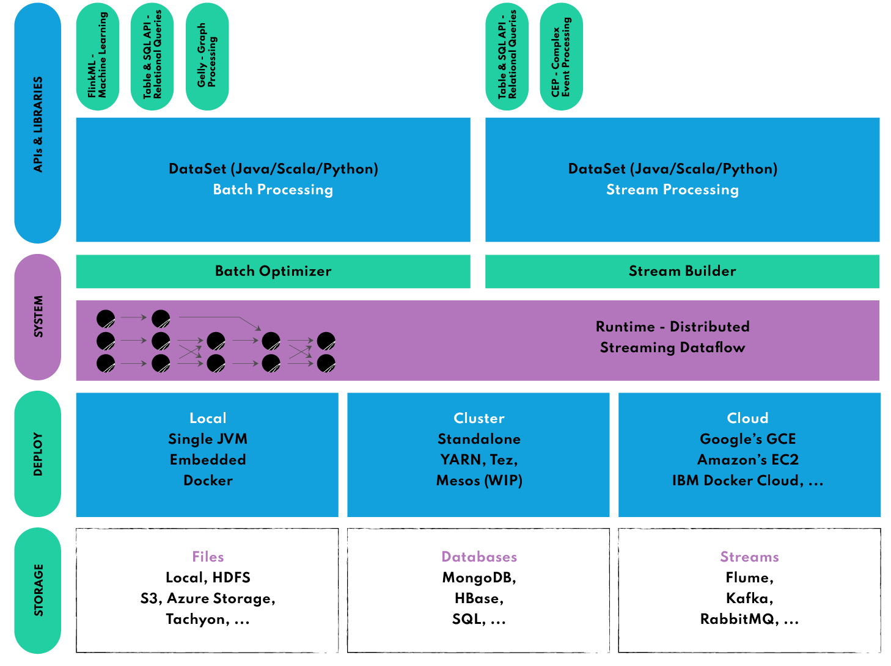

# 6.5 아파치 플링크 (Apache Flink)

> 플링크(Flink)는 독일어로 민첩함을 뜻하는 단어로 베를린 TU대학교에서 시작된 아파치 프로젝트입니다. **Exactly-once의 이벤트 처리**를 보장하는 **네이티브 스트림** 방식으로, **지연 발생이 적고 처리량은 높으며** **비교적 사용하기 쉬운 이점**이 있습니다. 일괄처리 기능도 제공하지만 스트림 프로세싱을 목적으로 주로 사용됩니다.
> 

대용량 데이터 스트림 처리를 위한 오픈소스 분산형 스트림 처리 엔진

## Flink 특징

- **네이티브 스트림**: **경량 분산 스냅샷을 구현**해서 Exactly-once 를 보장하면서 오버헤드도 낮출 수 있습니다.
- **인메모리:** Java 애플리케이션으로 JVM(Java Virtual Machine)에서 실행되지만 JVM GC(Garbage Collector)에 전적으로 의존하지 않습니다. 대신 커스텀 메모리 관리자를 구현하여 안정적인 메모리 사용량을 유지하면서 성능을 향상시킵니다.
- **손쉬운 설정 및 사용, 강력한 확장 기능:**  입력 이벤트 스트림에 개별적으로 액세스할 수 있으며 강력한 윈도우 연산자를 사용하여 분석을 수행할 수 있습니다. 고급 분석용 API에서 상세한 제어 기능을 제공하는 상태 저장 이벤트 기반 애플리케이션 수준에 이르기까지 ***계층화된 API를 제공**합니다.
    
    ---
    
    - **계층화된 API**
    
    
    
    - **DataStream API:** Flink 애플리케이션 작성 시 UnBounded Streams 에서 사용되는 고수준 API입니다.
    - **DataSet API:** Flink 애플리케이션 작성시 Bounded Streams에서 사용되는 더 낮은 수준의 API입니다.
- **상태 기반 계산(stateful computation) 지원:** 기본 비즈니스 로직을 실행하는 모든 애플리케이션은 이벤트 또는 중간 결과를 기억하여 나중에 다음 이벤트가 수신되거나 특정 기간이 지난 후에 접근할 수 있도록 합니다.
    
    
    


- **게으른 평가:** 계산을 최대한 늦출 수 있는 게으른 평가를 사용합니다. 즉, 계산이 필요할 때까지 계산이 수행되지 않습니다.
- **지연 데이터 처리:** 이벤트 발생 시간과 처리 시간을 구분하고 워터마크를 사용하여 지연 데이터를 처리합니다. 
즉, 데이터 포인트는 들어오는 즉시 처리되지 않더라도 처리될 수 있습니다.

## Flink 아키텍처 및 주요 구성 요소


- **JobManager:** 하나이상의 TaskManager로 구성되어 있으며, 제출된 작업을 예약 및 관리하고 작업에 자원을 할당해 실행 계획을 조율합니다.
- **TaskManager:** 클러스터의 여러 노드에 걸쳐 할당된 자원에서 사용자 정의 기능을 실행합니다.

이 아키텍처의 장점은 대규모 데이터 세트를 거의 실시간으로 처리할 수 있도록 효율적으로 확장할 수 있다는 것입니다. 

## Flink Ecosystem



- **DataSet API:** 일괄 처리를 위한 Flink의 핵심 API로 Map, Reduce, Join, Co-group 같은 반복 연산에 사용됩니다.
- **DataStream API:** 스트리밍 데이터(무제한 및 무한 라이브 데이터 스트림)를 처리하는 데 사용되며, 이를 통해 사용자는 외부 데이터 저장소를 쿼리하여 윈도우잉, 시간당 기록 변환, 이벤트 보강 등 들어오는 이벤트에 대한 임의의 연산을 정의할 수 있습니다.
- **복합 이벤트 처리(CEP: Complex Event Processing)**
정규식이나 StateMachine을 사용하여 이벤트 패턴을 지정해DataStream API와 통합되어 **데이터에 대한 패턴 인식을 실시간으로 수행**할 수 있습니다. 
네트워크 이상 탐지, 규칙 기반 알림, 프로세스 모니터링, 사기 탐지 같은 애플리케이션에
- **SQL 및 Table API:** SQL 쿼리와 Table API를 사용해 테이블 스키마를 기반으로 데이터를 쉽게 조작하여 최소한의 노력으로 복잡한 데이터 변환 파이프라인을 구축할 수 있습니다.
- **Gelly**
    - DataSet API 위에서 실행되는 다목적 그래프 처리 및 분석 라이브러리로 확장성과 견고함을 모두 갖추고 있습니다.
    - Gelly는 label propagation, triangle enumeration, page rank와 같은 기본 제공 알고리즘을 갖추고 있으며 쉽게 구현할 수 있는 사용자 정의 **그래프 알고리즘 API도 지원**합니다.
- **FlinkML**
    - DataSet API 위에서 실행되는 분산 머신 러닝 알고리즘 라이브러리로 선형 회귀, 로지스틱 회귀, 의사 결정 트리, K-평균 클러스터링, LDA 등과 같은 지도 및 비지도 학습 기법을 모두 적용할 수 있는 통합된 방법을 사용자에게 제공합니다.
    - 신경망 구축을 위한 실험적인 딥 러닝 프레임워크(TensorFlow 패키징)를 제공합니다.
    - example code
        
        ```python
        from pyflink.commonimport Types
        from pyflink.datastreamimport StreamExecutionEnvironment
        from pyflink.ml.linalgimport Vectors, DenseVectorTypeInfo
        from pyflink.ml.clustering.kmeansimport KMeans
        from pyflink.tableimport StreamTableEnvironment
        
        # create a new StreamExecutionEnvironment
        env= StreamExecutionEnvironment.get_execution_environment()
        
        # create a StreamTableEnvironment
        t_env= StreamTableEnvironment.create(env)
        
        # generate input data
        input_data= t_env.from_data_stream(
            env.from_collection([
                (Vectors.dense([0.0, 0.0]),),
                (Vectors.dense([0.0, 0.3]),),
                (Vectors.dense([0.3, 3.0]),),
                (Vectors.dense([9.0, 0.0]),),
                (Vectors.dense([9.0, 0.6]),),
                (Vectors.dense([9.6, 0.0]),),
            ],
                type_info=Types.ROW_NAMED(
                    ['features'],
                    [DenseVectorTypeInfo()])))
        
        # create a kmeans object and initialize its parameters
        kmeans= KMeans().set_k(2).set_seed(1)
        
        # train the kmeans model
        model= kmeans.fit(input_data)
        
        # use the kmeans model for predictions
        output= model.transform(input_data)[0]
        
        # extract and display the results
        field_names= output.get_schema().get_field_names()
        for resultin t_env.to_data_stream(output).execute_and_collect():
            features= result[field_names.index(kmeans.get_features_col())]
            cluster_id= result[field_names.index(kmeans.get_prediction_col())]
        print('Features: '+ str(features)+ ' \tCluster Id: '+ str(cluster_id))
        ```
        
    