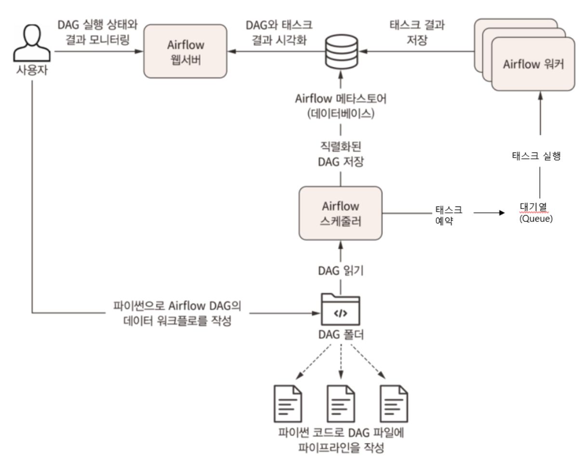

# 7.1 Introduction to Apache Airflow


## Airflow 란?

- Python 기반의 workflow tool 입니다.
- workflow 를 구성하는 방법을 DAG 와 task 라는 단위로 복잡하고 다양하게 구성 가능합니다.
- `Task` : airflow의 operator, etl등의 작업들이 각각의 task가 되며, task간 순서 지정이 가능합니다.
- `DAG(Directes Acyclic Graph)` : 방향성 비순환 그래프로 데이터파이프라인 하나의 단위, 하나의 DAG에는 하나 이상의 task로 구성됩니다.
- Airflow는 데이터 파이프라인의 태스크를 예약하고 결과를 모니터링하는 `웹 서버`, `스케줄러` 및 `워커 프로세스`라는 세 가지 주요 컴포넌트로 구성!

### `데이터 파이프라인`을 관리하기 위한 Airflow

- 💡 데이터 파이프라인은 `방향성 비순환 그래프(DAG)`에 `Task`와 이에 대한 `의존성`을 정의합니다.
- 💡 수년간 태스크 그래프를 실행할 수 있는 여러 워크플로 관리 시스템이 개발되었고, 그 중 Airflow는 배치 지향 데이터 파이프라인 구현을 위해 특화된 주요 기능을 가지고 있습니다.


## Airflow의 장단점

### 장점:

- 파이썬 코드로 작성되어, 쉽고 간단하게 배치, 워크플로우 구성이 가능합니다.
- 파이썬 기반으로 구현되어 있기 때문에, 파이썬 언어에서 구현할 수 있는 대부분의 방법을 사용하여 복잡한 커스텀 파이프라인 구축이 가능합니다.
- 후술할 `Backfill` 기능을 사용하여 과거 데이터를 손쉽게 재처리할 수 있기 때문에 코드를 변경한 후 재생성이 필요한 데이터 재처리가 가능합니다.

### 단점:

- 반복적이거나 배치태스크에 기능초점이 맞춰져 있기 때문에, 스트리밍 데이터 처리에 적합하지 않습니다.

## Airflow의 주요 컴포넌트



- `Airflow 워커`: 예약된 task를 선택하고 실행합니다.
- `Airflow 스케줄러`: DAG를 분석, 현 시점에서 DAG의 스케줄이 지난 경우 워커에 DAG의 태스크를 예약합니다.
- `Airflow 웹서버`: 스케줄러에서 분석한 DAG를 시각화하고 DAG 실행과 결과를 환인할 수 있는 주요 인터페이스를 제공합니다.

### 이외 컴포넌트

- `Airflow database` : 최초 설치시 기본으로 sqlite가 기본으로 설치됩니다.
- `Airflow queue` : 멀티노드 구성인 경우에만 사용합니다.

## Airflow 스케쥴링

💡 Airflow의 스케줄 간격은 Cron구문을 활용하여 주로 설정합니다.

| 크론 구문 예시 | 설명 |
| --- | --- |
| 0 * * * * | 매시간 (정시 실행) |
| 0 0 * * * | 매일 (자정에 실행) |
| 0 0 * * 0 | 매주 (일요일 자정에 실행) |
| 0 0 1 * * | 매월 1일 자정 |
| 45 23 * * SAT | 매주 토요일 23시 45분 |
| 0 0 * * MON, WED, FRI | 매주 월, 화, 금 자정에 실행 |
| 0 0 * * MON-FRI | 매주 월~금 자정에 실행 |
| 0 0,12 * * * | 매일 자정 및 오후 12시 실행 |

### 백필(backfill)

- DAG의 과거 시점을 지정해 실행하는 프로세스 입니다.
- DAG에 과거 시작 날짜를 지정하고 해당 DAG를 활성화하면 과거 시작 이후부터 현재시간까지의 모든 스케쥴 간격이 생성됩니다.
- Backfill의 경우 `catchup`이라는 매개변수에 의해 제어됩니다. (True/False)

### 🛠 매일 0시 0분에 실행되는 DAG예제

```bash
DAG( 
    dag_id='test_dag', 
    schedule_interval='0 0 * * *', 
    start_date=datetime.datetime(2023, 1, 1) 
)
```

- 위와 같이 설정하게 되면, 최초 실행일자는 2023년 1월 2일 0시 0분이며,
2023년 1월 1일 0시 ~ 2023년 1월 1일 23시 59분 까지의 데이터를 기준으로 작업합니다.

- 만약 2021년 1월 4일에 start_date가 2021-01-01인 DAG를 생성하여 ON했다면 2021-01-01, 2021-01-02, 2021-01-03에 해당하는 스케쥴이 트리거되어 실행됩니다.

- `Start_date` : 처음 DAG가 실행되는 시간이 아닌, COPY하기 시작한 시간 입니다.
- `Execution_date` : 실행시각이 아닌, 일련의 주문번호 개념 (crontab실행시점)
    - 증분 적재하는 경우에만 활용 가능합니다.
    - 파이프라인 실패 혹은 재처리가 필요할 경우 사용하는 변수값 입니다.

## Airflow는 만능?!

- Airflow는 scheduling 기반의 batch 용 workflow 도구입니다.
- 아래와 같은 기능은 어려움이 있습니다.
    - streaming 작업 (마이크로 배치식으로 부분적으로 구현은 가능)
    - 무한히 실행되는 작업
    - Airflow 외부 요소에 의해 trigger 되는 scheduling 방식 (API로 트리거는 가능, 외부 API가 DAG을 찌르는 건 어려움)
- 아래와 같은 작업은 airflow에서 적합하지 않을 수 있습니다.
    - 지연을 허용하지 않는 작업의 스케줄링
    - Airflow worker 내에서 고부하 작업의 처리 (내부에서 고연산 작업을 하기보단 제출하는 형태로 구현합니다.)


<script src="https://utteranc.es/client.js"
        repo="Pseudo-Lab/data-engineering-for-everybody"
        issue-term="pathname"
        label="comments"
        theme="preferred-color-scheme"
        crossorigin="anonymous"
        async>
</script>