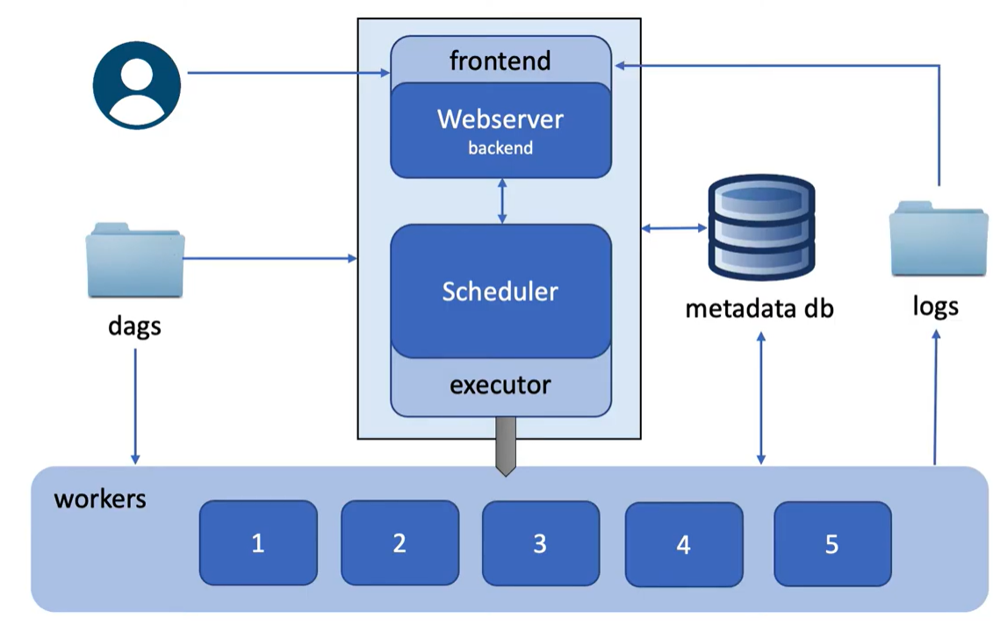
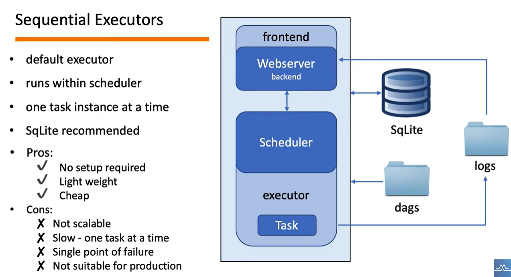
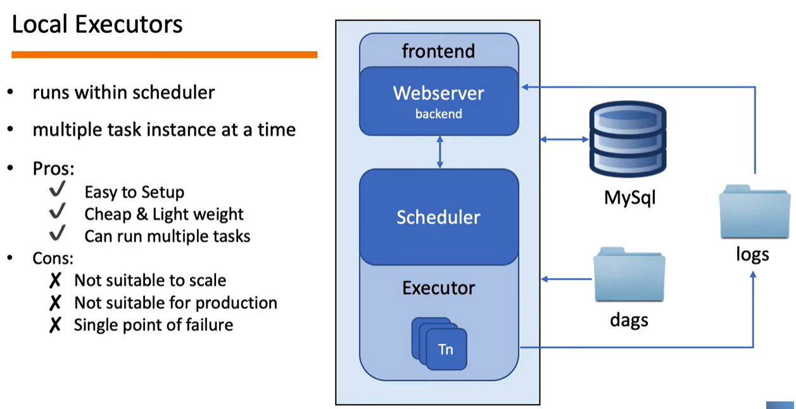
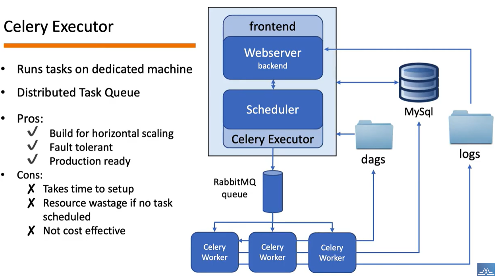
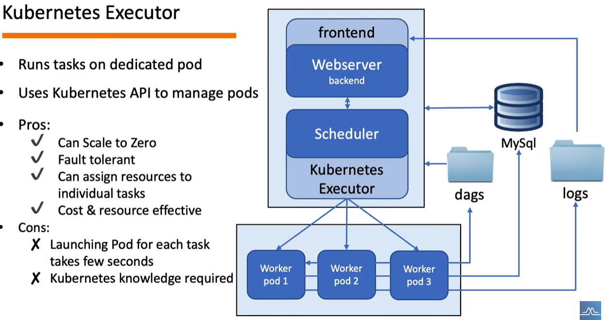

# 7.2 Airflow Executor

## Introduction to Executor

- Executor는 worker에게 task를 실행시키는 역할입니다.
- 실제 task의 실행은 스케줄러 내부에서 수행할 수도, 외부의 worker에게 실행을 맡길 수도 있습니다.
- 다양한 종류가 있으며, 직접 machine 을 pooling 해서 관리하는 경우에는 Celery Executor를, k8s 환경 하에서는 Kubernetes Exceutor 를 가장 많이 선택하게 됩니다.

## [Sequential Executor](https://airflow.apache.org/docs/apache-airflow/stable/core-concepts/executor/sequential.html) (기본 제공)

- Airflow를 처음 설치 시, 기본적으로 제공됩니다.
- 기본 DataBase인 SQLite와 활용 가능합니다.
- 작업을 순차적으로 진행하는 단일 스레드 기반으로 병렬처리가 불가능합니다.
- 스케일 인아웃이 불가능 합니다.
- 주로 초기 개발 및 테스트 환경에서 사용됩니다.

## [Local Executor](https://airflow.apache.org/docs/apache-airflow/stable/core-concepts/executor/local.html)

- 로컬에서 프로세스를 실행시켜 task를 실행하는 방식입니다.
- 병렬처리가 가능합니다.
- 스케일링 하기 적합하지 않습니다.
- 프로덕션 레벨에서는 적당하지 않습니다.

## [Celery Executor](https://airflow.apache.org/docs/apache-airflow/stable/core-concepts/executor/celery.html)

- Celery 백엔드(RabbitMQ, Redis)를 활용합니다.
- 분산 task 처리가 가능합니다.
- 수평적 스케일링 가능합니다.
- 내결함성을 제공할 수 있습니다.
- 프로덕션 레벨에도 적합합니다.

## [Kubernetes Executor](https://airflow.apache.org/docs/apache-airflow/stable/core-concepts/executor/kubernetes.html)

- K8s 환경에서 수행해야 할 시점이 된 태스크를 스케줄러가 찾고, Executor가 동적으로 Airflow 워커를 POD 형태로 실행합니다. 
- 리소스를 개별 task에 할당 가능합니다.

