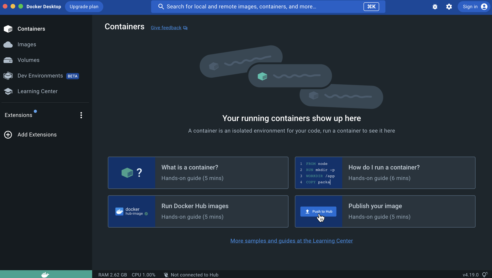

# 7.4 Airflow Hands-On

- 로컬환경에서 Docker를 이용한 학습을 할 것이기 때문에 Docker Desktop을 설치합니다.

## 준비사항

### Docker Install (Windows)
- Docker
    - Windows 환경 설치 참고 블로그
        
        [[Windows 10] Docker 설치 완벽 가이드(Home 포함)](https://www.lainyzine.com/ko/article/a-complete-guide-to-how-to-install-docker-desktop-on-windows-10/)
        
        [윈도우 버전 Docker 설치 방법](https://freewings.tistory.com/98)
        
        [도커 데스크탑 설치하기 - 윈도우11 WSL2 환경](https://digiconfactory.tistory.com/entry/도커-데스크탑-설치-WSL2)
        
- `AIRFLOW_VERSION` - Airflow version (e.g. `2.6.1`) or `main`, `2-0`, for latest development version
- `PYTHON_VERSION` Python version e.g. `3.8`, `3.7`

### Docker Install (Mac)

```bash
# Mac 환경
# brew 설치 시, compose, machine 등 추가 설치 필요

# brew --cask 설치 >> Docker desktop on Mac 설치 (docker-compose, docker-machine 포함)
brew install docker --cask
```

### 설치완료



- 설치 완료! 🚀


<script src="https://utteranc.es/client.js"
        repo="Pseudo-Lab/data-engineering-for-everybody"
        issue-term="pathname"
        label="comments"
        theme="preferred-color-scheme"
        crossorigin="anonymous"
        async>
</script>