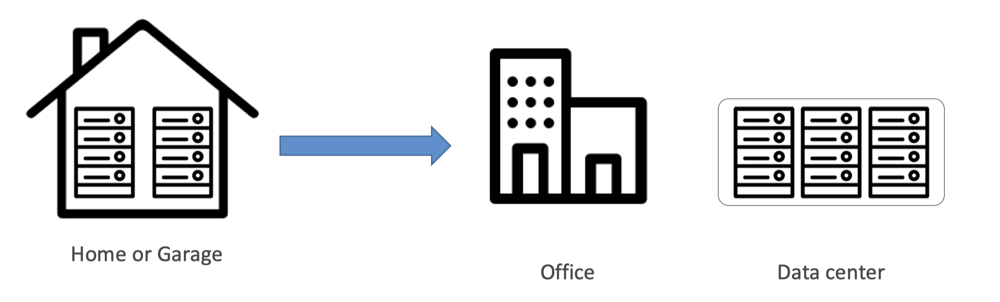
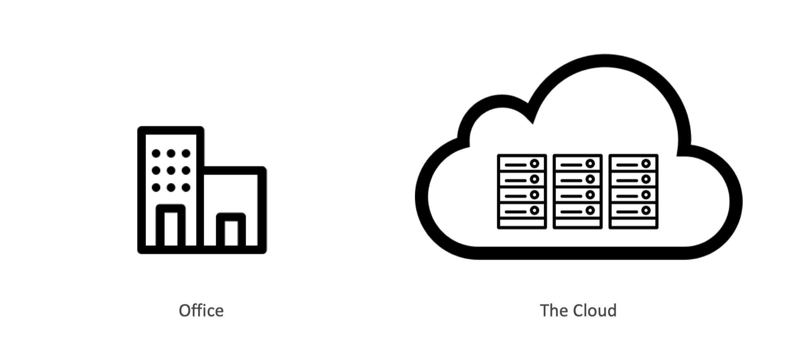
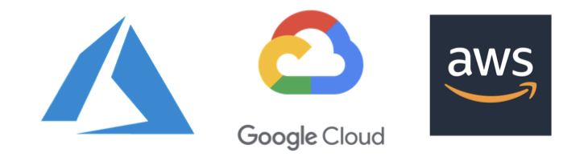
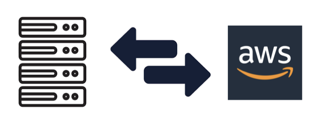
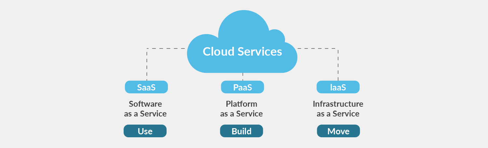
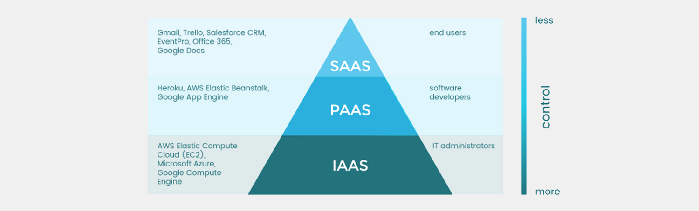

# 8.1 Cloud Computing

## 8.1.1. 클라우드 컴퓨팅의 역사와 진화

<aside>
💡 클라우드 컴퓨팅
</aside>

`Cloud?` 란 무엇일까요?  iCloud, Google Drive (Google Photo) 등 일상생활 속에서 클라우드라는 용어를 많이 보셨을 것입니다.  → “네트워크를 이용한 사용성의 극대화”라고 생각해보겠습니다.

`Computing?` 컴퓨팅 자원 → FROM COMPUTER

### 클라우드 컴퓨팅 역사(History)
- 가상화 (virtualization)    
    (1970~1980) IBM은 시스템/360와 시스템/370 메인프레임 시스템에 가상화 기능을 도입했습니다. 이로써 하나의 물리적 시스템을 여러 '가상' 시스템으로 분할하여 사용할 수 있게 되었습니다.
    

- 분산 컴퓨팅과 그리드 컴퓨팅
    
    (1990 - 2000년대 초): 여러 컴퓨터를 네트워크로 연결하여 공동으로 문제를 해결하는 분산 컴퓨팅과 그리드 컴퓨팅이 발전했습니다. 이들 기술은 클라우드 컴퓨팅의 발전에 중요한 역할을 했습니다.
    
- 웹 2.0
    
    (2000년대 중반 - 현재) : 웹 2.0의 등장으로 사용자들이 동적인 콘텐츠를 생성하고 공유할 수 있게 되면서, 웹 기반 서비스가 대량의 데이터를 저장하고 처리하는 데 필요한 클라우드 기반 인프라에 의존하게 되었습니다.
    

Plus, 하드웨어의 발전

⇒ 가상화와 분산컴퓨팅(소프트웨어), 하드웨어의 발전, 네트워크의 발전, 마지막으로 대기업의 자본이 클라우드 컴퓨팅 “서비스”를 가능하게 만들었고, 수요가 있으니, 만들어 버렸습니다.

- 클라우드 컴퓨팅 서비스의 등장
    
    **(2000년대 후반 - 현재):** 2006년, 아마존웹서비스(AWS)가 Elastic Compute Cloud(EC2)를 론칭하면서 상용 클라우드 서비스가 시작되었습니다. 이후 구글, 마이크로소프트, IBM 등이 클라우드 서비스를 제공하기 시작하였습니다.
    

---

### 클라우드 컴퓨팅 등장 배경 (사용자 기준의 변화)

`문제점`

- 데이터 센터 땅값…
- 전기값… 쿨링… 유지보수 비용
- 하드웨어 추가, 교체에 시간이 든다
- Scaling이 힘들다..
- 3교대 인건비?
- 재난 상황… (카카오 데이터센터)

이러한 문제점들을 노리고 나온 것이 `Cloud Service` 입니다.

- on-demand : 컴퓨팅 파워, 데이터 스토리지, 애플리케이션, 등등 필요한 것만
- pay-as-you-go : 쓰는 만큼 내라
- 컴퓨터 Scaling도 마음대로
- 변경도 마음대로
- 즉각적으로 변경되며 (껐다켰다 없다..)
- 관리는 HOST가..

---

## 8.1.2. 클라우드 배포 모델

<aside>

👉**Private Cloud**

`내부 데이터 센터에 배치된 클라우드` 

Private Cloud란 사내 데이터 센터에 비치된 클라우드입니다. 
주요 특징은 다음과 같습니다. 
* 단일 회사내에서 사용, 외부에 노출 x 

* 완전한 컨트롤

* 보안 - 민감 ⬆️

* 규제준수나 비즈니스 특성

</aside>

<aside>

👉 **Public Cloud**

`서비스 제공 업체가 클라우드 리소스를 인터넷을 통해 제공`

Public Cloud란 클라우드 서비스 제공 업체가 클라우드 리소스를 인터넷을 통해 제공하는 것을 의미합니다. 
별도의 설치 없이 쉽게 접근 가능하며 스케일링이 가능하며 비용을 절약할 수 있습니다.

</aside>

<aside>

👉 **Hybrid Cloud**

Hybrid Cloud란 Private Cloud와 Public Cloud의 특성을 갖고 있습니다. 
민감한 데이터는 내부에서 관리하고 그렇지 않은 것은 외부에 맡기는 전략입니다.

</aside>

---

## 8.1.3. 클라우드 서비스 모델

끝으로 다양한 클라우드 서비스 모델에 대해서 알아보도록 하겠습니다.

### 1. Infrastructure as a Service (Iaas)
- 가장 기본적인 클라우드 서비스
- 가상화된 컴퓨팅 리소스 제공
- Iaas 사용자는 네트워크, 서버, 데이터 스토리지 등의 인프라를 직접 구성 및 관리,
- 하드웨어는 클라우드 공급 업체가 관리

→ 가상 머신, 서버, 스토리지, 네트워크, 로드 밸런서

→ Amazon Web Services (AWS) EC2, Google Cloud Platform (GCP) Compute Engine, Microsoft Azure Virtual Machines.

### 2. Platform as Service (PasS)
* Iaas에 비해 더 높은 수준의 추상화 제공 - 애플리케이션 코드와 데이터만 관리
* 제공자는 운영체제, 미들웨어, 런타임 등의 인프라 관리

→ 개발 툴, 데이터베이스 관리, BI 서비스

→ Google App Engine, AWS Elastic Beanstalk, Microsoft Azure App Service.
    
### 3. Software as a Service (Saas)
    
* 제공자는 소프트웨어 애플리케이션 제공, 소프트웨어와 하위 인프라 모두 관리

* 사용자는 소프트웨어 기능을 사용, 설정 관리

→ 이메일, 캘린더, CRM 툴, 업무 자동화 툴

→ Microsoft Office 365, Zoom 

다양한 클라우드 서비스 모델이 지금 당장 와닿지 않으실 수 있습니다. 각각의 모델별 특징에 대해서 한 번 이해하고 생각해보시면 좋을 것 같습니다(앞으로 자주 마주치게 될 서비스들입니다!)
