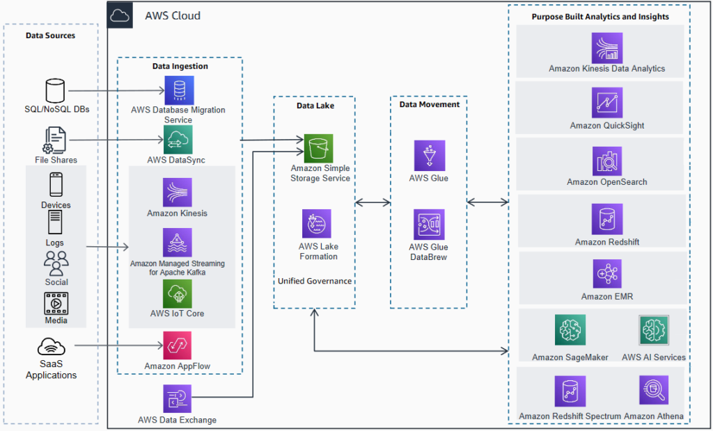
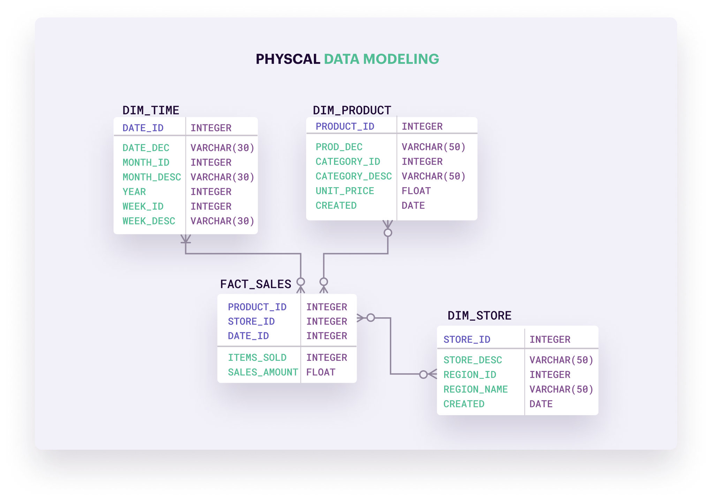
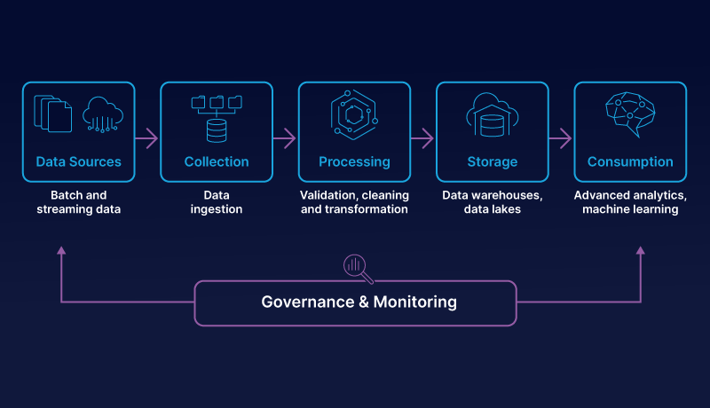
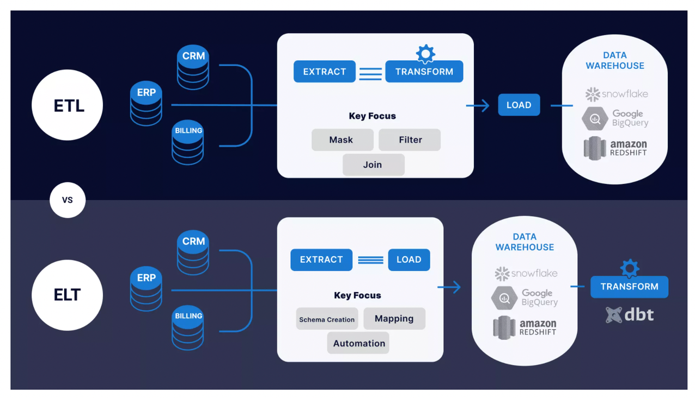
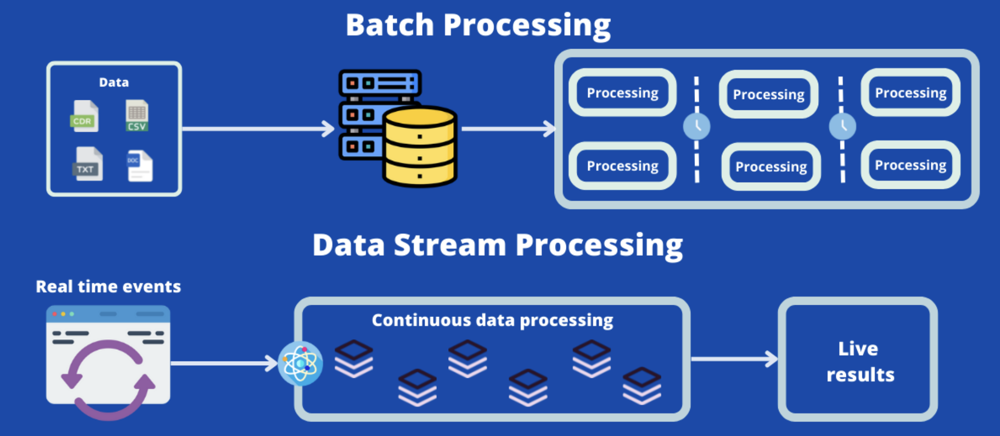
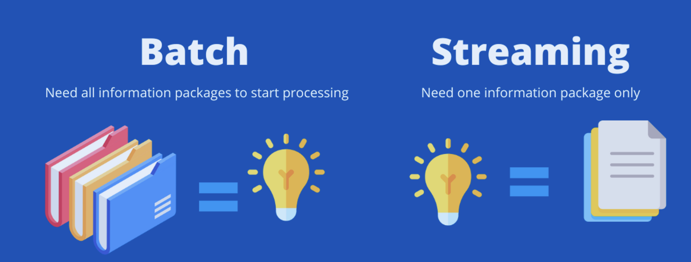

# 8.2 Data Engineering

### **데이터 아키텍쳐**

> 필요한 데이터를 적절하게 저장, 처리, 분석할 수 있도록 아키텍쳐를 설계하고 구축
> 

---

### **데이터 모델링**

> 데이터가 어떻게 구조화, 연결, 처리될 지를 정의하는 과정
일관성과 효율성을 보장
> 

---

### 데이터 파이프라인 구축

> 데이터가 어떻게 수집, 변환, 저장되는지를 정의하는 프로세스
> 

### 데이터 통합의 전략 (ETL vs ELT)

- ETL vs ELT: ETL은 Extract, Transform, Load의 순서, ELT는 Extract, Load, Transform의 순서.

→ ETL은 데이터를 원본에서 추출한 후, 변환(일반적으로 클렌징, 정규화, 비즈니스 규칙 적용 등)을 수행하고, 그 결과를 데이터 웨어하우스에 로드하는 과정입니다. 이 방식은 데이터 웨어하우스에 저장되는 데이터가 이미 정제되고 구조화되었기 때문에, 분석이나 보고를 빠르게 수행할 수 있습니다.

→ ELT는 데이터를 먼저 원본에서 추출한 후, 데이터 웨어하우스에 로드하고, 그 다음에 변환을 수행하는 과정입니다. 이 방식은 원본 데이터를 빠르게 저장하고, 필요한 변환을 나중에 수행할 수 있으므로, 빅데이터 환경에서 유용하게 사용될 수 있습니다.

### 데이터 처리 방식 (Batch vs Data Streaming)

- 실시간 처리 vs 배치 처리

→ 실시간 처리: 데이터가 생성되자마자 즉시 처리하는 방식. 이 방식은 빠른 응답 시간이 필요하거나, 실시간 이벤트를 모니터링하거나 반응해야 하는 시나리오에 적합

→ 실시간 분석, 실시간 모니터링, 실시간 추천 시스템

→ 배치처리 : 일정 시간 동안 데이터를 수집한 후, 한번에 모아서 처리하는 방식입니다. 이 방식은 처리할 데이터의 크기가 크거나, 처리 시간이 길거나, 처리 주기가 정해져 있는 경우에 적합합니다. 예를 들어, 매일 밤 재고 데이터를 처리하거나, 월별 보고서를 생성하는 등의 작업에 사용됩니다.

---