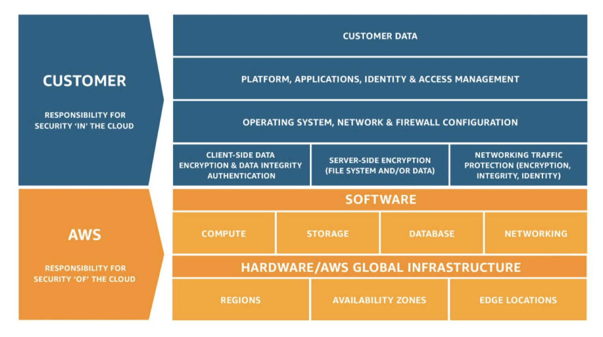
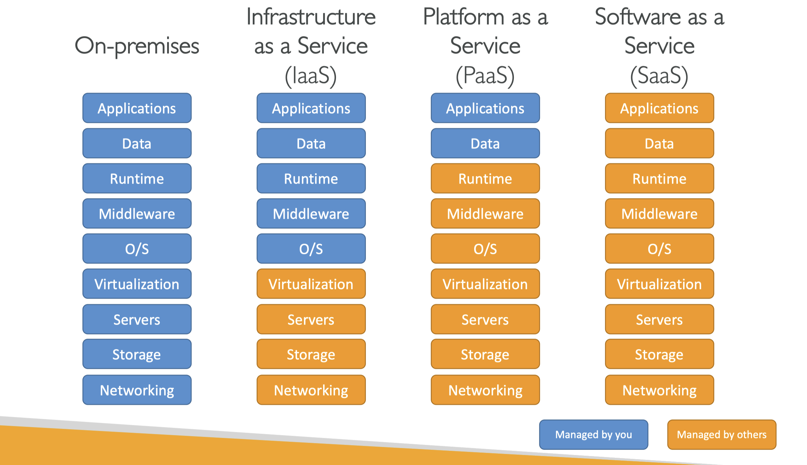
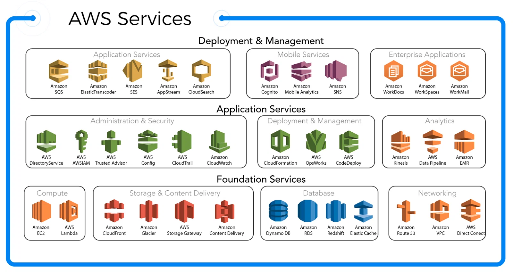
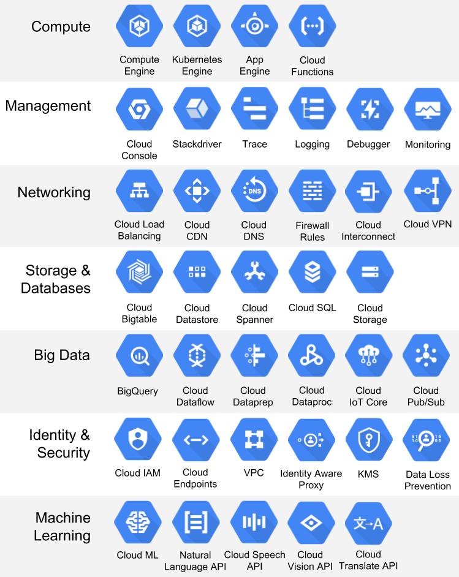
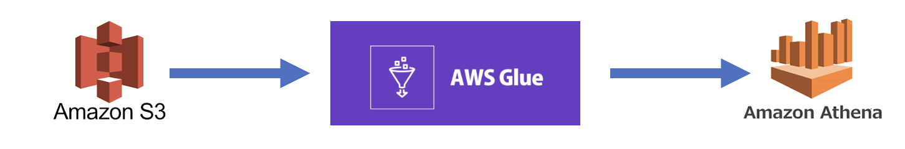

# 8.3 클라우드 컴퓨팅에서의 데이터 엔지니어링과 프로세스들

> 무수한 서비스들 - 모든 서비스가 기존 on-prem에서 쓰던 서비스들과 매칭이 되며
다시한번 강조하지만 “사용성” 만 늘려놓은 서비스들이다.
본인 혹은 회사 사정에 맞게, 비용과 사용성 등을 고려해서 필요하다면 학습해서 사용
> 

1. 서비스의 다양한 곳에서 발생하는 정형/비정형 데이터를 수집하기 위한 배치/실시간 파이프라인 구축 및 운영
    
    > 개발팀과 밀접하게 데이터 수집, 앞단의 업무를 하는 경우
    > 
    
    → 웹, 앱 등의 클라이언트 환경, DB 혹은 서버같은 내부 백엔드 환경, 그리고 마케팅 툴을 사용한다면 Facebook Ad, Appsflyer 등등에서 발생하는 데이터들을 ETL/ELT
    
    → batch/streaming pipline을 구성하고 schema정의, ETL/ELT를 위해 분산 컴퓨팅 프레임워크 사용 (Spark, Presto,..)
    

1. 데이터레이크/데이터웨어하우스 등 전사 인원들의 원활한 데이터 분석을 위한 데이터 플랫폼 운영
    
    > 데이터팀이 있는 회사에서 팀 서포트
    > 
    
    → 클라우드를 쓰지 않는 환경에서는 Hadoop + ecosystem
    
    → 클라우드를 활용하는 환경에서는 AWS EMR, Athena, Glue, GCP BigQuery, Dataproc 등의 managed data service를 활용해서 플랫폼을 구축합니다.
    

!! S3 → Glue → Athena 

1. 대용량의 데이터 가공을 통해 실제 서비스 혹은 분석에 사용될 수 있는 데이터 마트 구축
    
    > 분석가는 물론 데이터를 활용하는 타팀 혹은 고객을 위한 업무
    > 
    
    → 전사 고객들이 핵심 데이터에 쉽고 빠르게 접근할 수 있어야 하기 때문에, 원천 데이터에서 다양한 추상화를 거쳐 주로 데이터 마트라고 부르는 가공 데이터를 만듭니다. 
    

1. 데이터 기반 서비스 제공 및 서빙
    
    > 데이터팀 규모가 너무 작거나, 너무 클 경우 →  배포 모니터링”까지” 하거나 “전담”하거나
    DataOps, MLOps의 영역
    > 
    
    AB테스트, 추천 결과 서빙